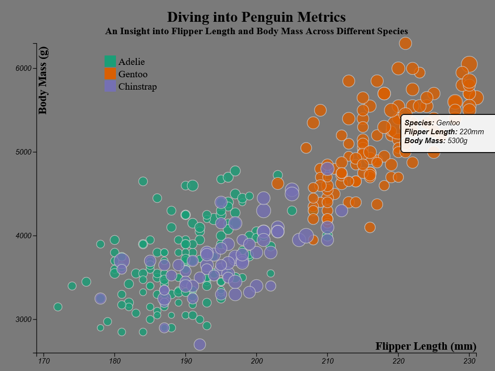
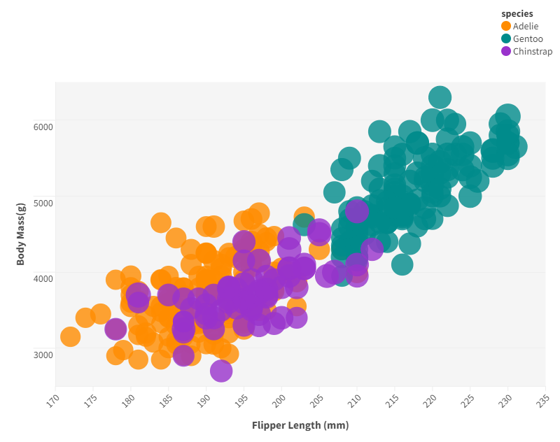
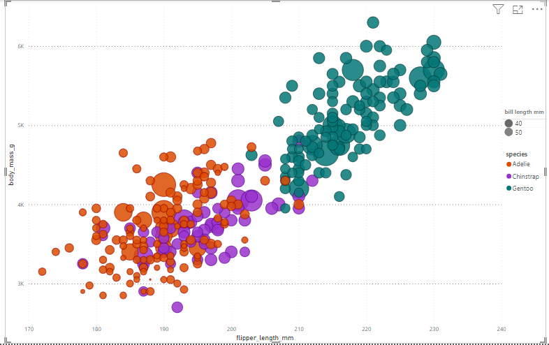
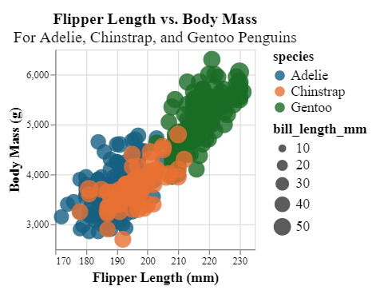
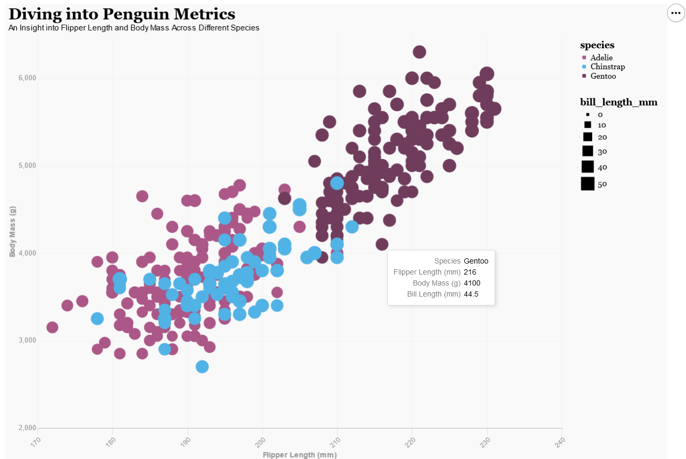
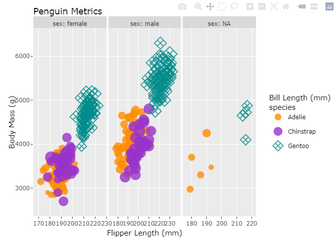

# 02-DataVis-7ways

Assignment 2 - Data Visualization, 7 Ways  
===
# 1. d3 js
D3.js, or Data-Driven Documents, is a JavaScript library renowned for its unmatched customization and low-level control in creating interactive and dynamic data visualizations for the web. With a steep learning curve, it empowers developers to craft highly tailored and sophisticated visualizations through direct manipulation of HTML, SVG, and CSS.

**Advantage:**
- Unmatched Customization
- Community Support
           
**Disadvantage:** 
- Higher Learning Curve Compared to other Tools: D3.js demands a steeper learning curve in contrast to drag-and-drop tools, as it requires programming expertise for effective utilization.

**Where do I see this in future:**
I think that due to the specialized nature of technical skills, particularly in coding, their widespread adoption among non-coders may be limited.

**Technical achievements:** 
Dynamic Data Loading: Uses D3 to asynchronously load data from the "penglings.csv" file, allowing for dynamic data integration. 
Color and Size Encoding: Encodes species information with custom colors and bill length with variable circle sizes, providing a multi-dimensional representation of the data.
Text Annotations: Adds informative text annotations for axis titles and legends, contributing to the clarity of the visualization.

**Design achievements:** 
Consistent Styling: Maintains consistent and cohesive styling throughout the visualization, contributing to a unified and aesthetically pleasing design.
Dynamic Size & Color Legend implementation:  Utilizes a custom color mapping for each penguin species and dynamically generates legends for both size and color based on the specified data ranges and color mapping

# 2. Flourish
Flourish is a data visualization platform that enables users to create interactive and engaging visualizations, including maps, charts, and narratives, without extensive coding. With a user-friendly interface, it simplifies the process of storytelling through data, making it accessible for a wide range of users.

Tool: flourish 
[Link:](https://app.flourish.studio/projects)

**Advantage:** 
- user-friendly interfac
- Free edition for try
- Plenty of examples and templates
           
**Disadvantage:** 
- Limited Customization Options
- Limited Data Manipulation Features: While Flourish allows column addition and deletion, it lacks basic functionality for creating new columns, such as computing the sum of two existing columns, limiting its flexibility in more advanced data transformations.

**Where do I see this in future:**
I reckon that Flourish may evolve to address user feedback and expand its capabilities, potentially incorporating more advanced data manipulation features.

**Hacks:**
Due to technical constraints, I couldn't display both legends simultaneously. However, I addressed this limitation by customizing the color legend to accurately represent the assigned colors for each relevant category.

# 3. PowerBI 
Power BI is a Microsoft business analytics tool that facilitates data visualization and sharing, offering a user-friendly interface and seamless integration with the Microsoft ecosystem for robust data connectivity and dynamic dashboard creation.

Tool: powerbi 

**Advantage:** 
- User-Friendly Interface
- free desktop edition
- data manipulation capabilities
- plenty of examples and communities
           
**Disadvantage:** 
- Complexity in Customization (for example: only 1 legend is available)

**Where do I see this in future:**
I think that Power BI is likely to continue evolving as a leading business intelligence and analytics tool, with advancements in features, connectivity, and collaboration.

**Hacks:**
Because of the technical limitation of the tool, but using the table trick I display the second legend

# 4. Vega-lite
Vega-Lite is a high-level declarative visualization grammar that simplifies the creation of interactive and expressive visualizations using a concise JSON syntax.

**Advantage:** 
- Declarative simplicity
- High-level abstractions
- Default interactivity
           
**Disadvantage:** 
- Limited Customization

**Where do I see this in future:**
 I reckon that Vega-Lite is likely to remain a prominent choice for declarative data visualization, gaining further adoption for its simplicity and versatility.

**Technical achievements:**
- Declarative Syntax & Effective Data Mapping: Uses a concise and high-level syntax for visualization configuration and efficiently maps variables to visual channels for a comprehensive representation. 
- Color Encoding & Palette Usage & Opacity Control: Implements a meaningful color scale for enhanced data interpretation, and applies a distinct and visually appealing color palette for species differentiation. Includes opacity for transparency, improving visibility in crowded regions. 
- Dynamic Data Source: Enables dynamic loading of data from an external CSV file for adaptability.
- Scale Configuration & Size Variation: Defines scales for accurate data representation and distribution and uses varying point sizes to convey additional information effectively.

**Design achievements:**
- Data Range and size consideration: Carefully chosen scales prevent crowding or sparse regions, optimizing distribution.
- Consistent Aesthetics: Unified color palette, color harmony,  opacity for Clarity and visual elements contribute to a cohesive design.

# 5. Python + Altair
Altair is a declarative statistical visualization library for Python that enables users to create a wide range of interactive and visually appealing charts. With a concise and intuitive syntax, Altair allows users to express their data visualizations using a simple Python API, making it accessible for both beginners and experienced data scientists. It seamlessly integrates with Pandas DataFrames, providing a convenient way to transform and visualize data in a meaningful manner.

**Advantage:**
- Interactive Visualizations: Built-in support for interactive plots.
- Declarative Syntax: Intuitive and concise code for creating visualizations.
           
**Disadvantage:**
- Limited Chart Types: Altair may have fewer chart types compared to other visualization libraries.

**Where do I see this in future:** 
I think that Altair is expected to become even more popular as it maintains its simplicity and integrates seamlessly with data tools like Pandas. Future improvements may include more chart options and enhanced interactivity to keep up with evolving data visualization trends. 

**Technical achievements:**
-Altair Chart Configuration: Utilizes Altair to create an interactive scatter plot with circles. Applies color mapping to species and sets a custom color range. Encodes size based on bill length, contributing an additional data dimension.
-Tooltip Integration: Incorporates tooltips for interactive exploration, providing details on species and numerical variables when hovering over data points.
-Mark Configuration: Configures the circle marks with a specified opacity level for better visibility.
-Interactive Display: Uses the IPython display function to showcase the interactive chart within the Jupyter Notebook environment. In summary, the code effectively leverages Altair's capabilities to create an interactive and visually informative scatter plot, showcasing technical achievements in data visualization and exploration.

**Design achievements:**
-Consistent Aesthetics: Maintains a consistent aesthetic with a specified color range and opacity, contributing to a unified and visually appealing design.
-Color Mapping for Species: Implements a custom color mapping for each penguin species, enhancing visual distinction and facilitating species identification.
-Size Encoding for Additional Insight: Utilizes point size to encode bill length, adding an extra layer of information to the plot and making it more informative.

# 6. R + ggplot2 (plotly) + R Markdown
Plotly is a versatile and interactive data visualization library that supports a wide range of chart types. Combining R with ggplot2 for versatile plotting, Plotly for interactive visualizations, and R Markdown for dynamic report generation provides a powerful and seamless workflow. This integrated stack allows for creating aesthetically pleasing and interactive data visualizations within R Markdown documents, facilitating reproducible and shareable data analyses and reports.

Tool: RStudio

Advantage: 
- Rich Visualization Capabilities: Powerful and expressive visualizations.
- Seamless Integration: Smooth collaboration with R Markdown.
- Interactive Plots with Plotly: Enhanced interactivity in visualizations.

Disadvantage: 
R, ggplot2 (plotly), and R Markdown are hard to learn especially mastering these tools, especially for beginners. Additionally, the generation of complex interactive visualizations may require a deeper understanding of underlying code, potentially posing a challenge for users seeking a more straightforward graphical interface.

**Hacks:** 
I used the professor's code as a basis for extension.

**Technical achievements:**
Efficient data manipulation, meticulous aesthetic configuration, faceting, and the transformation of a static ggplot into an interactive plot using plotly were seamlessly executed to create a visually appealing representation of penguin metrics. The plot's aesthetics were fine-tuned for clarity, employing color schemes and sizing considerations. Faceting enhances insights by breaking down the data into subplots based on categorical variables. The integration of plotly introduces interactivity, such as tooltips and zooming, fostering a dynamic and engaging exploration of the penguin metrics.

**Design achievements:**
Enhances plot interpretation by customizing legends, ensuring a clear association between colors and penguin species. This contributes to improved readability and comprehension of the visualized data. Additionally, the faceting of the plot by penguin sex aids in a focused comparison between male and female penguins, highlighting potential differences in metrics. The use of ggplotly introduces interactivity, allowing users to explore specific details through tooltips, enhancing the overall user experience. Clear titles and axis labels further contribute to the plot's interpretability, guiding viewers in understanding the relationships between different penguin metrics.

# 7. Python + Matplotlib
Matplotlib is a widely-used plotting library in the Python ecosystem, and its development has been active with regular updates and improvements. Developers often work on enhancing user experience, adding features, and addressing issues raised by the community.

**Advantage:**
- Versatility: Supports diverse plot types.
- Customization: Highly configurable visualizations.
- Community Support: Active user community.
           
**Disadvantage:**
- Initial Complexity for Beginners

**Where do I see this in future:**
I think that Matplotlib will become get faster at showing big and complex data, offer more types of plots, become easier to use with better design, work well with the latest Python updates, and let users interact more with their data when creating plots.

**Hacks:**
To overcome the challenge of displaying both legends simultaneously, I created two separate legend sets. The first legend set captures the color information for each species, while the second one illustrates the size classification. Both legend sets are then combined into a comprehensive legend_handles list, which is subsequently utilized to generate a unified legend with the title "Species." This legend is positioned in the upper left corner outside the plot area, offering a clear and comprehensive reference for interpreting the penguin data visualization.

**Technical achievements:**
Achieved dynamic data visualization by implementing marker size adjustments based on a conditional statement, showcasing adept data manipulation skills. Utilizing the matplotlib library for plotting, the code successfully employs a customized color mapping strategy, enhancing visual differentiation among penguin species. Skillful legend management is demonstrated through the inclusion of species and bill length categories, contributing to the overall interpretability of the plot. The integration of external libraries, particularly numpy for conditional sizing, reflects a sophisticated approach to leveraging tools for enhanced functionality. Lastly, the code is characterized by clear and well-documented practices, ensuring accessibility and maintainability for future collaboration or modifications.

**Design achievements:**
Demonstrated an integration of matplotlib in Python for creating a visually appealing and informative scatter plot of penguin data. Effective color mapping distinguishes between different penguin species, while dynamically adjusting marker size based on bill length enhances the representation of individual data points. The thoughtful inclusion of legends provides clear insights into both species and bill length categories, contributing to the overall clarity of the visualization. Additionally, the code showcases the ability to combine data manipulation techniques with design principles, resulting in a cohesive and meaningful representation of the dataset. Overall, the achievement lies in the creation of a well-designed and comprehensible data visualization through thoughtful choices in color, size, and other plot elements.

