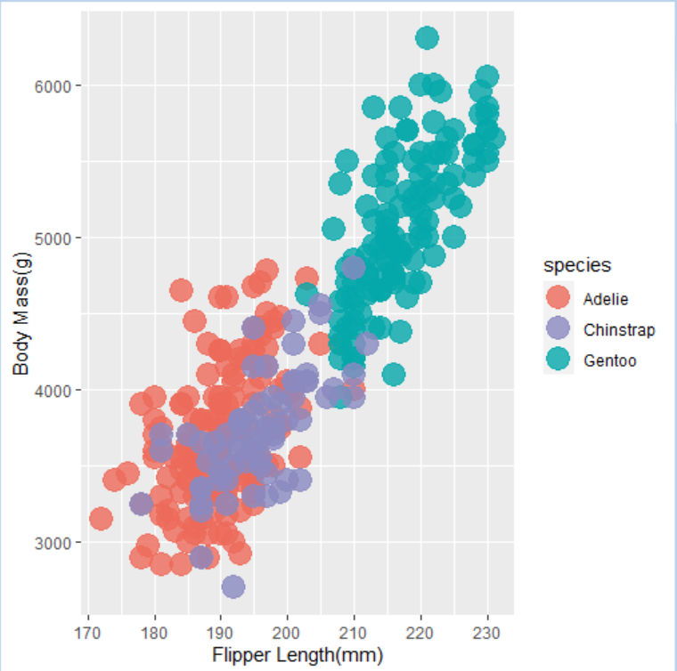
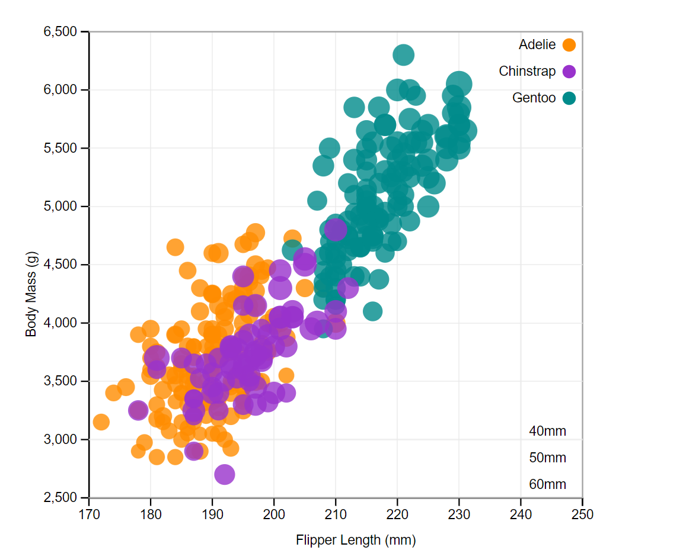
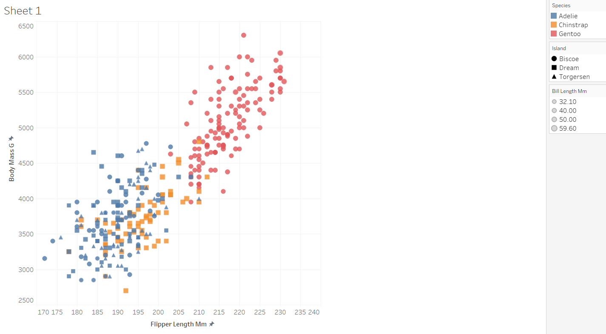
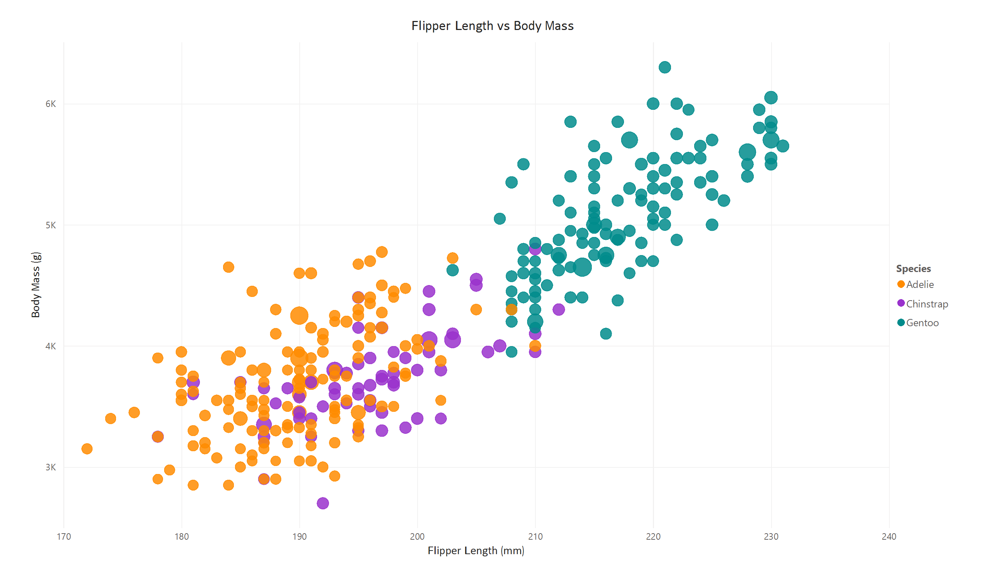
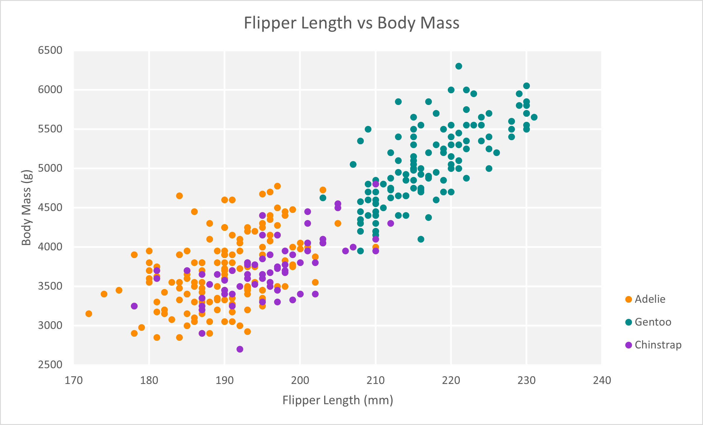
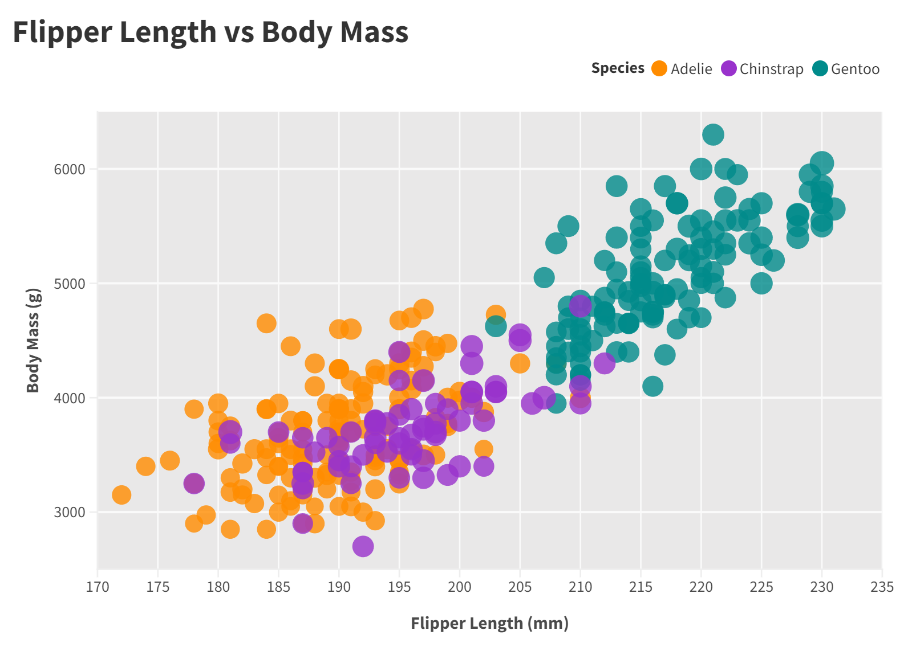
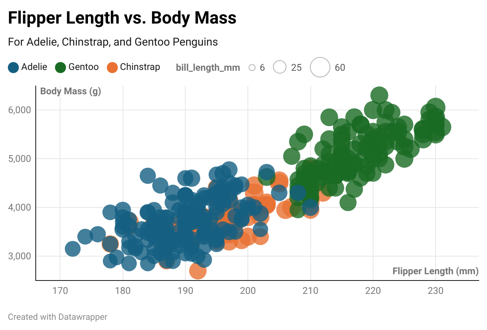

# 02-DataVis-7ways

Assignment 2 - Data Visualization, 7 Ways  
===

# R + ggplot2 + R Markdown

===

# d3 

===

# Python + Seaborn + matplotlib.pyplot

===

# Python + Altair

===

# Tableau

===

# PowerBI

===

# Microsoft Excel

===

# Flourish

===

# Datawrapper

===
