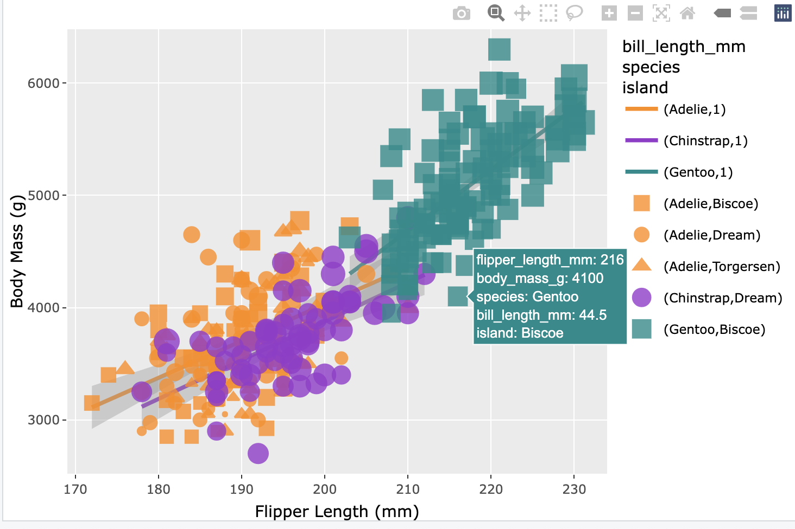
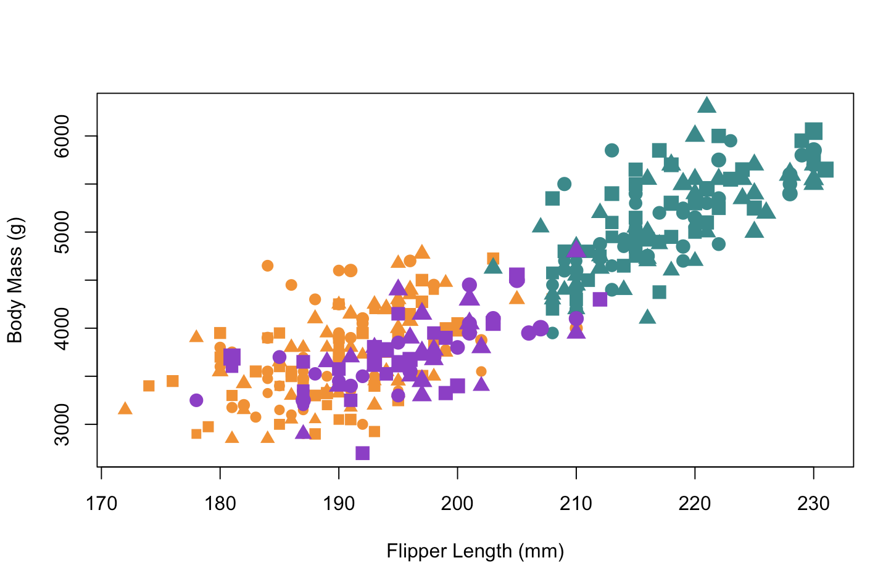
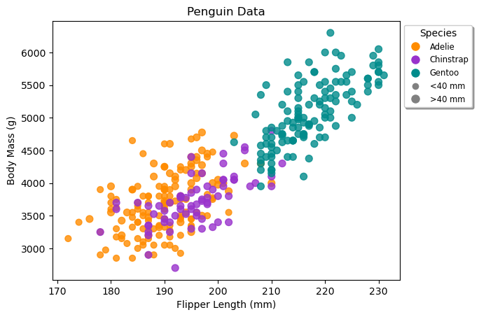
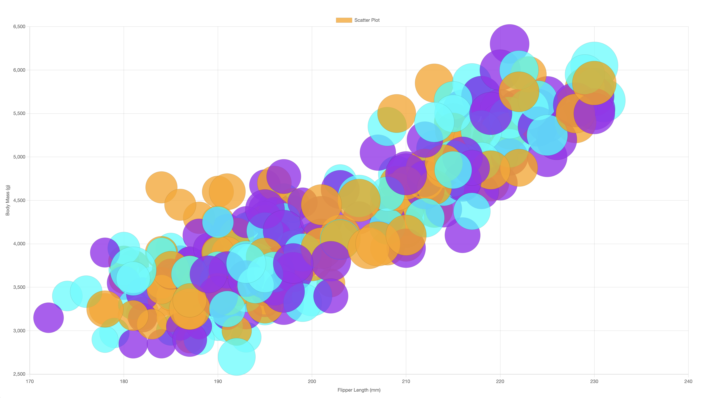
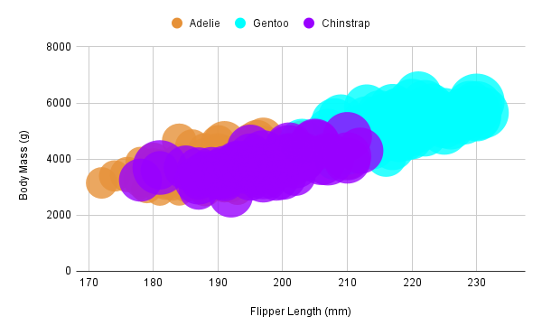

# 02-DataVis-7ways

Assignment 2 - Data Visualization, 8 Ways  

===

For this assignment I utilized the following tools/languages:

1. R
* Ggplot + Plotly
* R
2. Python
* Matplotlib
* Seaborn
* Altair (Note: Jupyter notebook)
3. Javascript
* D3.js
* Chart.js
4. Google Sheets
* Google Sheets

For my requirement I used 3 different programming languages and google sheets, making the graph in 8 different ways. I will now describe each of them in depth.

### Ggplot + Plotly

The code for this was taken from the professor's tutorial. I modified it by first installing all the dependencies for it to run on my end. I needed to do this as it was my first time working with R and RStudio. That part was pretty difficult for me to figure out. I then, for added complexity, figured out how to make a trend line and do shapes (based on islands). Stack overflow was used for the first thing (https://stackoverflow.com/questions/38412817/draw-a-trend-line-using-ggplot). I really like how the trend lines doesn't go across the whole graph, following only the data points in the groups.
The code in general behind this is pretty easy, but with some confusing syntax at first. I understand how it works now. From what I learned about R and Ggplot, Ggplot seems like a pretty nice way to make plots, with everything being kind of treated as an equation. Ggplot is pretty expansive in terms of plotting options, and was probably the easiest to use for complex chart options. When it comes to adding the tooltip, I used the library plotly in collaboration with ggplot (learned how to from https://plotly.com/ggplot2/hover-text-and-formatting/). Plotly added a lot of additional details to the graph, like the tool tip and a more informative legend, interesting showing that some species are only in 1 island and other cool tidbits.

### R

R by itself was a pretty basic implementation. I looked up documentation on how to add attributes to a plot (http://www.sthda.com/english/wiki/add-legends-to-plots-in-r-software-the-easiest-way), and created one. This implementation was extremely easy. From what I know of R just by itself though, the standard library is not the more thorough, and I should be using an alternative like Ggplot for more complex creations. I tried to add a tooltip for R, but there was no easy way to do so, especially since Plotly doesn't work with base R.

### Matplotlib

Having used matplot before, this example was pretty easy for me. I looked up with chat gpt how to do size and coloring in matplot, and implemented that with the rest of the code I made. From what I know of matplotlib and doing it in previous works, I know matplotlib is extremely expansive, probably similar to ggplot in levels. It's also convenient with easy to follow syntax. It did not auto generate any axises however. It was also easy to exaggerate the sizes through doing simple multiplication. Matplotlib was not an easy language to add a tooltip to. I researched how to do it (starting from here https://stackoverflow.com/questions/7908636/how-to-add-hovering-annotations-to-a-plot), and used events to determine whether or not the cursor was over a point. Due to the difficulty of displaying a tooltip, I printed out what penguin was being looked at in the terminal

### Seaborn

Seaborn is based off of matplotlib, so it wasn't that difficult to implement, just requiring how to do a scatter plot differently. I looked up how to exactly make the scatterplot using Chatgpt, and edited the output to better fit. Interestingly, the axis was auto generated, and the size labels were different than that of ggplot. Seaborn is hailed as a more in depth statistical library, and is just as easy as matplot to use considering it uses matlab partially. Seaborn didn't even have the motion event system that matplotlib had. I looked up how I should do this, and stackoverflow recommended to use a different library for a tooltip, and there wasn't much documentation on seaborn with tooltips, so I didn't do this.

### Altair

Like the other python libraries, the syntax of Altair is relatively simple. I used chatgpt to figure out what's necessary to make a chart, and coded off of that. Altair is pretty annoying as a language to use. First off, it requires some sort of web based tool, making it so I needed to use jupyter notebook. Secondly, the axises weren't that fitting at first, so I had to manually adjust everything (I'm sure there's a better approach though). Despite this being able to accomplish the plot the same as Matplotlib and Seaborn, I'd prefer to use one of those two tools. Altair had a built in tooltip, probably because it's web based.

### D3.js

D3.js was my first javascript approach. I first looked at https://d3-graph-gallery.com/graph/scatter_basic.html to figure out how to make a basic scatter plot. For extra effort, I looked at https://d3-graph-gallery.com/graph/custom_legend.html to figure out how to make a legend. I also tried to figure out how to change the shapes in the scatterplot, but found it too troublesome to do. D3 is quite a freeform tool, allowing you to specify many aspects/components of the plot, a reason to use a web based visualization tool. However, this comes with there being a lot of code bloat, and everything having to be specified in detail. As mentioned before, I had trouble figuring out how to do something as basic as changing the shapes in the scatterplot. So this language is a hard one to master, but I know it to be very useful with how often it is used in the web and all the types of visualizations that can be made. I took a javascript coding approach to do a tooltip in this, inspired by https://medium.com/@kj_schmidt/hover-effects-for-your-scatter-plot-447df80ea116 . I coded the mouseover events to display a tooltip next to the circle when you hover over one.

### Chart.js

Chart.js, in contrast to D3.js, has a lot more pre-made from the get go. I looked through the docs and was able to make a scatter plot relatively easily, with their pre built functionality. It was a bit difficult to figure out how to parse the csv though, so in the end I just decided to use d3's method. Chart.js is also a bit unruly, with less control on the placement of things, like how it takes up the size of the whole screen despite not being specified to. One cool thing about this though is information about each bubble is visible when highlighting. I'd want to use Chart.js if I wanted a simple web based solution. Chart.js had a built in toolkit.

### Google Sheets

Google Sheets is a very simple approach that's also very limited and comes with difficulties in finding and changing various aspects of the chart. It not being code based meant I didn't have free rein to do what I wanted with the graph. Despite that, I could accomplis everything I wanted with the graph relatively simply. This would probably be my go to tool for simple visualizations. Google Sheets has a built in toolkit, which is pretty nice for such an easy tool.

## Technical Achievements
- My main form of technical achievement was trying to add some sort of tooltip that describes what the points are to all graphs, as discussed in each individual section.
- I also put in extra effort with Ggplot and D3.js, adding trend lines/shapes to ggplot, adding the legend to d3.js, and adding shapes to R. 
- I also created an 8th visualization.

### Design Achievements
- No design achievements worked on. I did try to make sure everything looked fine however, adjusting each graph to be more visible through methods such as changing the size of the bubbles.
