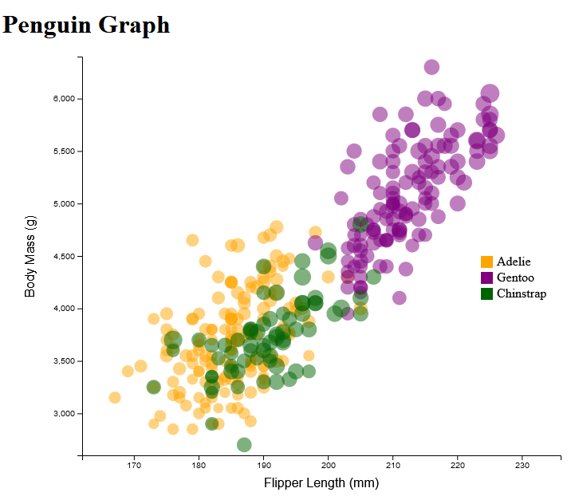
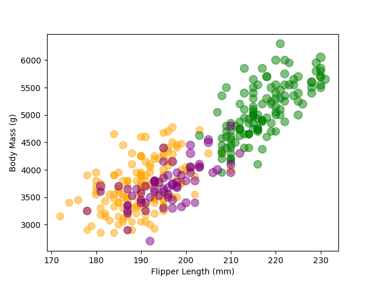
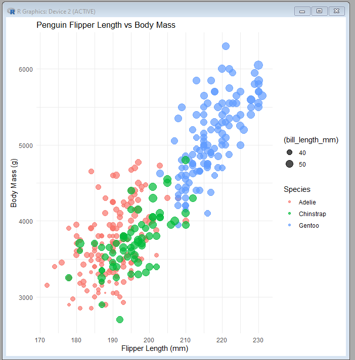
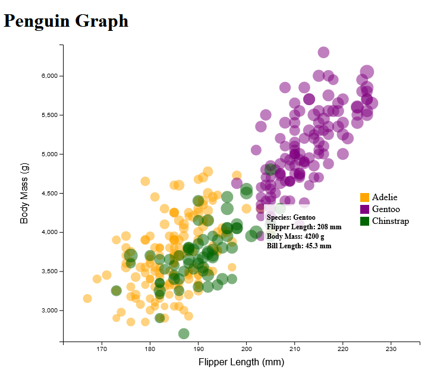
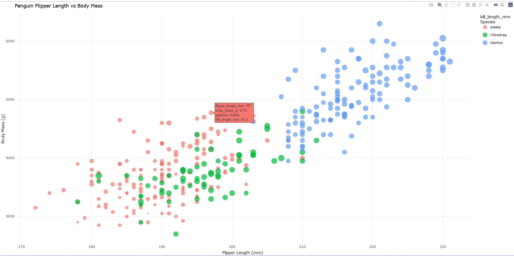
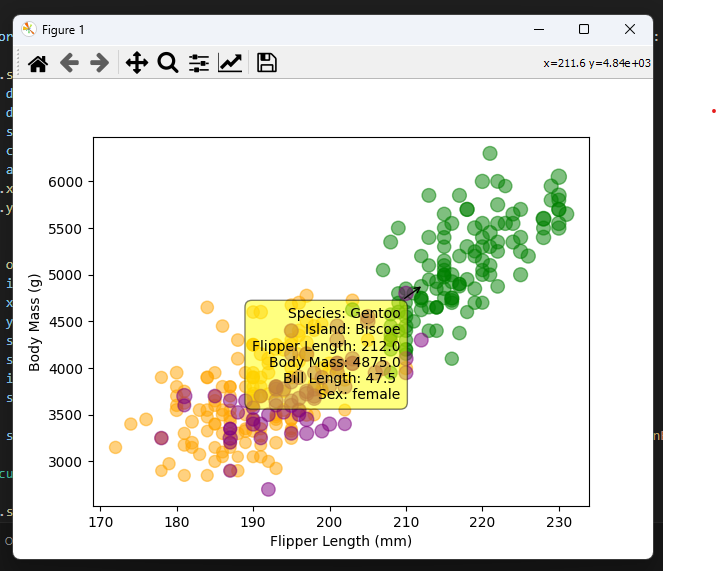
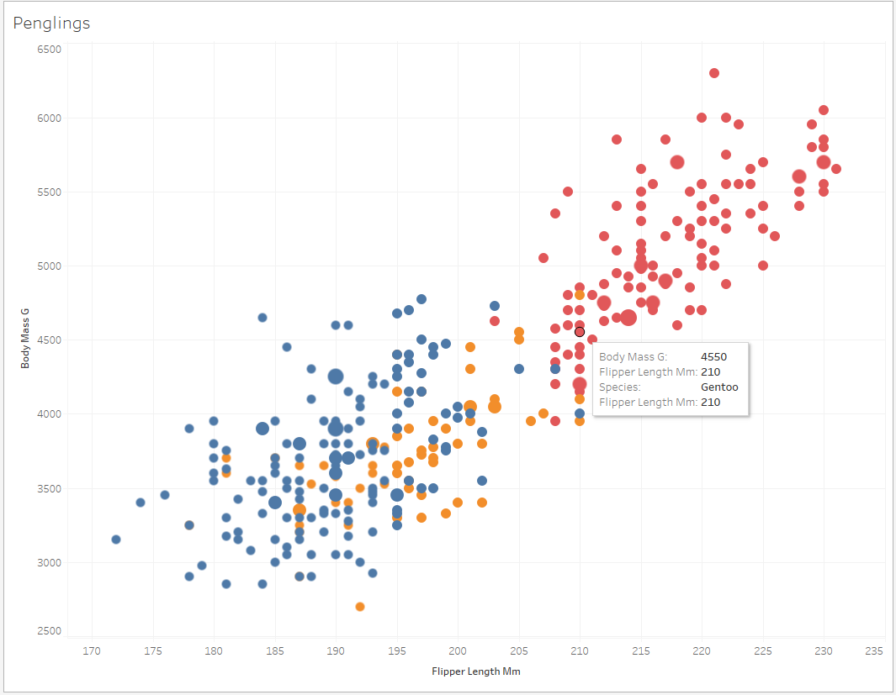

# 02-DataVis-7ways

Assignment 2 - Data Visualization, 7 Ways  
===

# D3 + Javascript

The first graph I created was using the d3 data visualization library for javascript. I thought it would be simple since I already had experience with creating something like this, but it really took a lot of time and effort. The graph itself was fine, but I really struggled a lot with the formatting of the page. I kept having issues where the bottom half of the graph was cut off and eventually had to redo the entire layout of the page to make things appear properly. Aside from that however, each feature the graph had to have was very easy to add and only required minor tweaks. I think this tool will be really useful for me, but it will take a lot more experience for me to be good at handling it. One hack that i did take some time on was getting the N/A values to disappear, as they would appear in the corner of the graph; i just had to filter out the N/A values from the dataset at the start. Out of all the ones I looked at, I think this combo is by far the most flexible, but for the task of creating a simple graph it is unnecessary and other tools are far quicker and more efficient. 

# Excel

The next software I used was Excel, utilizing the built-in graphing functionalities to act on the data. Since I am not very experienced with excel, this took me some time. However it was only a matter of looking for the proper columns to highlight and selecting them under the proper conditions, as well as some minor formatting changes; once I had the columns right I was basically finished. I could see the tool being really useful for someone with not too much coding experience, as zero code was required; but I don't think this tool is right for me.

# Tableau

The next one I used was Tableau, a data visualization and business intelligence platform. I have to say, all the hoops I needed to jump through to install the software, register with a student license, and install were definitely a downgrade on the product. It took me longer to find where i needed to go than to create the actual graph. The graphing itself was pretty easy, once I understood the built in category system it was pretty simple to place all the datapoints in their respective categories and create the graph. I would say this is only for someone who uses tableau extensively; if you want to make one or two graphs, this whole process is not really worth it. Also it didn't require any coding, so those less experienced with code will probably find this easier.

# Vega-Lite

The next one I used was Vega-Lite, a high-level grammar language for creating charts/graphs. This tool was all-around a very good experience. The Lite version was completley web-based, so I didn't have to download anything, and with only a few commands I could generate all of the required data in a pleasing format. Literally the only step that brought me any difficulty was importing the CSV file properly. For someone who just wants to generate a graph or other plot, this is the perfect software to use; it's lightweight, and responds quickly with very few commands.

# Matplotlib and Python

The next tools I used were matplotlib, a 2D plotting library, and python, the language the library is built for. This combination I have some experience with due to my MQP, so it was a relatively easy task to put the data into it and use the proper commands to display it in certain ways. I would say this software is pretty decent for making graphs, but while this graph looks decent, the general look and feel of matplotlib is feels very dated and from an older style of visualization. With an important aspect of data viz is graphs and charts looking modern and slick, I would generally avoid matplotlib.

# R and GGPlot2

The next tools I used were R, a statistical computing language, and ggplot2, a plotting library made for R. This was a little harder, but mostly due to my inexperience with both tools. R required some installation, and I couldn't get it working quite the way I wanted to. GGplot functions were very similar to the matplotlib equivalents so that was relatively easy to understand, but I still had to do some research to find the right way to print it. Overall the benefits and detriments are very similar to matplotlib - it's relatively simple if you have the proper tools downloaded, but it has the feel of outdated graphing software which is a definite downgrade from the competition

# Flourish

The final tool I used was Flourish, a web-based data vis platform with many visualization options. My experience with this website was VERY positive; it was ridiculously easy to import data, and customize the chart to fit the requirements that were set for it. I think in the future whenever I have to create a simple graph or chart for any purpose, I will probably start with this website. Obviously it won't work for a more complicated visualization, which is where a more advanced tool such as d3 would come into play, but Flourish is more than advanced enough for any simple data display.

# Technical Acheivements
I worked to make as many of the graphs interactive to some degree. Some of the tools had the ability to do it on their own, others I had to add it in manually. Here are some screenshots of the results:

d3 and js: Created a mouse event to hover/unhover a box with text inside of it

R and ggplot2: Added feature that converted ggplot to 'plotly' which had functionality for hovering

Python and MatplotLib: Added MLPCursors import to get hover functionality

Vega-Lite: Used existing tooltip functionality to add a tooltip and populate with data fields

Tableau: Functionality already existed

Flourish: Functionality already existed

