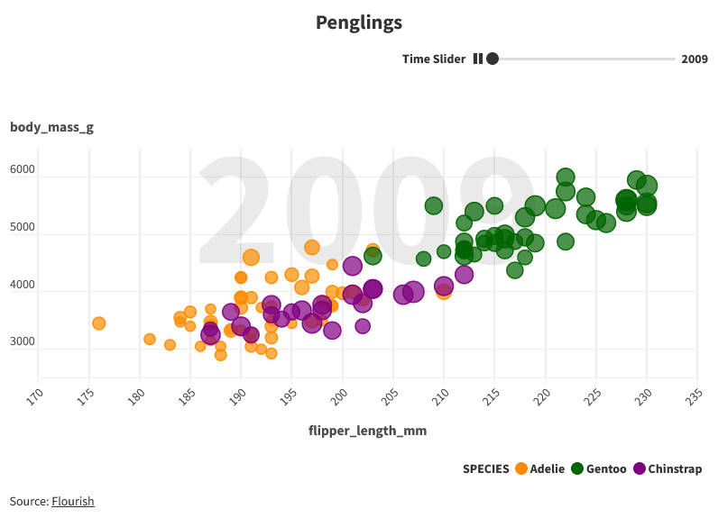
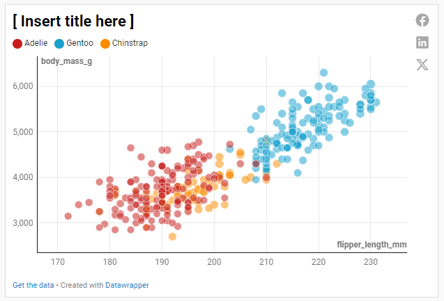
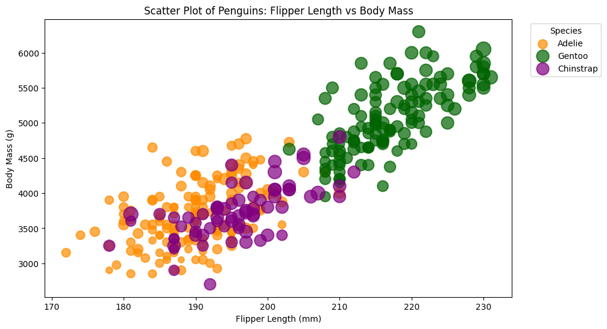
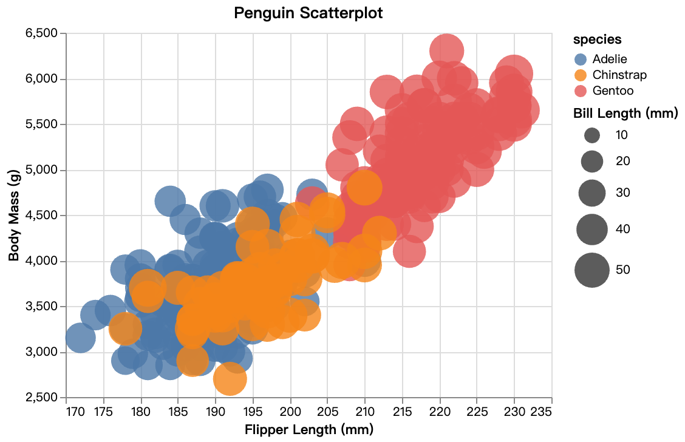
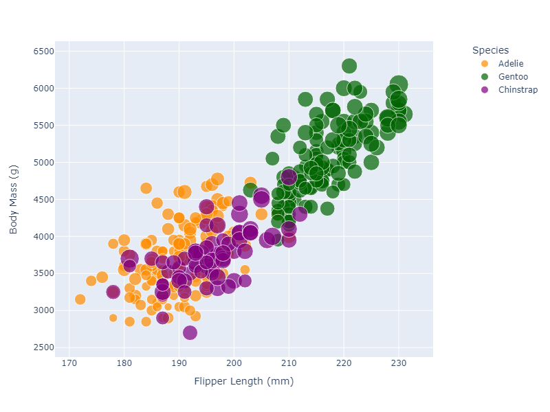
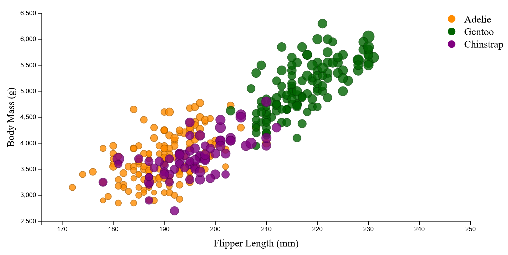

# 02-DataVis-7ways

Assignment 2 - Data Visualization, 7 Ways  
===

# FLOURISH

- The tool seemed very powerful and user friendly with options to create various types of visualization. 
- Large collection of templates that can be modified using our own data. 
- The tool seemed to not require any programming knowledge. 
- The tool seemed to support various chart types with animations. 
- I found it easy to use with ability to publish the chart very helpful. 
- No ability to add columns post data upload.
- Simple animations were easy to implement.  

**Tweaks:** I had to add an extra a coulumn representing "dot_size" to ensure that individual circles are scaled based on the area of bill. 

# DataWrapper
- DataWrapper is similar to Flourish in many ways. 
- Unlike Flourish, I was unable to add title for the legend or time slider. 
- However, the cloorblind check during the preview seemed like a great feature that I did not immediately see on Flourish plaform. 
- Ability to add columns post data upload and conduct operations. I did not use this feature.  
**Tweaks:** Similar to Flourish, I had to add an extra a coulumn representing "dot_size" to ensure that individual circles are scaled based on the area of bill. 

# Python + Matplotlib + Pandas
- Versatile programming language with collections of libraries. It can be used for creating static, interactive, or animated visualizaiton. 
- I used Pandas for data manipulation and Matplotlib for data visualizatoin task. 
- I also used Jupyter Notebook to help with easier debug and ability to run each cell individually. 
- Overall, the task was not resource intensive in terms of time and research to create this visualizaiton. 
- Matplotlib's "scatter" function allwed for easier customization of data as required by the assignemnt. 

# Python + Altair + Pandas
- Similar to above, I used Pandas for data manipulationa and Altair for data visualizatoin task. 
- I also used Jupyter Notebook to help with easier debug and ability to run each cell individually. 
- Similar to Matplotlib, Altair's "alt" function allowed for easier customizaiton and effects such as tooltip to show information based on hover. 

# Python + Plotly + Pandas
- Similar to above, I used Pandas for data manipulation and Plotly for data visualizatoin task. 
- I also used Jupyter Notebook to help with easier debug and ability to run each cell individually. 
- Plotly seems to support tooltip automatically (built-in) unlike Matplotlib and Pandas for added interactive element. 
- Unlike Matplotlib and Altair, I had to drop cells with null values. [ Hadn't checked for null or missing values until now. ]
- Pandas made data manipulation easy. 

# R + ggplot2
- I tried two differnt libraties (ggplot2 and plotly) for R. However, I ran into issues based on newer version of R. 
- ggplot2 is a very powerful and renouned library in R. I used this on Visual Studio Code IDE based on R plugin. 
- The data processing was done using R to include the normalization of bill length to scale the circle sizes. 
- The layering approach of the ggplot2 made the coe inuitive and flexible (for example: adjusting the ratios of figure)

# D3
- d3 enables allows to create interactive and dynamic visualizaiton, especially for web browsers. 
- I tried only 1 interactive aspects (tool tip) for mouse over and mouse out effects. 
- Unlike other 6 approach, using d3 was definitely most challenging. However, it is also not limited or restricted as other tools/libraries.  

## Technical Achievements
- **MouseOver Effects**: In D3,added simple interactive effects by using tooltip to show attributes of each dots. 
- **Differnt Scaling Approach for radius**: I tried couple of different ways for scaling that included min-max normalization based on bill length feature and scaling based on bill area. 

### Design Achievements
- **Consistency of Design**: My goal was to keep visualization similar to the original to compare them all as defined on the assignment. 
- **Animations:**  Used animations on Flourish and DataWrapper platforms for added interativity and addtional insights. 