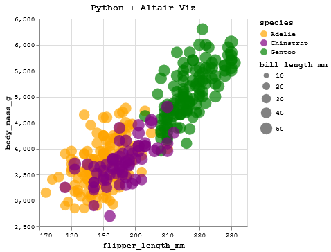
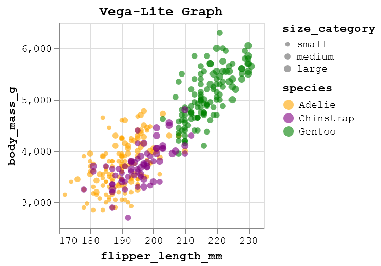
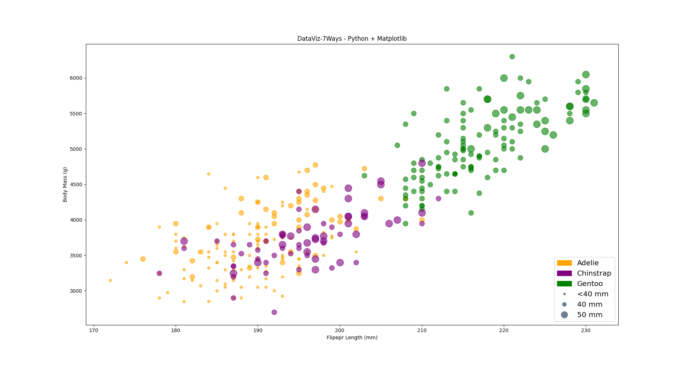
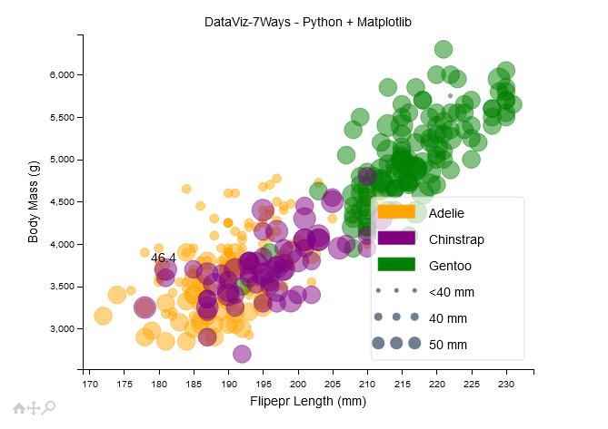
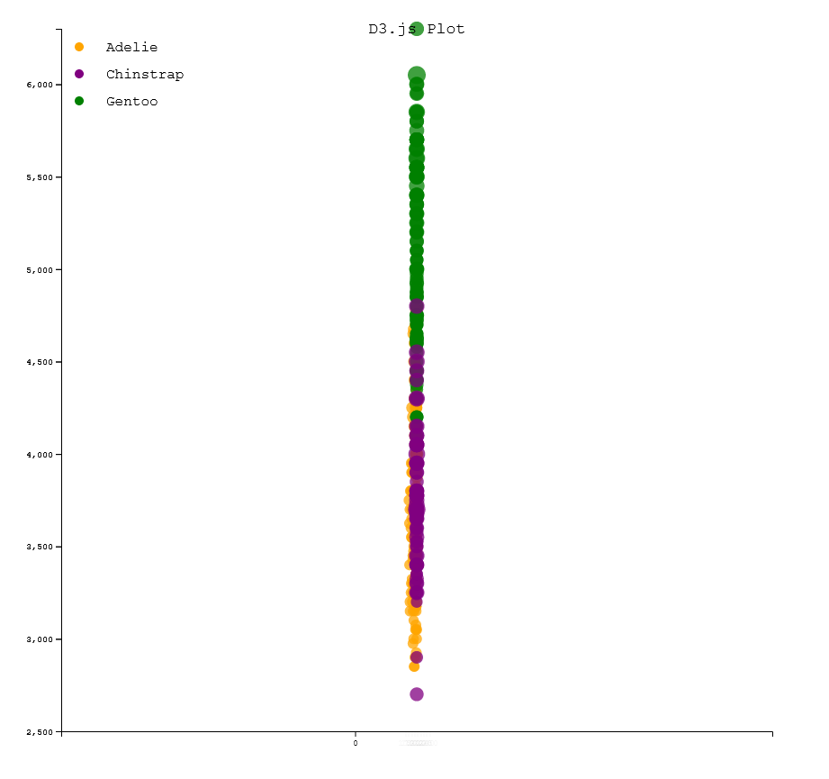
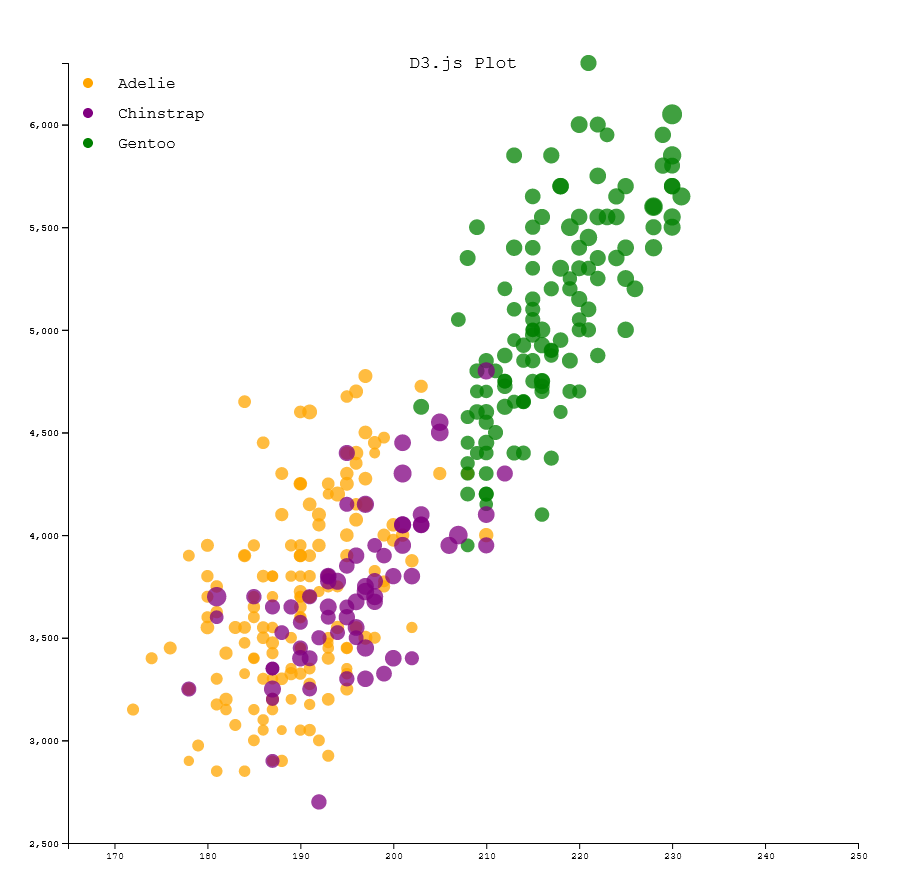
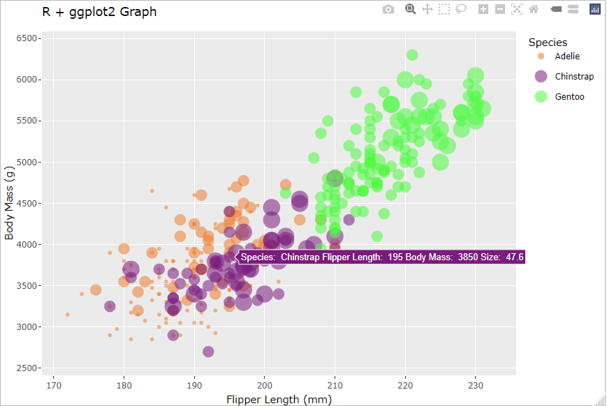
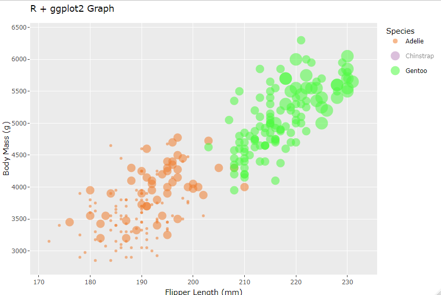
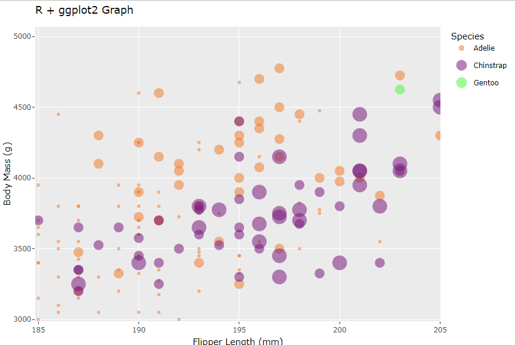

# 02-DataVis-7ways

# Assignment 2 - Data Visualization, 7 Ways

## Tool List:

1. **Python + Altair**
2. **Vega-Lite**
3. **Python + Matplotlib**
4. **D3**
5. **R+ggplot**
6. **Flourish**
7. **Data Wrapper**

# Python + Altair

Altair is a Python visualization library built on top of Vega-Lite. The way the code is structured is quite similar to how it appears in d3.js actually. I utilized the Chart() function as the main way to construct my graph while using the encodings to shape and stylize the graph. The overall process was relatively easy and simple to use. I was not entirely sure what environment to use and help me render the graph. One solution was to use Javascript and write the code as a script and load it that way, however, I ultimately settled on using Jupyter Notebook.

# Vega-Lite

Online Vega-Lite Editor : https://vega.github.io/editor/#/custom/vega-lite

After using Altair, I found that Altair was built from Vega-Lite, which piqued my interest in checking out how Vega-Lite is a visualization tool. Once again I was rather vexed as to what kind of development environment I should be using. Then I found that they had an online editor and made my visualization with that. The overall experience was quiet as it felt like I was making things in JSON format. Surprisingly, my code ended up exporting as a JSON file. (see in folder) One special thing to note when using the online editor is the way to import data. Instead of reading from a directory, I passed in a URL instead. I passed in the raw file URL generated from Github in order to make it work. However, the overall graph-making and styling is very similar to Altair.

# Python + Matplotlib

Matplotlib is another popular Python library that people use for data visualization. It is one of the key tools that I am currently using in my MQP. I have written all the graphing and data processing scripts using this combination. Yet I have never truly explored all the options offered by the library. So I spent a while trying to find out about the styling choices. I did not have too much trouble with this one since I am familiar with the tool. One new thing that I tried was making legends in a different manner. I created the legend using mpatches and mlines, which I have never done before.

I did struggle trying to make the visualization interactive. As I usually write the scripts in VS Code, I found that the visualization was not showing until I put it into Jupyter Notebook. So I have commented out the code that enables the interactive part. After that implementation, I was able to hover over the dots and that shows the bill length. However, that was how much I was able to achieve as I couldn't figure out how to make it look better or create other interactions.

# D3

I have never tried to make a scatter plot using d3, so I thought it was pretty interesting. There were a lot of tutorials and examples as to how to make a scatter plot using d3, so I did not have a lot of trouble. Something that I found rather hard was the way to add legends and other labels. Beyond that, I decided to implement something that I did not try in Assignment 1, which is animation. I implemented an initial loading animation where the data points spread out after loading as shown in the picture above. It was quite cool to see as all I had to do was redraw the axis after the initial plotting and add a delay effect on all the points.

# R+ggplot

I have had experience with R before, but I have never heard of ggplot. After watching the video, I thought that it was a cool tool. The overall process of using ggplot was relatively easy and the main point is using geom_point() to make the scatter plot. In terms of syntax, it felt very close to d3 and Altair. One troublesome thing was the way that legends were shown. In my aes() function, to shape the size of the data points, I had to use the ifelse(), but for some reason, it was used as the text for the hover display and legend. It took some research to find out how to disable that. (guide = FALSE)

The process for making this visualization was very simple. The only thing we needed was to add another library called Plotly. After creating the initial scatter plot, I passed the plot into ggplotly function and it enables interactions automatically. As shown in the pictures, we can hover over each point and see all of the information. This is one reason why I omitted most of the legends except species. If the hover gives most of the information already, then having legends again would be repetitive. We can also select species to only show points for that species as well as zoom in. This set of tools feels very convenient to use because it is very easy to use.

# Flourish

Visualization Link: https://public.flourish.studio/visualisation/16737973/

The next tool that I checked out was Flourish. It has a very straightforward process of creating the visualization. All we had to do was upload the data and select the columns to make the scatter plot with. It also has the ability to map the species to a color. I really like this tool as it is very efficient and has the most friendly UI. It took me less than 10 minutes to make this visualization. The interaction is automatically enabled on the plot as well. The default seems to be hover only, which shows the information for each data point. I was not able to find other settings to enable more visualization. I feel like this could be one of the best data visualization tools for simple purposes, as the more customized interactions still need to be developed by ourselves.

# Data Wrapper

Visualization Link: https://datawrapper.dwcdn.net/p5LaQ/1/

The last tool that I checked out was Data Wrapper. While it is still convenient enough to navigate, it felt inferior to Flourish. One of the main reasons was that the UI felt more clunky. The creation process is pretty much the same as Flourish. Most of the settings are toggles, but the naming or description felt a bit confusing. There are interaction options that can be enabled. The default one was only highlighting the selected group. I do think that Data Wrapper and Flourish are both excellent tools, especially for them being web-based.

## Technical Achievements

1. **Python + Matplotlib**: I was able to create the base visualization and enable simple hover interaction to show the value of each data point
2. **D3**: Animated visualization loading
3. **R+ggplot**: Incoorporated additional libray to enable wider interactions

### Design Achievements

1. **Consistency**: All the data visualization created shares the same upward trend as well as color scheme. Each library/system has different settings for the colors, so I tried to match that as close as possible
2. **Axis Label**: I made sure that all the axies and graphs are properly labeled with a title.
3. **Size Mapping**: Whenever possible, I made sure that the size of the data point is based on the bill_length_mm column. However, some are very hard to tell such as in Data Wrapper or some does not seem to have the option to preform that.
4. **Legends**: All visualizations has proper legends
