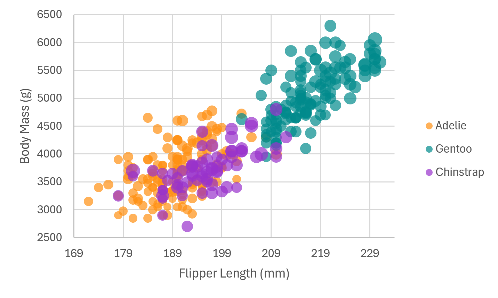
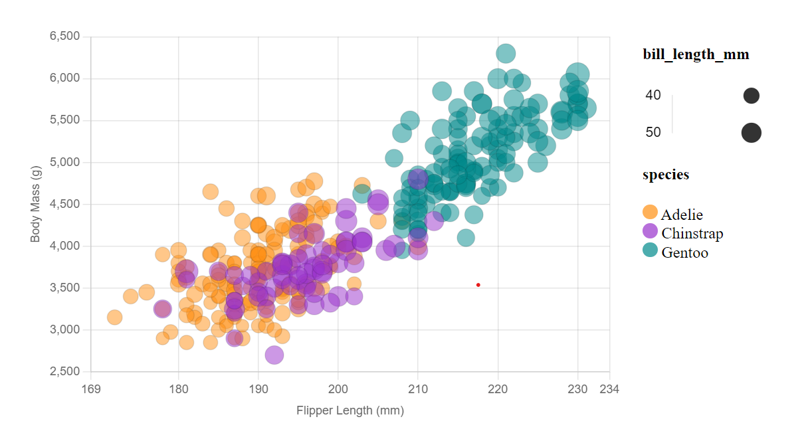
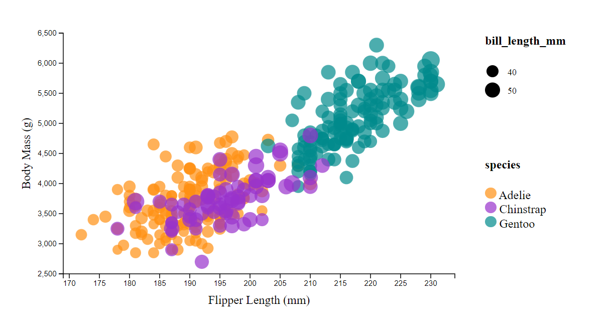
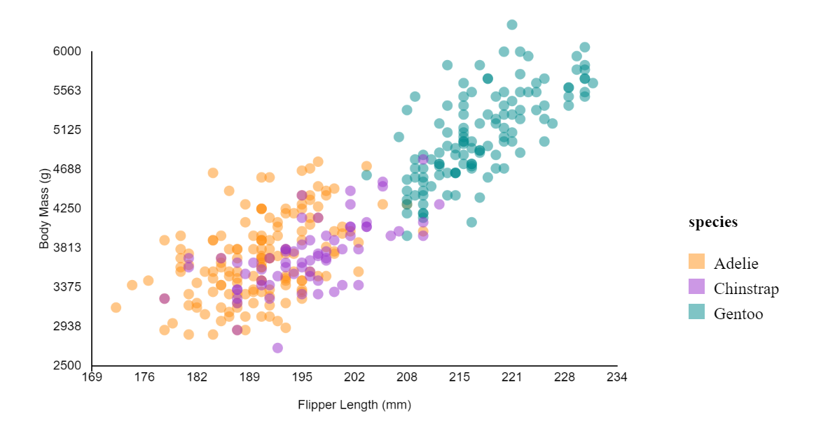
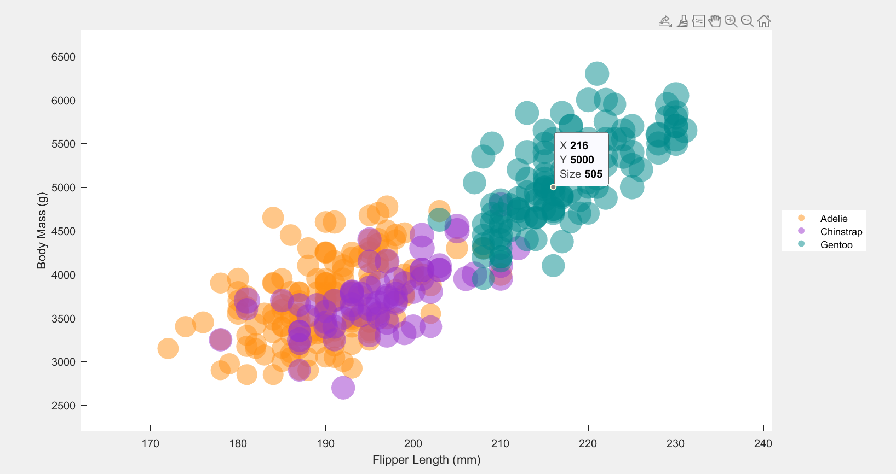
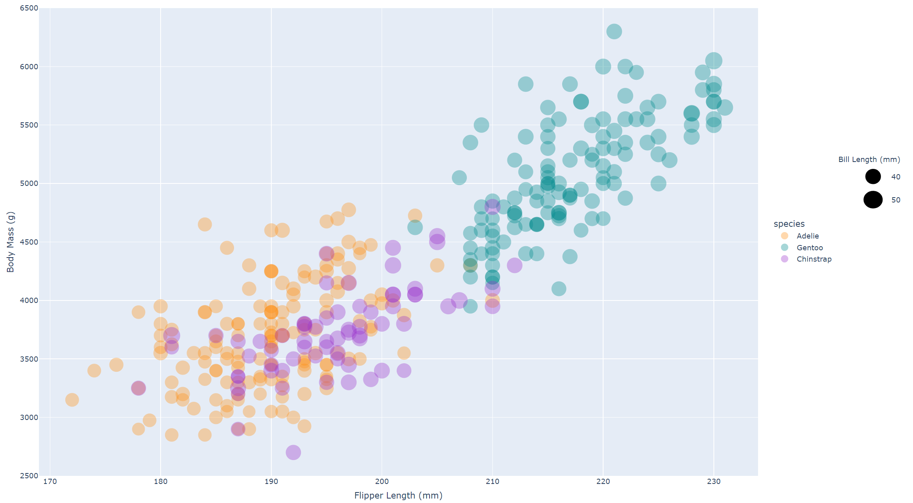
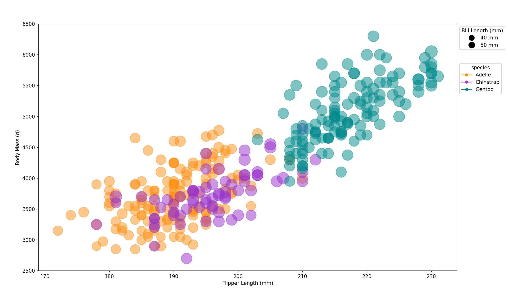

# Penguin Data Visualization Project

## Visualization Tools Used

- **Excel**
- **Chart.js**
- **D3.js**
- **p5.js**
- **MATLAB**
- **Plotly (Python)**
- **Matplotlib (Python)**

## Visualizations

### Excel
The journey began with Excel, where initial struggles were faced, particularly with formatting the CSV to suit Excel's requirements. Inspiration and guidance were found by reviewing classmates' pull requests, leading to key adjustments that facilitated the visualization process. Unfortunately, displaying a bubble size legend proved elusive in Excel.

- **Visualization**: 

### Chart.js
Next, the focus shifted to Chart.js, a familiar territory. The visualization was crafted within an HTML file, utilizing PapaParse for CSV parsing, resulting in a seamless experience.

- **Visualization**: 

### D3.js
The adventure continued with D3.js, transitioning the visualization from a JSON-based canvas object to SVG. This endeavor also employed PapaParse within an HTML document to manage data parsing effectively.

- **Visualization**: 

### p5.js
The p5.js library presented challenges, particularly in synchronizing data loading with graph rendering due to async/await issues. Efforts to implement a separate legend object and accurately represent bubble sizes encountered difficulties.

- **Visualization**: 

### MATLAB
Returning to MATLAB after some time brought a straightforward experience. The visualization was successfully implemented using standard MATLAB practices.

- **Visualization**: 

### Plotly (Python)
The Plotly library in Python, coupled with Pandas, was next. Crafting a second legend for bill length required meticulous adjustments to positioning, showcasing the flexibility and power of Plotly.

- **Visualization**: 

### Matplotlib (Python)
Finally, Matplotlib provided a rewarding conclusion to the visualization journey. Employing Pandas and Numpy, the chart creation process was straightforward, yielding impressive results.

- **Visualization**: 

## Reflections and Learnings

Each tool and library presented unique challenges and learning opportunities, from data preprocessing in Excel to async/await issues in p5.js, and from familiar ease in Chart.js to new insights in Matplotlib. This project not only enhanced my data visualization skills across a spectrum of tools but also underscored the importance of flexibility and persistence in data science.
