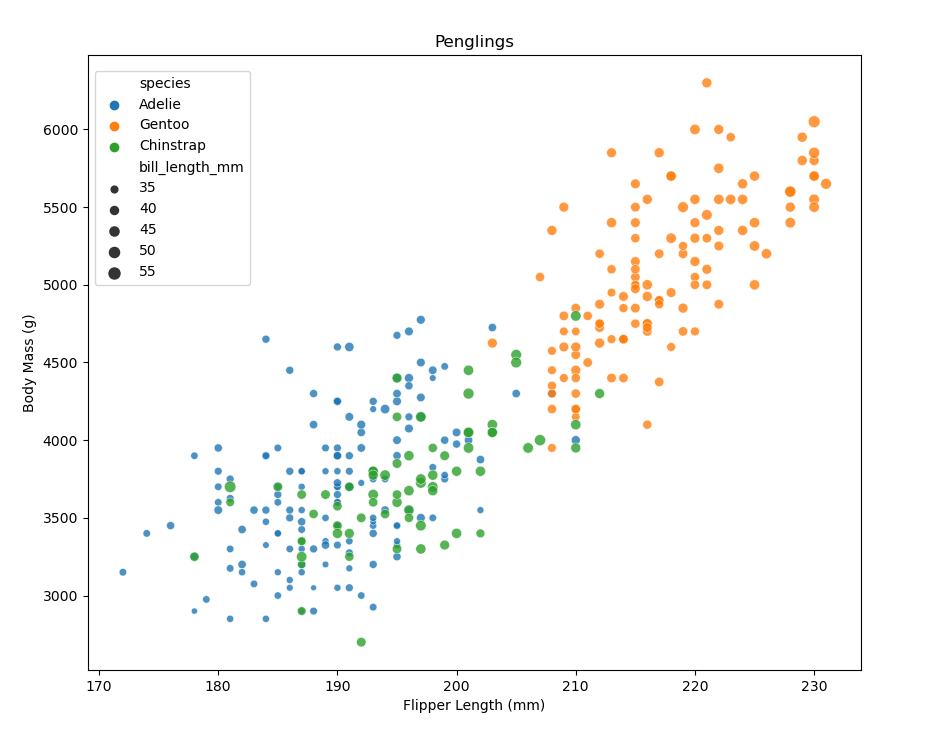
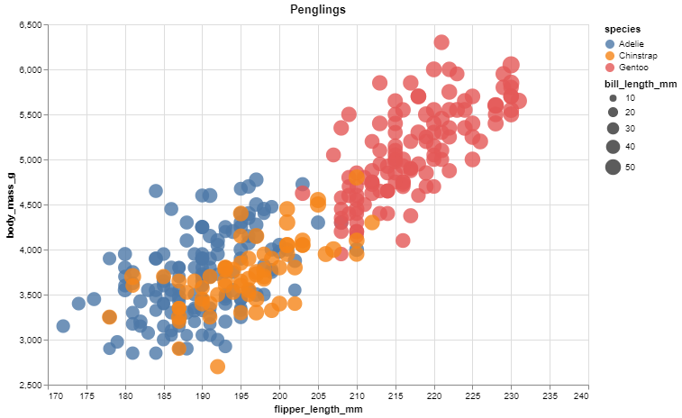
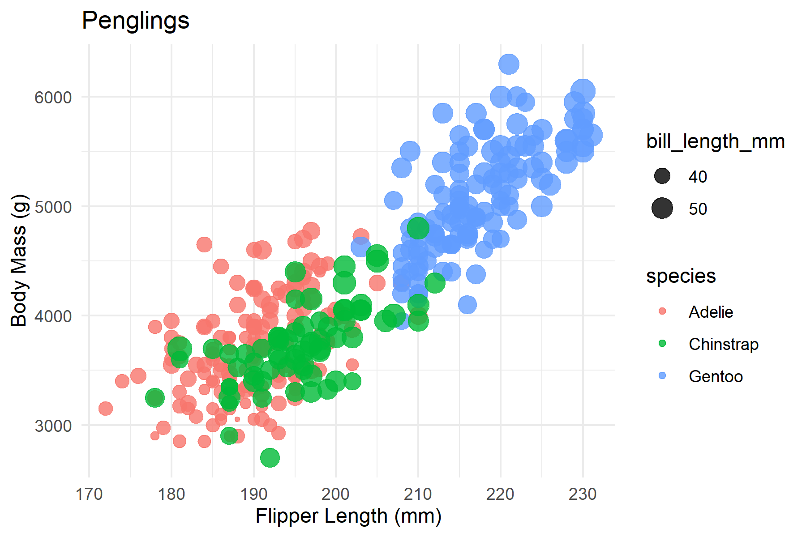
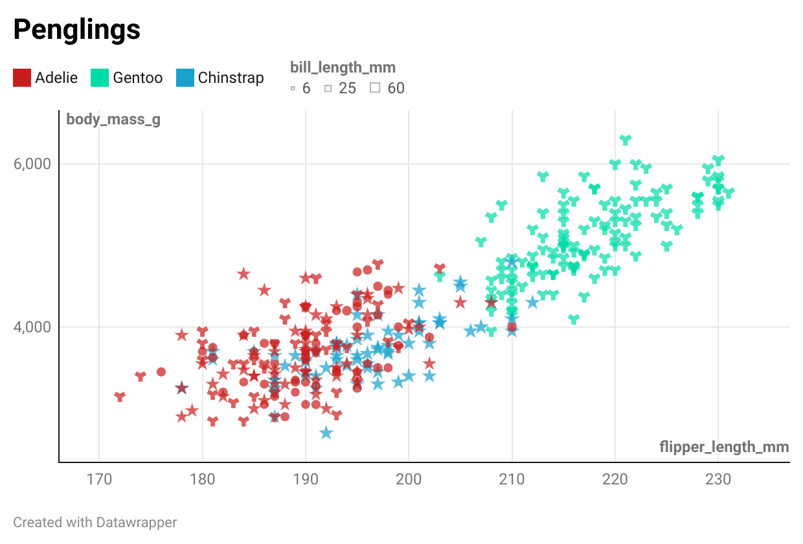
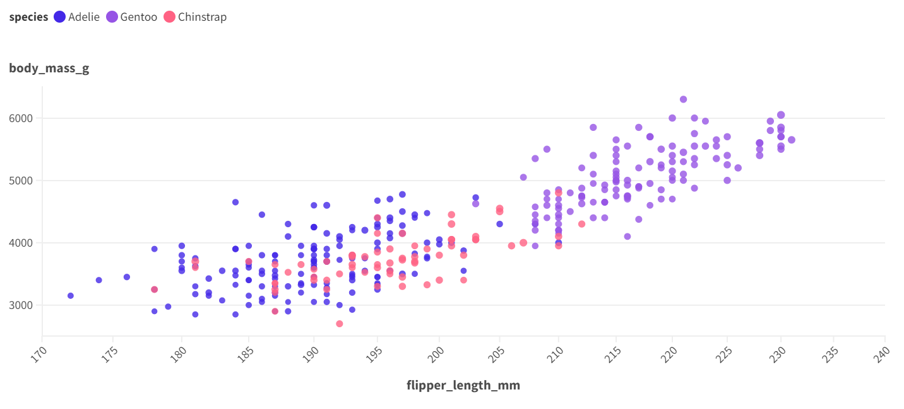

# 02-DataVis-7ways

Assignment 2 - Data Visualization, 7 Ways  
===

## Python Plot 1 -> Matplotlib + Seaborn

I created my first plot using python. 
I employed the Matplotlib and Seaborn libraries. 
These libraries work very well together and writing the code to output the plot was very straightforward and simple. 

## Python Plot 2 -> Altair

## Tableau

## RStudio -> ggplot2

## Javescript -> d3

## DataWrapper

## Flourish

