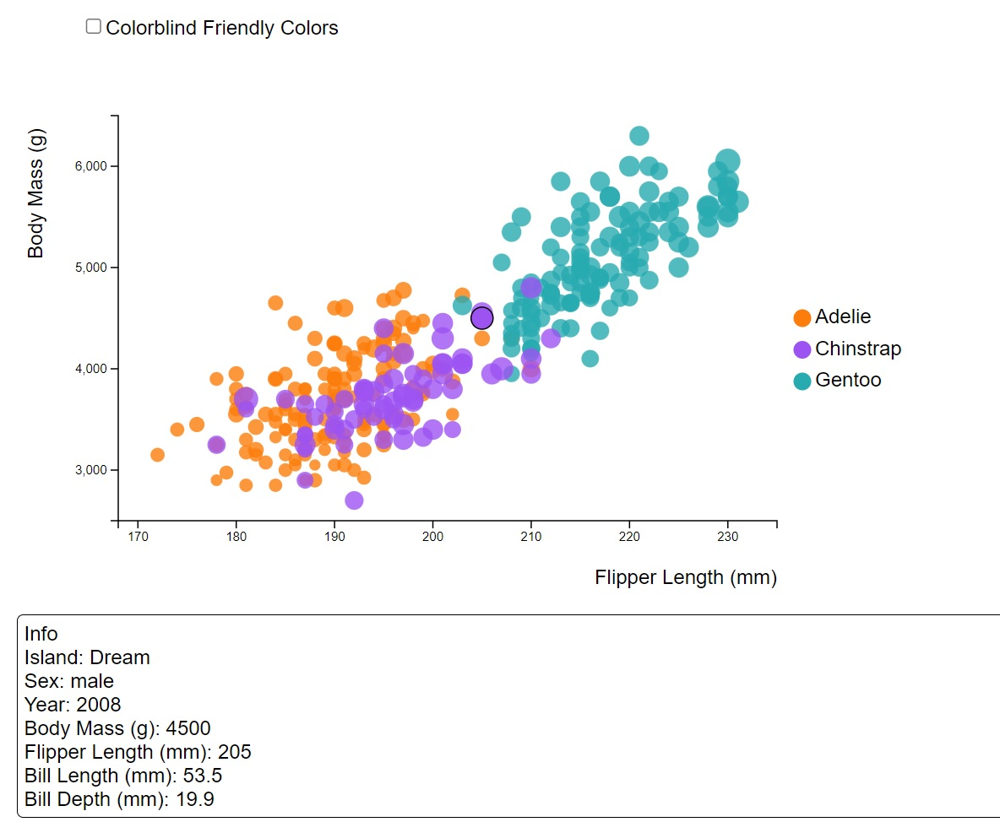
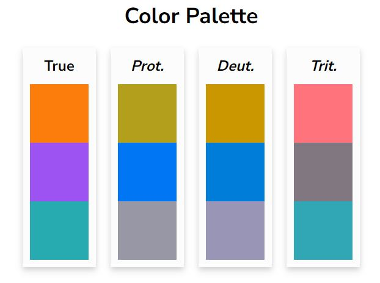
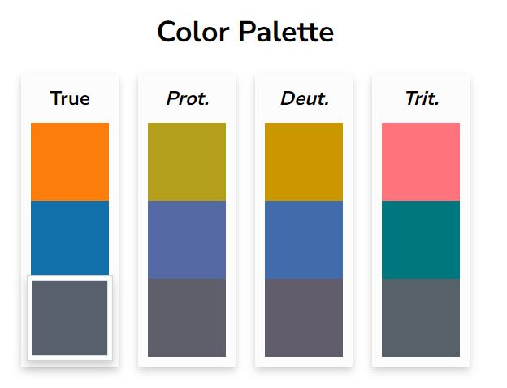
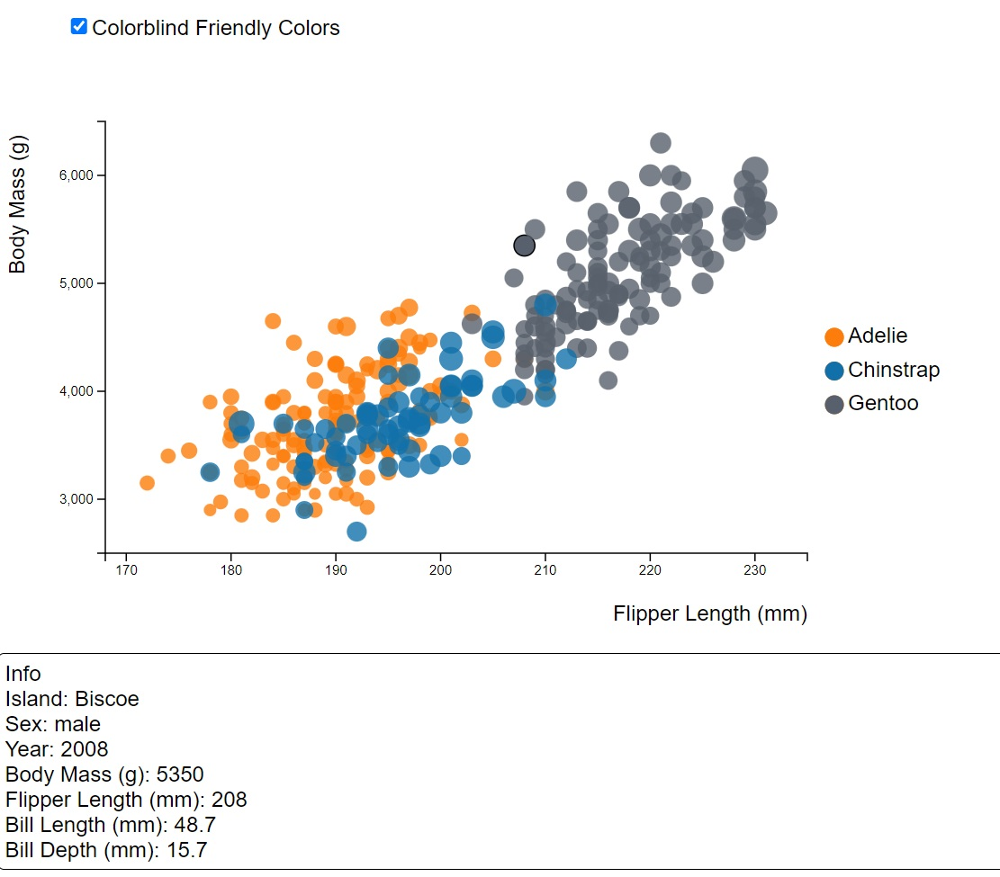

# 02-DataVis-7ways

Jack Lafond

CS573

Assignment 2 - Data Visualization, 7 Ways  
===

# Excel

For my first tool I used excel. Excel is nice to use as it is integrated well with csv data and you can look/manipulate the tabulated data as you are making visuals. Initially I tried to create this graph using excel's scatter plot, but later realized that the scatter plot had no option for sizign the dots and instead I needed to use a bubble chart. 

While excel is integrated nicely with csvs there are some weird bugs that can happen. I found that my data was reading as strings rather than numeric which lead to some weird graphs when trying to get it working. I was able to fix this by changing the values int he workbook to numeric. I also had a hard time getting the points to color based on species. To get this working I had to create three seperate columns each with a different species label, adn for the values that did not correpsond to that species I had to set those cells to N/A values. This only took a few commands but it was still mildly annoying. 

However, once it was working, the customization is pretty thorough. It is easy to change the axis scales, tick mark intervals, and easy to add titles and a color legend. Excel also has the ability to add custom colros which was nice for color consistency. I did find that there was no option for a size legend and there was also no option to have the start of the tick count be different than the start of the axes.

Overall excel is a nice tool to use if you are going to be manipulating data, and it provides a good amount of customizability without getting into any code.

# Tableau

Tableau is another tool for visualizing data without getting into code. Using tableau is even easier than excel as you don't have to select a chart type, you can just drap and drop attributes on rows or columns to start building your graph, and you can drag and drop on detail or colors to add those featrues as well. 

Creating this chart was very fast and by default tableau adds legends for you for any encoding that you do which is nice. There is customizability to change the axis, including labels, fonts, tick marks, scale, and tick start and end. One complaint I do have is that to get custom colors you need to change some files in your tableau set up which is a little annoying, but luckily the colors I needed were in the selection already. Another complaint is that in oreder to make another chart with a different color scheme on species I had to create duplicate data since tableau doesn't support multiple color schemes on the same series.

Tableau like excel is a nice tool to use to avoid code, while still having a good amount of customizability. While you can directly manipulate values in excel, tableau allows for formulas and calculations to make new data, and tableau has another tool for data prep that allows you to join data from different sources before you start visualizing which is a nice thing to have.

# Flourish

Flourish is a web based tool that allows you to build visualizations all online, and without the need for any code.

I found this tool to be very nice for building a quick, simple visualization. Flourish provides you with templates and fake data to start with so that you can interact with the visualization and understand how it works right away. The inerface allows you to load your own data very easily, and select what attributes correspond to which features of your vis.

There was limited customizability, but for a browser based tool its not bad. I was able to select a font, but only from a small pool, I was able to change the axis scales, but not the tick intervals. I was able to encode size, however I could only change the max size not the range. I was able to select custom colors which was nice. There was also no option for a legend for size, and moving around the text is limited.

Overall Flourish is a nice tool for someone trying to make a quick and clean visualization that doesn't want to download any apps and doesn't need to much customization.

# DataWrapper

Data Wrapper was another web based tool for visualizations.

This interface was nice to use it had a good data loading phase which reminded me of a mini tableau prep. There was also a lot of customizability for a browser tool. I was able to customize scales, tick intervals, and tick starts. They include legends for both color and size, however there is no customization for dot sizing. The axis titles were also changable, and custom colors could be used. 

Between Flourish and DataWrapper I think it depends on which visualization you are trying to make and the customizations that are important to you, when trying to choose one browser tool vs the other.

# Altair

Altair is a python library for data visualization.

I enjoyed using this library as I use python a lot when dealing with data so being able to go from storing and manipulating data in a pandas dataframe to creating a visualization is very nice.

Altair offers lots of customization with not many lines of code required. I was able to change axis scales, customize the exact tick marks I wanted, set titles, encode the dot size and opacity, and set the colors all within 9 lines of code. Some other benefits of using code are increased customization like being abel to set the scale raneg for the dot sizes. I was also able to use custom colors which again is nice for consistency. The legends came as a default which is a plus.

Overall altair is nice to use and one of my favorites as it integrates well with pandas, which I use for most of my data handling and manipulation. The balance of tons of customizablity with limited lines of code was very nice.

# R + Plotly

Plotly is another data vis library available in python and R.

This library was very similar to altair, and was slighlty more readable. Like the other code tools there was lots of customizability. I was able to set the scales, custom tick marks, axis labels, a legend, and custom colors. Like plotly I was also able to customize the sizing scale which can be important for any plot that utilizes size as and encoding. 

Another benefit of this is that R is a statistical language. Being able to go from statistics and numbers, to creating nice, highly customizable visualizations is a huge plus. These visualizations will help to convey what the data you are using, and the numbers you are calculating actually mean. 

# D3

D3 is a data vis framework in javascript.

Being in javasript was very nice as you can manipulate html much more than other languages which resulted in the most customizability of any library or tool that I used. 

I was able to create custom legends, select any font I wanted, customize every part of the axes, customize the sizing of the dots and their scale, use custom colors, and anything else I wanted to use. Connecting to the data was easy as d3 has many methods for different data formats. 

Another thing that is nice about d3 is the ability to add interactivity. I was able to add a checkbox to change the coloring to more color blind friendly colors, rather than creating to seperate visualizations as I had been doing. I also added a popup feature that displays the information of a dot as you hover over it. The current dot is also outlined and the opacity is set to 1 to better highlight which dot is currently being hoverred over. 

Overall d3 gave the most freedom to create, encode, and interact, however this does come with the requirement that some javascript and html knowledge is needed beforehand. With that being said there is tons of documentation online for almost anything in d3 so there is often help when you are trying to do something.

# Technical Achievements
For my technical achievements I added some good interactivity for my d3 visualization.

I added a checkbox to change the colors from the normal scheme to a more colorblind friendly scheme (explained in design achievements) and I inlcuding hover interactivity.

On hover a dot is outlined in a dark stroke and its opacity changes to 1 so that it is highlighted from the rest of the graph. Below the graph a popup displays all the information about that current data point. When the mouse is no longer hovering on that data point it is no longer highlighted and the popup disappears.

# Design Achievements
For design achievemnts I tried to keep the graphs as consitent as possible. I used the same exact custom colors when I could, and I used the same or similar fonts when possible. I also tried to include all legends when possible. 

I also tried to create a more colorblind friendly color scheme and implemented it for every graph I made. I made this color scheme based on this site, [Coloring for Colorblindness](https://davidmathlogic.com/colorblind/#%23D81B60-%231E88E5-%23FFC107-%23004D40).

The normal colors scheme is already pretty good and each color can be differentiated for most types of colorblindess:

However I was able to make a palette that stays a little more consistent across these types, so that way having a converstaion about them may be easier:

While its not perfect, the orange tends to stay between yellow and pink, the blue tands to stay blue, and the gray stays as the darkest color. The blue and orange also correspond to the chinstrap and adelie species which overlap more, and this constrast can also help when dealing with the overlap.

Here are all of the seven graphs but in the new color scheme:

