Assignment 2 - Data Visualization, 7 Ways  
===

CS573 Data Visualization, Spring 2024

Jingni Cai

In this projuect I successfully make a visualization using 7 different tools, including d3.js, seaborn, ggplot, plotly, Altair, Flourish, and Tableau.

01 Javascript + D3
---
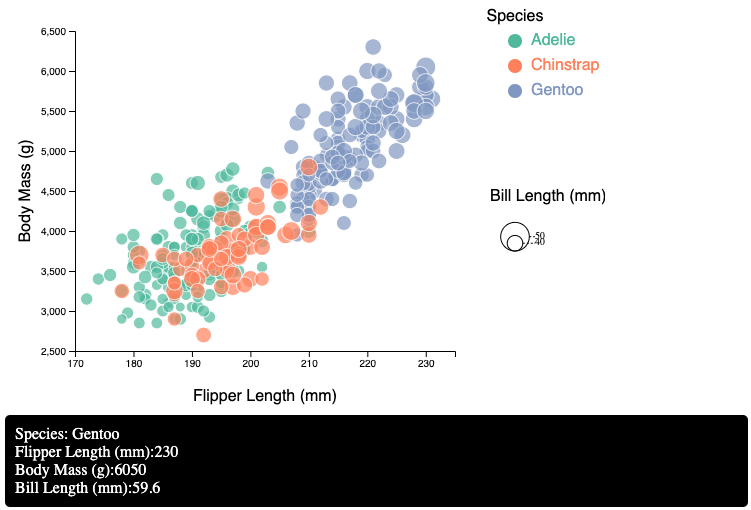

It's really fun to create this bubble plot with D3. Compared to other tools, we can implement various interactions as desired. In this project, I utilized constant variables such as width and height to calculate the position of the plot, x-axis, y-axis, and the positions of the legends (In Assignment 1, I performed all calculations on paper and pen).

I read the data from the local file system using d3.csv('file_path'), which is quite simple and straightforward. I used d3.scaleSqrt() to create a scale for bubble size and d3.scaleOrdinal() to make a scale for bubble color. I created a tooltip div and three functions (showTooltip, moveTooltip, and mouseLeaver) for interaction. When drawing the scatter plot, I added several dots using svg.append().selectAll('dot').data(data).join('circle'). I applied my color scaler and size scaler for the attributes 'r' and 'fill'. When a user hovers their mouse over a specific species, I reduce the opacity of all groups to 0.05 and set the opacity of the selected one to 1. I used the size scaler to create the Bill Length legend.

Technical Achievements:

* Interactive tooltips display detailed information about the data point where the mouse is pointing.
* Interactive legend: When the mouse hovers over a species, the corresponding data points in the plot will appear, while the data points belonging to the other two species will fade out.

Design Achievements:

* Color mapping to species.
* Size mapping to Bill Length.
* set the capacity of circles to 0.7 for a semi-transparent effect.
* Legends for color mapping to species and size mapping to Bill Length.

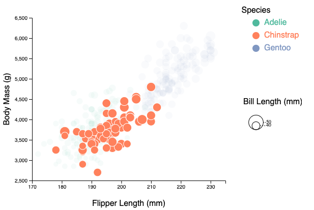
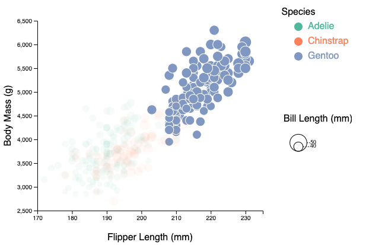
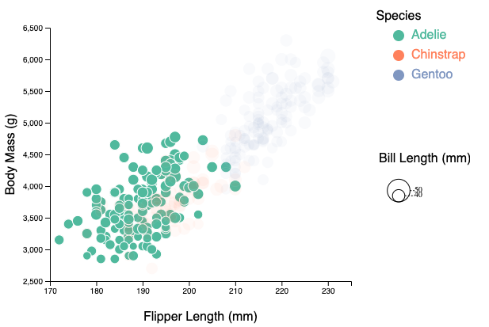

02 Python + Plotly
---
Plotly is a visualization tool that allows for interactions, and Plotly graphs can be embedded in any HTML page. One disadvantage is that it takes a considerable amount of time to calculate and render when dealing with large datasets. In comparison to commonly used data visualization tools like Matplotlib, Plotly provides easy customization options for colors, fonts, markers, and labels.

With Plotly, you can create a bubble plot with just one line of code. However, for this project, I aimed to incorporate additional technical and design features, resulting in a more intricate bubble plot than what is typically seen. I calculated the optimal sizeref value for the bubble plot using the maximum value of bill_length_mm. Initially, we create a figure, setting the title, properties for the axis, and the background color. Then, we add scatters for each species using go.Scatter(). This enables users to interact with the plot by clicking on the color legends, showing only the group of species they are interested in. Additionally, I added a 'text' column to the original dataset to display a comprehensive tooltip message.

At the moment, the bubble size legend is not supported, as per the official replies: [1](https://github.com/plotly/plotly.py/issues/3505), [2](https://github.com/plotly/plotly.js/issues/5099)

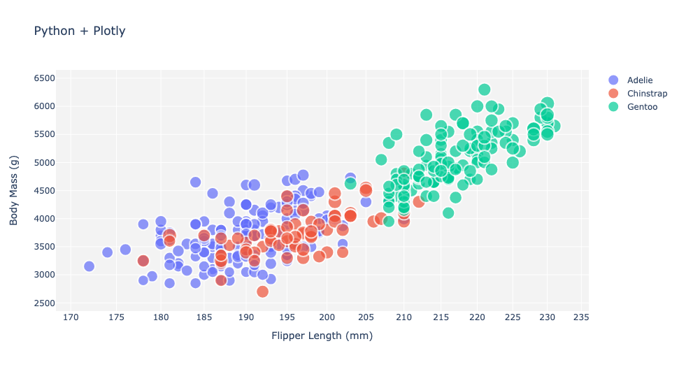

Technical Achievements:

* Interactive tooltips display detailed information about the data point where the mouse is pointing.
* Interactive legend: When the mouse hovers over a species, the corresponding data points in the plot will appear, while the data points belonging to the other two species will fade out.

Design Achievements:

* Color mapping to species.
* The background grid.
* set the capacity of circles to 0.7 for a semi-transparent effect.
* Legends for color mapping to species and size mapping to Bill Length.
* Allow use to zoom in and zoom out

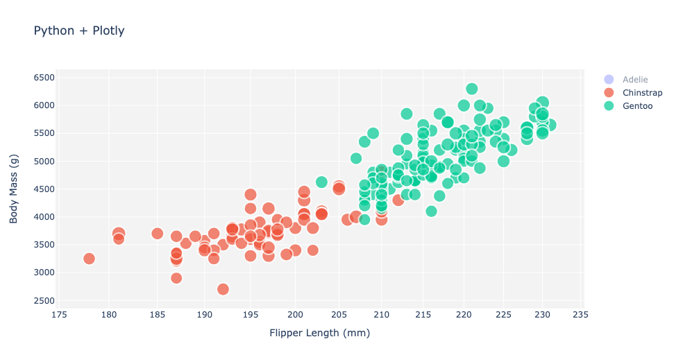

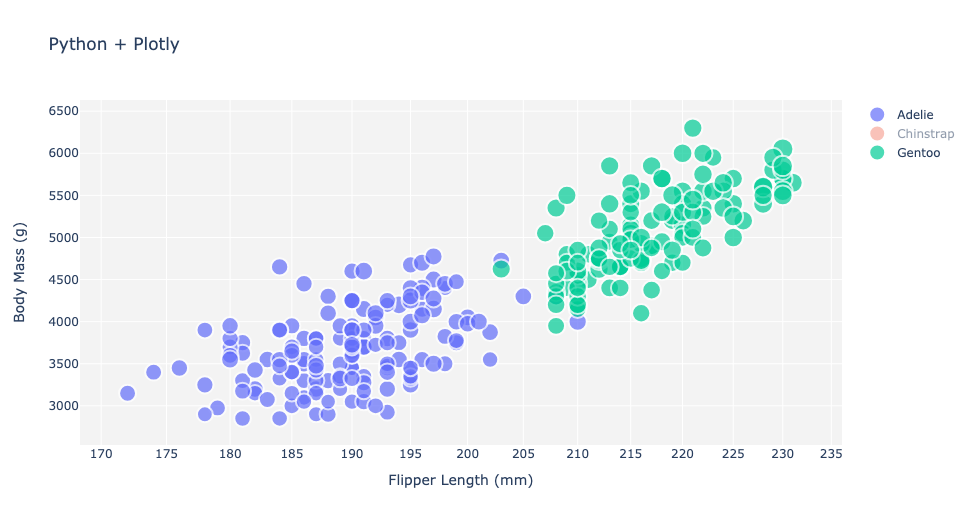
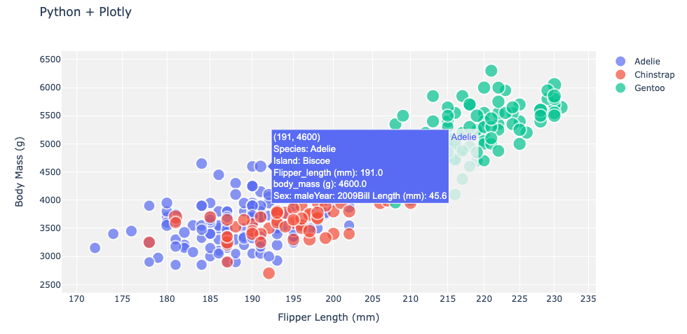
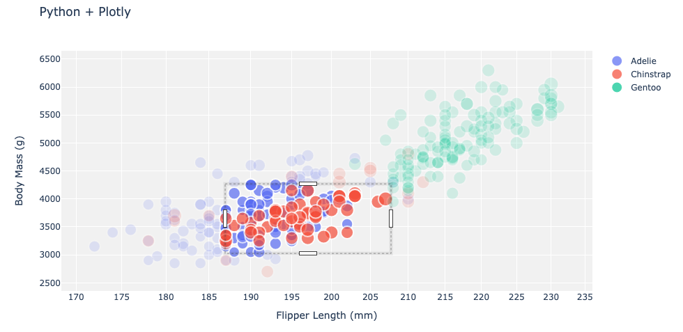

03 Python + Seaborn
---
Seaborn is a popular visualization package in the Python ecosystem. We can easily generate a bubble plot using the seaborn.relplot() method. By passing parameters such as "x='flipper_length_mm'", "y='body_mass_g'", "hue='species'", and "size='bill_length_mm'", we can create a basic bubble chart with color mapping to species and size mapping to bill length. It's a straightforward tool that users can utilize to create a static data visualization plot.

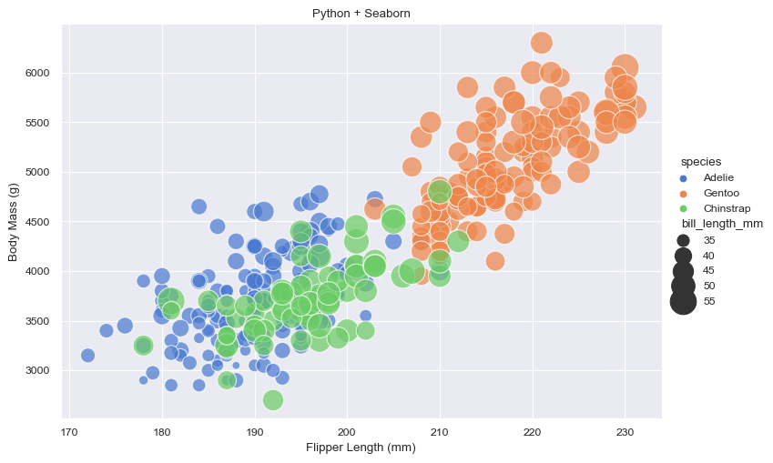

Technical Achievements:

* implemented the plot using a single line of code

Design Achievements:

* Color mapping to species.
* The background grid.
* set the capacity of circles to 0.7 for a semi-transparent effect.
* Legends for color mapping to species and size mapping to Bill Length.

04 Python + plotnine (ggplot)
---

plotnine is like "the python version" of ggplot. It is an implementation of a grammar of graphics in Python based on ggplot2. It uses quite similar grammar with ggplot. The implement is also very simple and straightforward. It can be a good choice for people who want to generate static plots. 

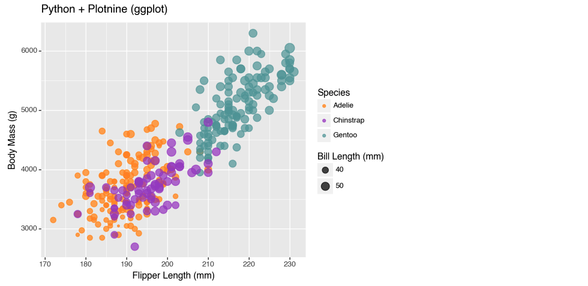

Technical Achievements:

* make a comparison bubble plot using facet_wrap('island') (the implementation is much easier than using matplotlib/seaborn, since we don't need to create subplots and add plots to each individual subplot.)

Design Achievements:

* Color mapping to species.
* Size mapping to bill length
* The background grid.
* set the capacity of circles to 0.7 for a semi-transparent effect.
* Legends for color mapping to species and size mapping to Bill Length.

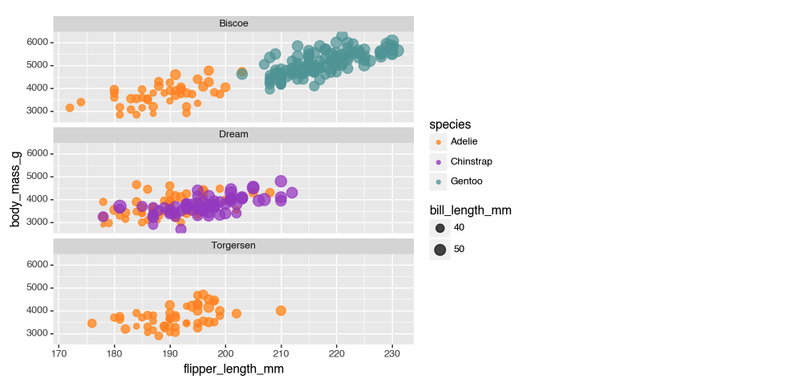

05 Python + Altair
---
I've never heard or used Altair before, and I find it enjoyable to use. We can implement various kinds of interactions as desired. I used alt.Chart().mark_circle().encode() to create a basic bubble chart. By passing parameters such as alt.X, alt.Y, alt.Size, and color, we can generate a bubble chart with color mapping and size mapping. Additionally, I created a stacked bar plot beneath the bubble chart. The combination of multiple plots turns it into an interactive dashboard. When people filter out data using any plot in the dashboard, the data in the other plot will change correspondingly.

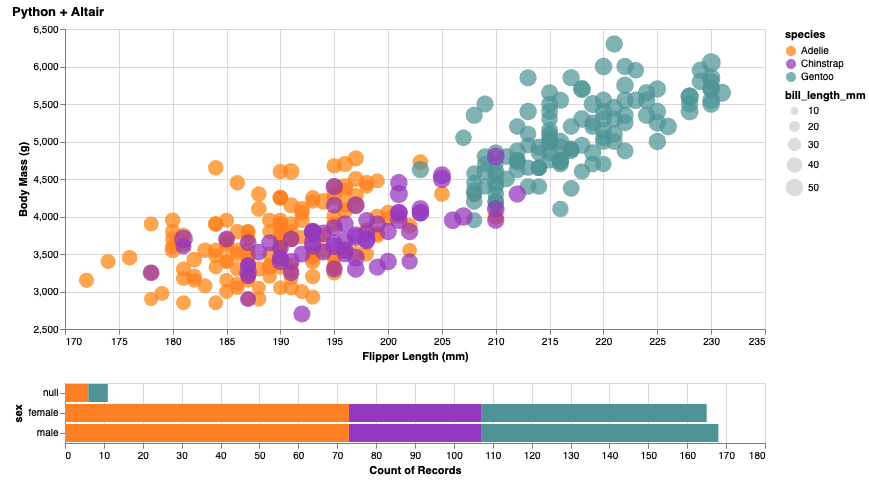

Technical Achievements:

* User can select a range of values in x-axis to filter out the unselected data
* I made a interactive dashboard. When people filter out data using any plot, the data in the other plot will change correspondingly.
* 

Design Achievements:

* Color mapping to species.
* Size mapping to bill length
* The background grid.
* set the capacity of circles to 0.7 for a semi-transparent effect.
* Legends for color mapping to species and size mapping to Bill Length.

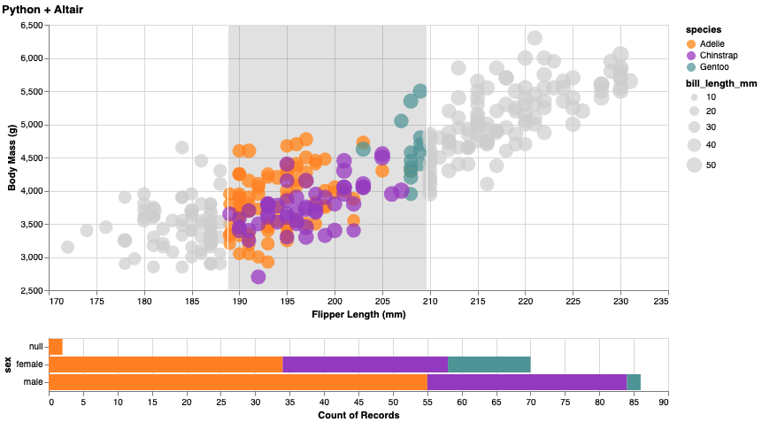
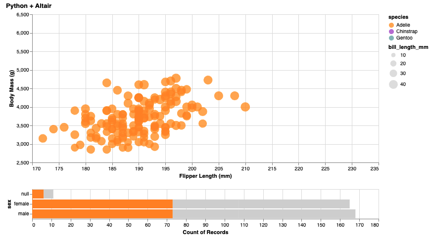
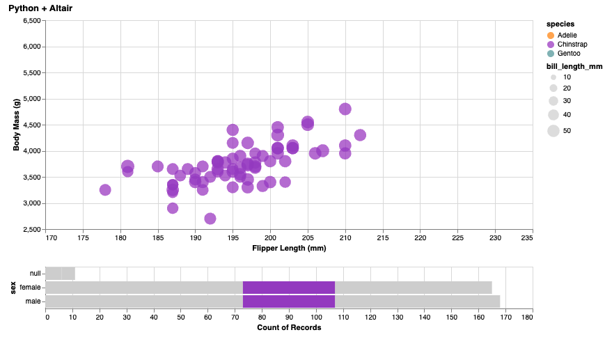
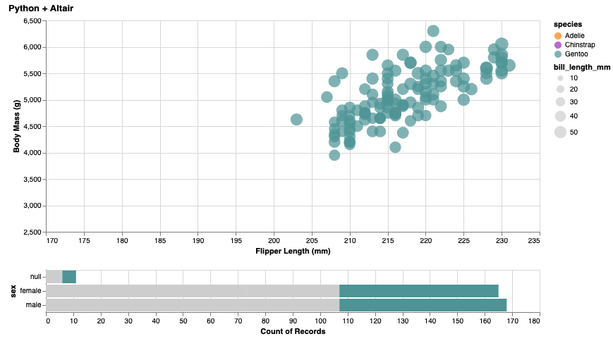

06 Flourish
---
Flourish is simple to use, but its functions are also limited compared to other tools. For example, you are only allowed to place the legend in some specific position. I believe it's a cool tool for illustrating historical changes in data with automatic animation. While it's straightforward, it meets most requirements and offers interactions such as displaying tooltips when hovering the mouse and filtering out species group data.

Two legend is not supported.
Bubble size legend is not supported.

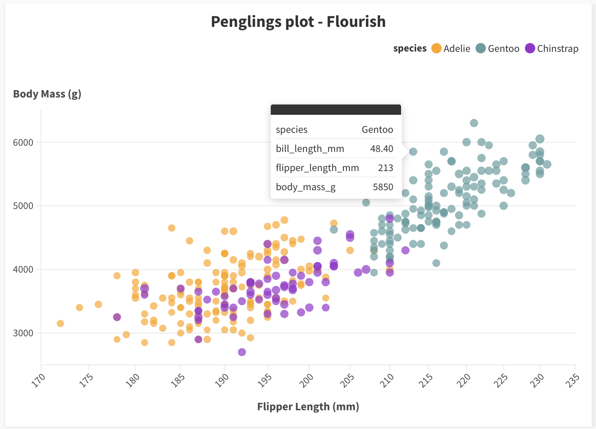

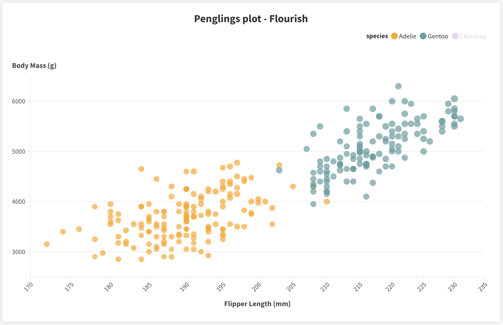

Technical Achievements:

* Interactive tooltips display detailed information about the data point where the mouse is pointing.
* Interactive legend: When the mouse hovers over a species, the corresponding data points in the plot will appear, while the data points belonging to the other two species will fade out.

Design Achievements:

* Color mapping to species.
* Size mapping to bill length
* The background grid
* set the capacity of circles to 0.7 for a semi-transparent effect.
* Legends for color mapping to species

07 Tableau
---
It's easy and enjoyable to create an interactive dashboard using Tableau. I made several plots and selected three to combine into my final dashboard. (The <> logic works here). I added interactive filters on my dashboard, allowing data to change in each plot correspondingly. It's cool to create a dashboard without writing any code (for this visualization) and simply drag and drop elements. But I can imgaine that it's going to be slow when the dataset is large.

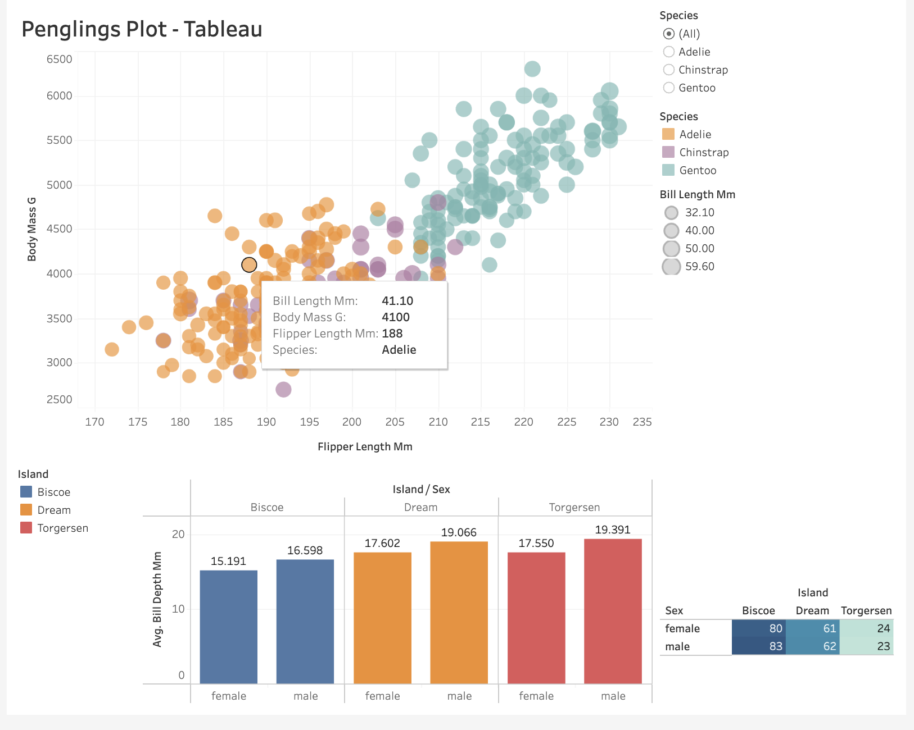

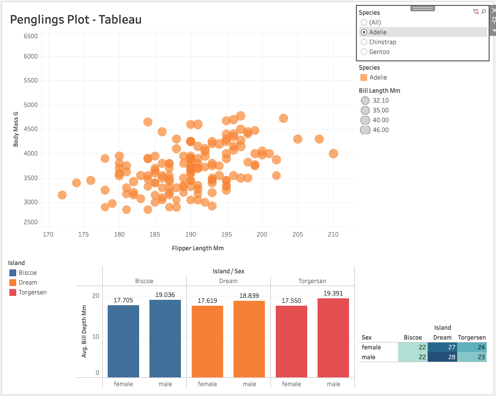
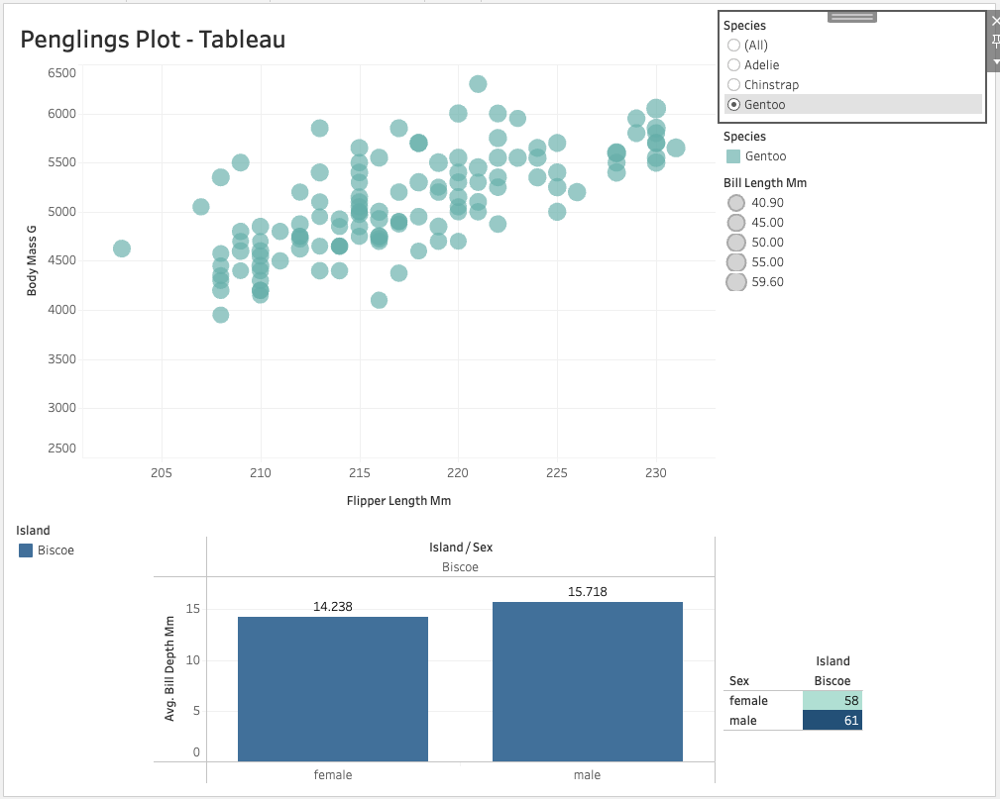

Technical Achievements:

* Interactive tooltips display detailed information about the data point where the mouse is pointing.
* Interactive legend: When the mouse hovers over a species, the corresponding data points in the plot will appear, while the data points belonging to the other two species will fade out.
* Data changes in each plot correspondingly and simultaneously based on the interactive filter.
* Implemented additional plots along with the bubble chart.

Design Achievements:

* Color mapping to species.
* Size mapping to bill length
* The background grid
* Set the capacity of circles to 0.7 for a semi-transparent effect.
* Legends for color mapping to species and size mapping to Bill Length.

reference:
---
1. https://stackoverflow.com/questions/57417164/is-there-a-way-to-calculate-optimal-sizeref-value-for-plotly-scatter3d 
2. https://flourish.studio/examples/
3. https://altair-viz.github.io/gallery/seattle_weather_interactive.html
4. https://plotly.com/python/line-and-scatter/
5. https://issuu.com/dezinemagazine/docs/dezine_-_issue_06/s/19734
6. https://d3-graph-gallery.com/graph/bubble_template.html
7. https://d3-graph-gallery.com/graph/bubble_legend.html
