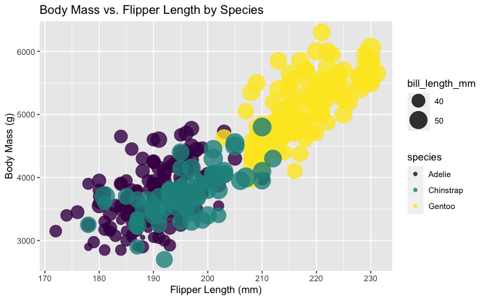
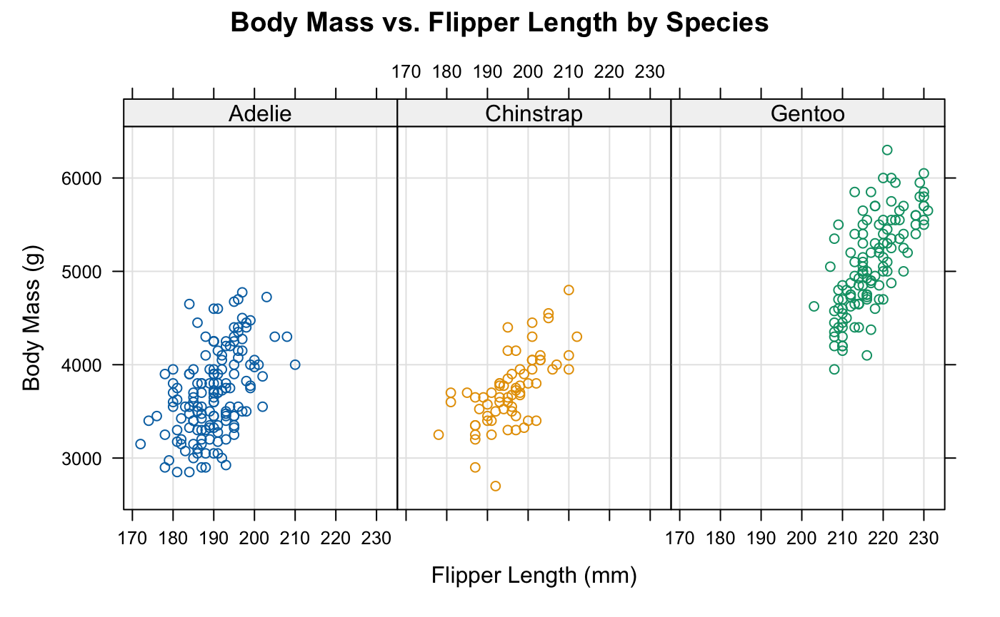
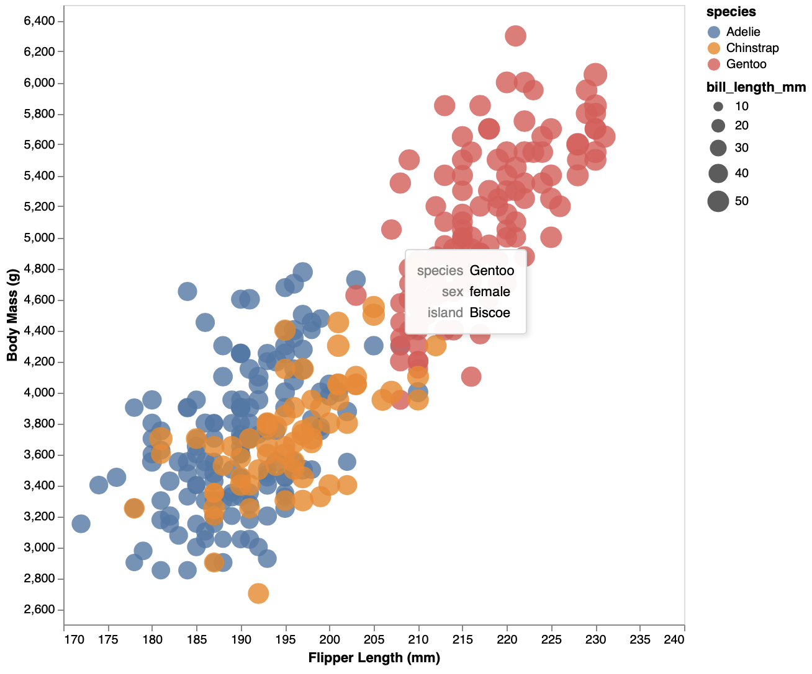
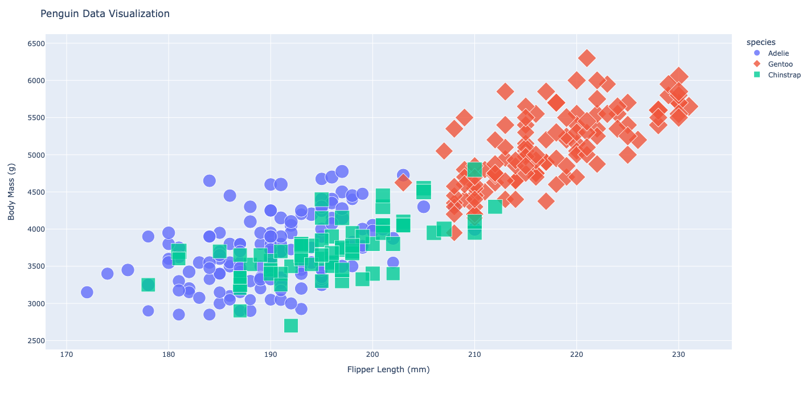
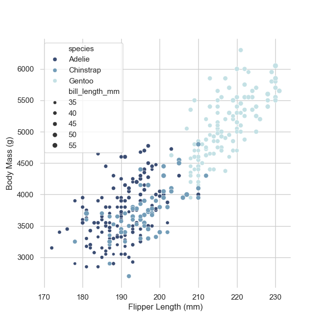
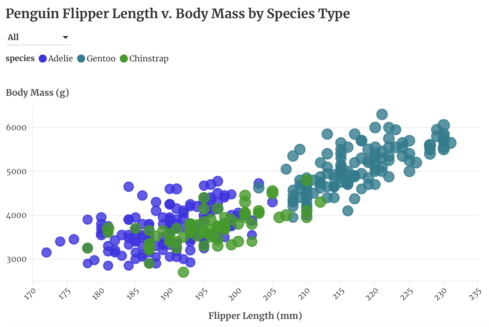
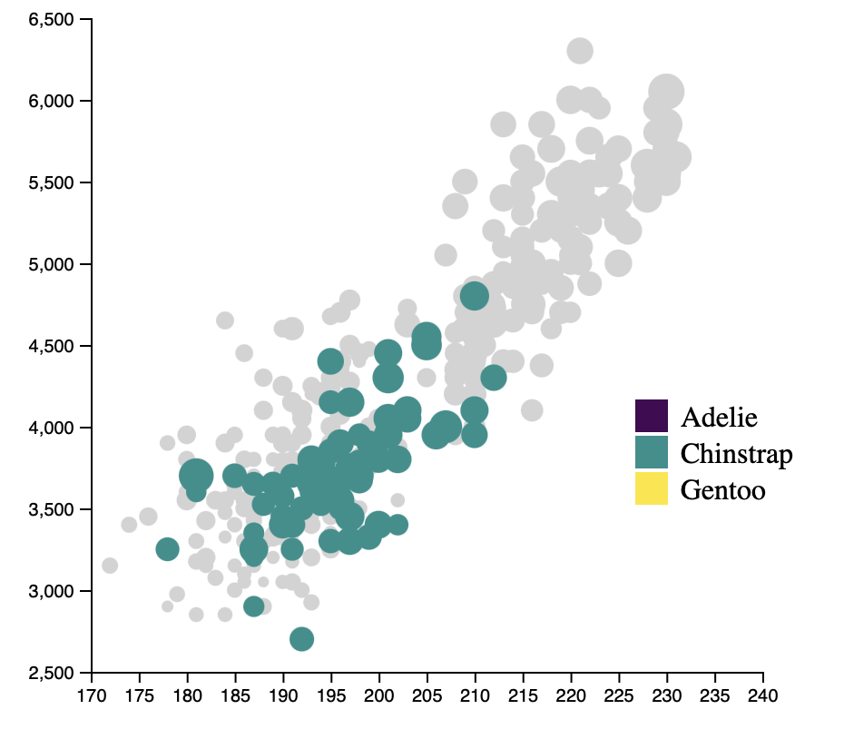

# 02-DataVis-7ways

Assignment 2 - Data Visualization, 7 Ways  
===

Libraries, Tools, Languages
---
The 3 libraries I used include: `Python, R, JavaScript` with tools including `d3, altair, plotly, seaborn, ggplot, lattice, and Flourish`.

# R + ggplot2 + R Markdown

R is a language primarily focused on statistical computing.
ggplot2 is a popular library for charting in R.
R Markdown is a document format that compiles to HTML or PDF and allows you to include the output of R code directly in the document.

To visualize the penguins dataset, I made use of ggplot2's `aes()` function to visualize the correct data with the correct color categories and size dimentions. Additionally, I used `geom_point()` to adjust the opacity of the data points distributed throughout the graph. 

The documentation of ggplot(2) was rather easy to find and to follow. While it didn't make the most elegant chart, it was extremely easy to put this chart together. Despite the data having NaN values, ggplot() didn't account for any of them within the graph which made the cleaning of the data one step easier. I would use ggplot() in the future when I am trying to create an aesthetically easy yet simple chart to make. When I looked into being able to include interactive elements to the graph, ggplot did not allow me, however, I could include another package (plotly) the do this. 

# R + lattice + R Markdown
R is a language primarily focused on statistical computing.
lattice is a popular statistical graphin library used to create visualizations for multivariate relationships. 
R Markdown is a document format that compiles to HTML or PDF and allows you to include the output of R code directly in the document.

I have no experience with lattice, so this was completely new to me. By using the libraries `xyplot()` feature, plotting was equally as straightforward as ggplot. Lattice, did allow me to use its multivariate analysis of features by visualizing each specie type in its own graph parallel to the other. I was also able to easily add in colors for each specie type making the categories very distinguishable. In the future, I intend to utilize lattice to visualize a plot in a manner that better conveys its meaning by separating the categories rather than stacking them on top of each other.

The main downfall of lattice was its inability to directly size the fots based on bill_length_mm. To do that, creator would have to make a function to manuall update that.

# Python + altair + VSCode
Python is a wide-ranging dynamic programming language used for general-purpose. It's design philosphy emphasizes the readability of code. 
Altair is a declarative statistical visualization library for Python.
VSCode is an IDE (integrated development environment) used for scripting, debugging, embedding Git, etc. 

To visualize the penguin dataset with Python and altair I first had to load in and clean the data by removing NaN values and the first column. Once the data processing was complete, I employed altair's `alt.Chart().mark_point().encode()` documentation. Altair was not the easiest to use and gave me a lot of trouble once I was attempting to plot or visualize the data. Eventually, I used `chart.save()` in order to be able to view the plot. Nevetheless, I did enjoy how much I was able to control with the graph such as the x and y-axis ranges and where they started. The `tooltip` feature is an easy alternative for a mouse-over for the data, therefore, I was easily able to show the sex, year, and island of each specie as the user hover's over a dot. 

Altair also allows the user to interact with the graph by clicking and dragging the graph. Simple features such as this go a long way within a visualization. I would use altair in the future if I was using it within a webpage. 

# Python + plotly + VSCode
Python is a wide-ranging dynamic programming language used for general-purpose. It's design philosphy emphasizes the readability of code. 
Plotly is a python library designed to make graphing and data visualizations interactive.
VSCode is an IDE (integrated development environment) used for scripting, debugging, embedding Git, etc. 

To visualize the penguin dataset with Python and plotly I first had to load in and clean the data by removing NaN values and the first column. Once the data processing was complete, I employed plotly's `px.scatter()` function to plot the data. Plotly was extremely easy to use and customize. I was seamlessly able to change the color and shape for each specie type. Plotly scatterplots also have built in functions that let the user interact with the data by using a lasso effect to focus only on a portion of the data. Additionally, there are options to zoom in and out of the data making the view of the information flexible. 

# Python + seaborn + VSCode
Python is a wide-ranging dynamic programming language used for general-purpose. It's design philosphy emphasizes the readability of code. 
Seaborn is a python library based on matplotlib that provides a high-level interace for attractive/informative statistical graphs. 
VSCode is an IDE (integrated development environment) used for scripting, debugging, embedding Git, etc. 

To visualize the penguin dataset with Python and seaborn I first had to load in and clean the data by removing NaN values and the first column. Once the data processing was complete, I employed seaborn's `sns.scatterplot()` function to plot the data. Seaborn had very robust documentation and allowed the creator to edit almost all components of the figure. Once the data was plotted and shown, it reminded me very much of plotly's features I mentioned above. Click and drag, zoom, and save were all available. My favorite feature was the undo and redo button within the figure. 

# Flourish
Flourish is an interactive data visualization tool that enables the creation of data stories through a web-based app. 

Visualizing the penguin dataset using Flourish was an extremely easy task. Honestly, it took longer to sign-up for Flourish than to create the scatterplot. I enjoyed exploring and messing around with Flourishs' features. I was able to change the animation of the graph, the text-style, and include filter's to adjust the data on the scatterplot. I thing Flourish was a less complicated Tableau and Power BI.

Play with it here: https://public.flourish.studio/visualisation/16708125/

# d3 + JS + VSCode
d3 is a JS library used to produce dynamic, interactive data visualizations in web browsers using SVG's.
JS (JaveScript) is a programming language used alognside CSS and HTML to design webpages. JS controls the interactions within the website. 
VSCode is an IDE (integrated development environment) used for scripting, debugging, embedding Git, etc. 

Visualizing the penguin dataset using d3 and JS was easily the hardest but most validating graph to make out of the 7. I completed this interactive plot by using `svg.append(), function()`, and `scaleLinear()`. Every feature seen previous in other graphs had to be manually coded in such as the legend, the size of the dots, and the color of the dots. If I truly wanted to make something that was my own, I would use d3 + JS as it gave me a blank canvas and allowed me to craft whatever I envisioned. For this specific graph, I included a mouseover function that would highlight all the species in the group. This simple interaction really made the entire graph come together for me. 

## Technical Achievements
- **Mouse-Over Feature**: Using the `tooltip` feature in my Python + altair graph I was seamlessly able to incorporate hover-over elements when the user hovers over a dot. This feature allows the user to dive into the data and learn more about that specific penguin. 
- **Highlight Features**: Using d3 + J I added a highlight feature that when the user is hover-overed a certain specie, only that specie is colored and made bigger. On the other hand, the other dots are greyed out to emphasize the specie shown. 

### Design Achievements
- **Color Vision Deficiencies**: As demonstrated in my ggplot2 + R colorscheme, I used the viridis() to include a perceptually uniform color scale for those with color vision deficiencies. 
- **Absolute Judgement – Multivariate Analysis**: As demonstrated in my lattice + R plot, I was able to plot each specie on its own graph while still preserving the same y-axis across all species. This elements allows for absolute judgement between the penguins within each specie. 
- **Dot Size Differentiation**: As demonstrated in some of my plots such as seaborn, I made the size of the dots very distinguishable to clearly visualize which dots were bigger than the others. 
- **Specie Shape Differentiation** As shown in my plotly graph I was able to categorize each specie with a different shape. I did this in case the user is color blind and unable to differentiate between the colors in a graph.  
- **Text-Font Change**: In my Flourish graph, I changed the font of thw graph to make it more visually appealing for the user to look at the graph. 
