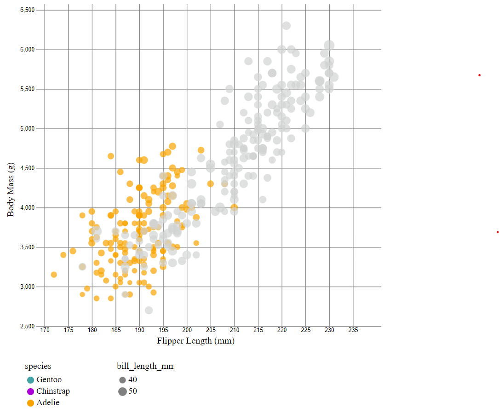
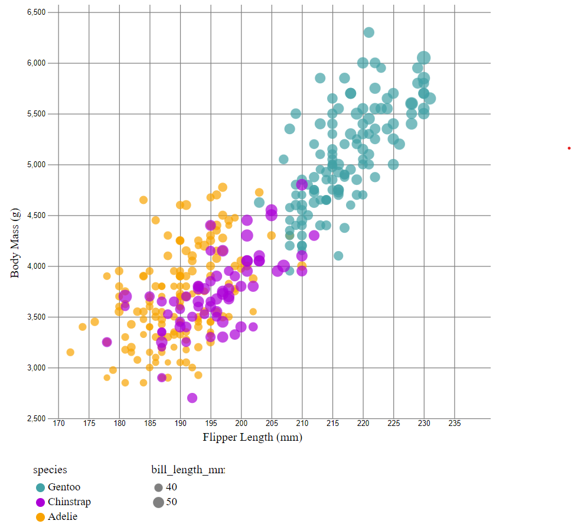
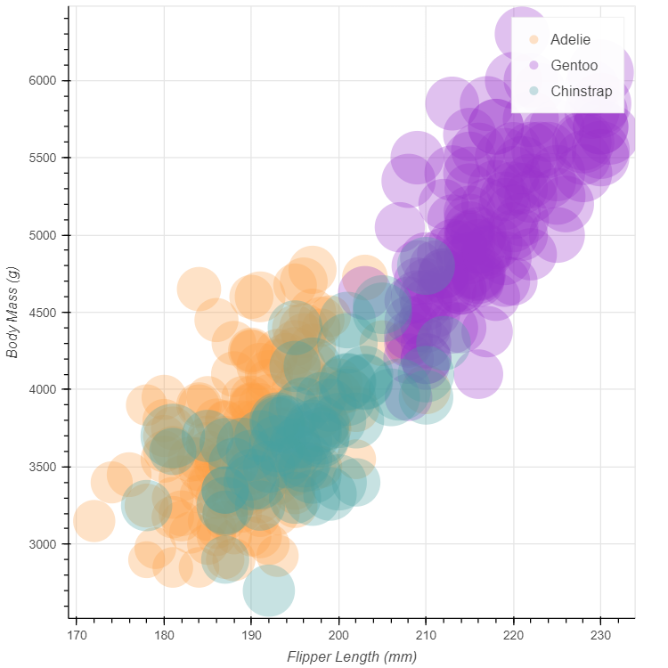
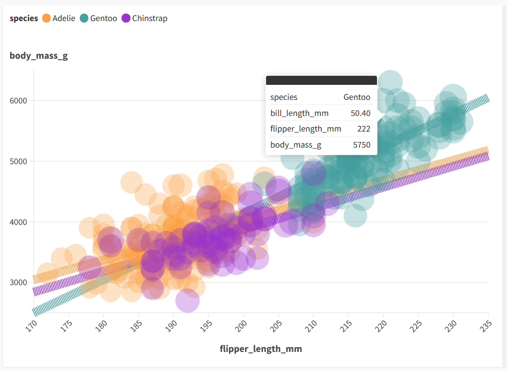

# Assignment 2

## 1. Javascript + d3

This visualization was a lot of fun to make. I found some really nice examples with code online and was able to implement them with only a little difficulty. The legend part took a bit longer and was more convoluted because the process was so manual. However, it clearly gives a lot of customizability which makes sense for a visualization module. 

### Technical achievements 
I added some interactivity in the visualization. If you hover over a data point, then all same species of that data point would be grouped and colored, while the rest will fade to grey. 

### Design achievements 
I kept the colors consistent to the ones shown in the example graph. I added legends that were similar to the example graph. Additionally, I lowered the opacity of the points to emphasize common points and make the graph less cluttered. Finally, I made sure the axis titles were labeled "Body Mass (g)" and "Flipper Length (mm)"

Here are the sources I used:
[1](https://d3-graph-gallery.com/graph/custom_theme.html)
[2](https://d3-graph-gallery.com/graph/scatter_grouped_highlight.html)
[3](https://d3-graph-gallery.com/graph/custom_legend.html)

## 2. Python + Pandas + Seaborn

This visualization was extremely easy to make in seaborn. Seaborn can easily change the color and size of the datapoints based on different features/column. Additionally, it was pretty easy to change the axes titles with a tiny bit of help from matplotlib. I can see it being difficult more difficult to make something interactive on seaborn through actions like mouse hovers. 

### Design achievements 
I kept the colors consistent to the ones shown in the example graph. I added legends that were similar to the example graph. Additionally, I lowered the opacity of the points to emphasize common points and make the graph less cluttered. Finally, I made sure the axis titles were labeled "Body Mass (g)" and "Flipper Length (mm)"

Here are the sources I used:
[1](https://seaborn.pydata.org/generated/seaborn.scatterplot.html)
[2](https://stackoverflow.com/questions/53733755/how-to-move-legend-to-outside-of-a-seaborn-scatterplot)

## 3. R + ggplot

This visualization was also extremely easy to make in R using ggplot. Installing R, RStudio, and ggplot was a pretty straightforward process. It was quite easy to customize the color theme and ggplot automatically generated a legend for both the species and for the bill length. 

### Technical Achievements
I also added linear regression lines to the scatterplot for each species. Due to the nature of the dot sizes, it was difficult to see the lines very clearly, especially with the confidence interval included. I tried to extend the lines and removed the confidence interval to see if it would look any better, but I think I liked the shorter lines better.

### Design achievements 
I kept the colors consistent to the ones shown in the example graph. I added legends that were similar to the example graph. Additionally, I lowered the opacity of the points to emphasize common points and make the graph less cluttered. Finally, I made sure the axis titles were labeled "Body Mass (g)" and "Flipper Length (mm)"

Here are the sources I used:
[1](https://sparkbyexamples.com/r-programming/read-csv-from-url-in-r/)
[2](http://www.sthda.com/english/wiki/ggplot2-scatter-plots-quick-start-guide-r-software-and-data-visualization)

## 4. Python + Pandas + Altair
Altair was similar to Seaborn that it was incredibly easy to create a graph with. Even though I had less (zero) experience with Altair, I would say that the customization was even easier than Seaborn in terms of colors, scales, titles, etc. Altair also automatically generated the legend for me and included a good range of points, especially when compared with some of the other tools. 

### Design achievements 
I kept the colors consistent to the ones shown in the example graph. I added legends that were similar to the example graph Additionally, I lowered the opacity of the points to emphasize common points and make the graph less cluttered. Finally, I made sure the axis titles were labeled "Body Mass (g)" and "Flipper Length (mm)"

Here is the source I used:
[1](https://www.geeksforgeeks.org/python-altair-scatter-plot/)

## 5. Python + Pandas + Bokeh
In my opinion, Bokeh feels a bit worse than both Seaborn and Altair to use. It has less customization than Altair does visually, and while the figure is built similarly to seaborn, the image output feels janky. The documentation also seems less extensive than Seaborn or Altair. All in all, I would not choose this tool over the other two if I was looking for a python graphing tool.

### Design achievements 

I kept the colors consistent to the ones shown in the example graph. I added legends that were similar to the example graph Additionally, I lowered the opacity of the points to emphasize common points and make the graph less cluttered. Finally, I made sure the axis titles were labeled "Body Mass (g)" and "Flipper Length (mm)"

## 6. Python + Pandas + Plotnine
Plotnine has essentially the exact same features as ggplot but implemented in Python instead of R. In any situation where it might be suitable to use ggplot, I would definitely try plotnine and python first just because it's my preferred language. Additionally, with Pandas, the data was incredibly easy to import. 

### Technical Achievements
Similarly to what I did for ggplot and R, I also added linear regression lines to the scatterplot for each species. I only did the shorter regression lines because I liked the look of it better than the longer ones. 

### Design achievements 
I kept the colors consistent to the ones shown in the example graph. I added legends that were similar to the example graph. Additionally, I lowered the opacity of the points to emphasize common points and make the graph less cluttered. Finally, I made sure the axis titles were labeled "Body Mass (g)" and "Flipper Length (mm)"

## 7. Flourish
Flourish was extremely easy to work with and customize. It also seems to support interactivity and dynamic visualizations very well, so I can definitely see myself coming here for a quick and easy visualization. I didn't need to use any external sources because the website was extremely easy to figure out. 

Since there is no code for this tool, here is the link to the website. 
[1](https://public.flourish.studio/visualisation/16857800/)

### Technical Achievements
Once again, I was able to add regression lines to the three different species on the scatterplot. I also changed the opacity and size of both the dots and the lines a bit so you could see the graph more clearly. 

### Design achievements 
I kept the colors consistent to the ones shown in the example graph. I added legends that were similar to the example graph. Additionally, I lowered the opacity of the points to emphasize common points and make the graph less cluttered. 

