# Assignment 2 - Data Visualization, 7 Ways  
----------------------------------------------------------------------

(1) DataWrapper Visualization : Live Demo [Here](https://www.datawrapper.de/_/ILbG9/) 

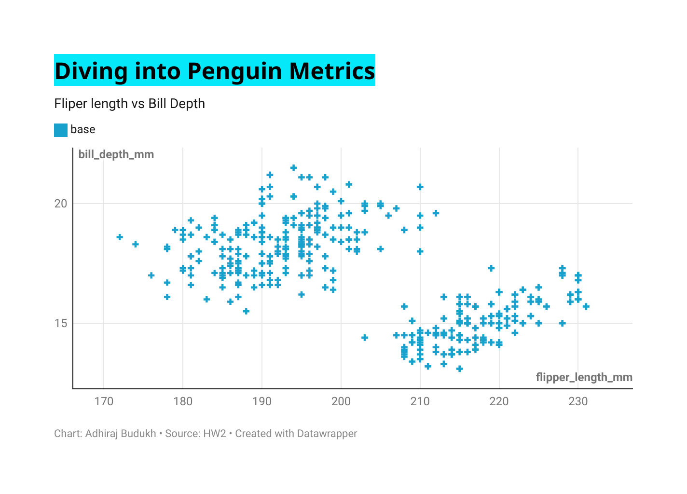

Datawrapper is an online data visualization tool that allows users to create interactive and customizable charts, maps, and tables from their data. It provides a user-friendly interface where users can easily upload their datasets or connect to external data sources such as Google Sheets, Excel files, or SQL databases.

Key features of Datawrapper include:

1. **Simple Interface**: Datawrapper offers an intuitive and easy-to-use interface that doesn't require any coding skills. Users can quickly create visualizations by uploading their data and customizing the appearance of the charts.
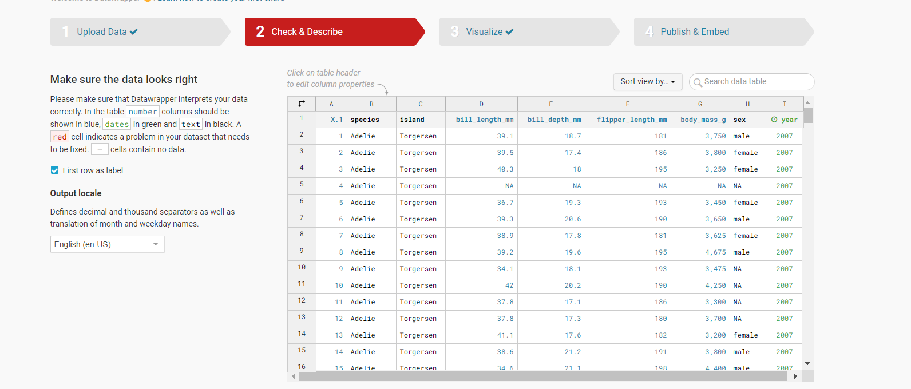
2. **Wide Range of Visualization Types**: Datawrapper supports various types of visualizations, including line charts, bar charts, scatter plots, choropleth maps, and more. Users can choose the most suitable visualization type for their data and customize it according to their needs.
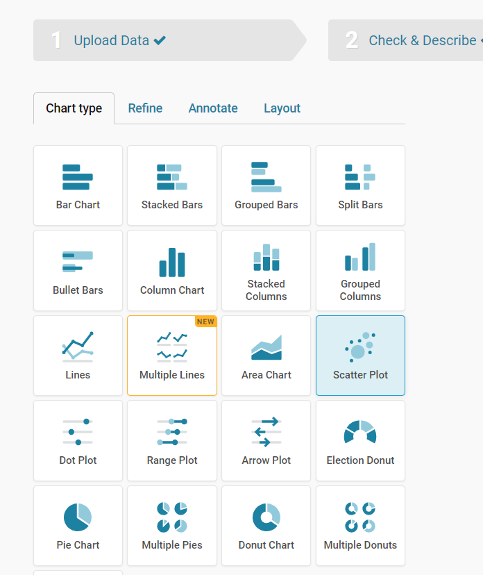
3. **Customization Options**: Users can customize various aspects of their visualizations, such as colors, fonts, labels, axes, tooltips, and legends. Datawrapper provides a range of customization options to help users create visually appealing and informative charts.
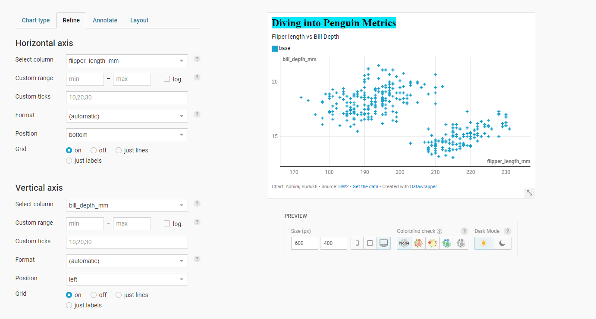 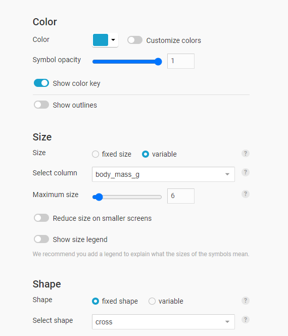
4. **Responsive and Interactive**: The visualizations created with Datawrapper are responsive and can be embedded in websites, blogs, or online articles. They are also interactive, allowing viewers to hover over data points for more information or interact with the charts using filters or zooming functionality.
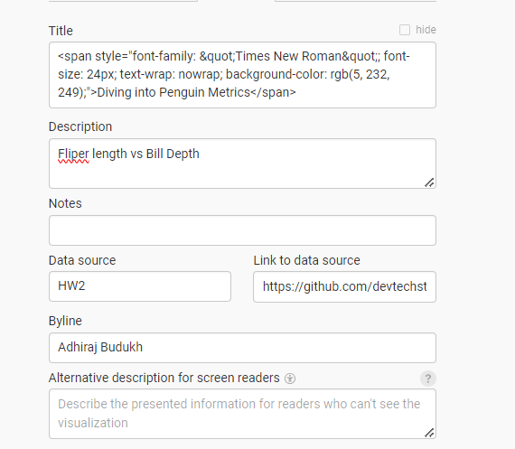
----------------------------------------------------------------------

(2) D3+Js
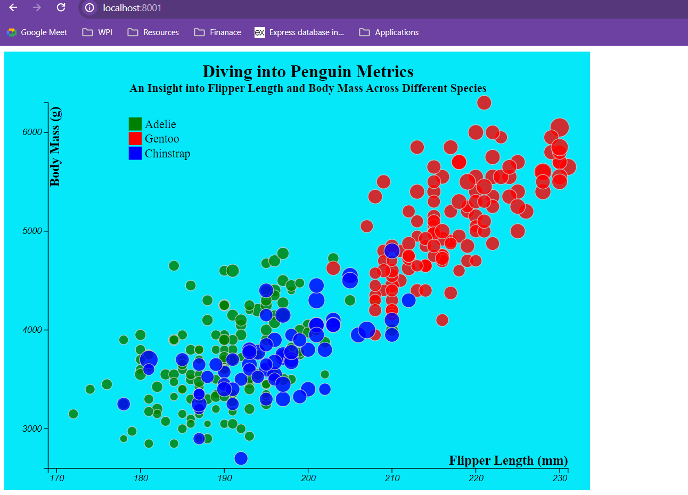

This HTML file incorporates D3.js to create a scatter plot visualization of penguin data. Let's break down the code and understand its functions and uses:

1. **Importing D3.js Library**:
   - The script tag imports the D3.js library from an external source (`https://d3js.org/d3.v7.min.js`).

2. **Styling**:
   - CSS styles define the appearance of the tooltip, which will display additional information when hovering over data points.

3. **Body**:
   - The body contains an SVG element (`#scatter-plot`) where the scatter plot will be drawn and a `div` element (`#tooltip`) for the tooltip.

4. **Script**:
   - The script section loads data from a CSV file (`penglings.csv`) using `d3.csv()` function.
   - The data is then parsed, converting certain columns to numeric values using `+d`.

5. **Graph Dimensions and Margins**:
   - Margins and dimensions for the graph are defined.

6. **Color Scale**:
   - A color scale is created using `d3.scaleOrdinal()` to assign different colors to different species.

7. **SVG Elements**:
   - The SVG element is appended to the `#scatter-plot` with appropriate width, height, and margin settings.

8. **Scales**:
   - Linear scales (`xScale`, `yScale`) are defined for x and y axes mapping data to pixel coordinates.

9. **Axes**:
   - x and y axes are created using `d3.axisBottom()` and `d3.axisLeft()` respectively.
   - Axis labels and formatting are also specified.

10. **Legend**:
    - A legend is added to the graph to denote different species, with corresponding colors.

11. **Scatter Points**:
    - Circles representing data points are appended to the SVG.
    - Circle positions (`cx`, `cy`) are determined by the data values and mapped using the scales.
    - Circle radii (`r`) are determined by another scale (`sizeScale`), mapped from bill length.
    - Circle colors (`fill`) are determined by the species and mapped using the color scale.
    - Tooltip events are added to display additional information (`species`, `flipper_length_mm`, `body_mass_g`) when hovering over data points.
    - On mouseover, the circle radius is increased, and the tooltip is displayed. On mouseout, the circle radius is reset, and the tooltip disappears.

12. **Error Handling**:
    - Error handling is done using `.catch()` method to log any errors to the console.
----------------------------------------------------------------------

`(3) Python + Altair` :

This Python code creates scatter plots using Altair library to visualize the relationship between bill length and bill depth of penguins from a given dataset. Best part of using Altair is you zoom in and zoom out the scatterplots.

Since, this is python code we are accessing the output generated in HTML by creating python server
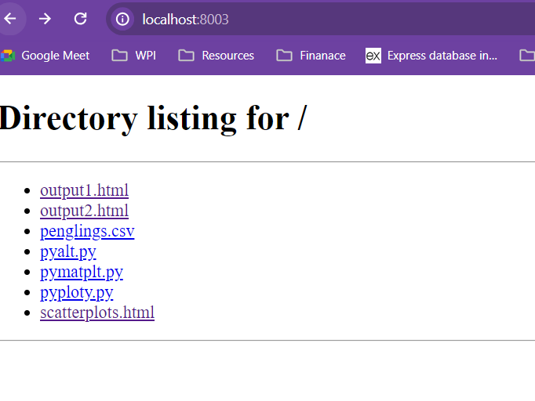

Outputs:
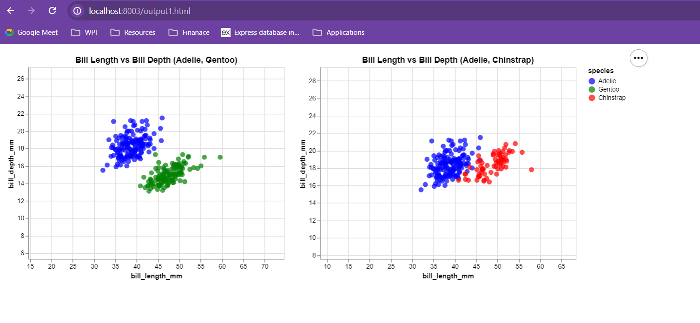 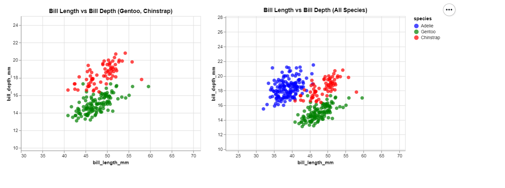

Each function and its role within Altair:
1. `alt.Chart`: This function initializes the creation of a new chart. It specifies the dataset to be visualized and provides a means for encoding data attributes onto visual properties such as position, color, and size.

2. `mark_circle`: This function specifies the type of mark (or glyph) to be used in the chart. In this case, it indicates that circles should be used for each data point in the scatter plot.

3. `encode`: This function is used to map data attributes to visual properties of the chart such as x-axis, y-axis, color, size, etc. It specifies how the data should be represented visually. For example, `x='bill_length_mm'` maps the 'bill_length_mm' column from the DataFrame to the x-axis of the chart.

4. `color`: This encoding function is used to set the color of data points based on a specific data attribute. It utilizes the color scale provided to map different categories or values to different colors.

5. `tooltip`: This encoding function determines what information should be displayed when hovering over a data point. It specifies which columns from the DataFrame should be shown as tooltips.

6. `properties`: This function sets various properties of the chart such as width, height, and title.

7. `interactive`: This function enables interactivity in the chart, allowing users to interact with and explore the data.

Now, let's look at the specific charts created in the code:

- **Chart 1**: This chart visualizes the relationship between bill length and bill depth for Adelie and Gentoo penguins.
  
- **Chart 2**: This chart visualizes the relationship between bill length and bill depth for Adelie and Chinstrap penguins.
  
- **Chart 3**: This chart visualizes the relationship between bill length and bill depth for Gentoo and Chinstrap penguins.
  
- **Chart 4**: This chart visualizes the relationship between bill length and bill depth for all three species combined.

Finally, the code combines these charts into a grid layout using the `&` operator and saves the combined plot as an HTML file named 'scatterplots.html' using the `.save()` method.

----------------------------------------------------------------------
`(4) Matplotlib`:

This Python code utilizes the `matplotlib` library to create scatter plots of bill length versus bill depth for different species of penguins. Best part of Matplotlib is  you can resize the subplot parameters even after generating the output and reset them if not
liked it.
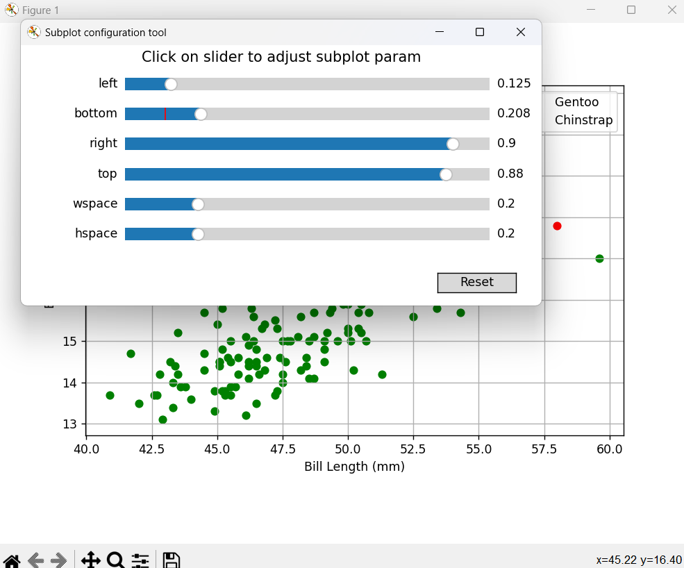 
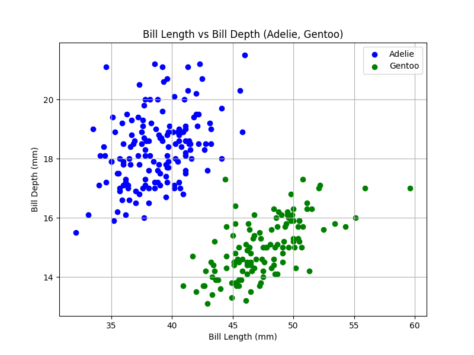 
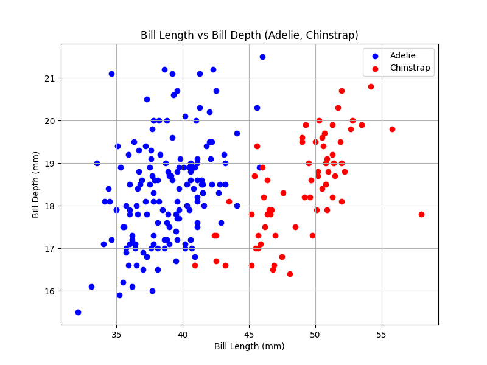 
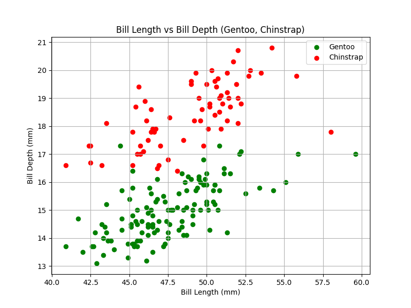 
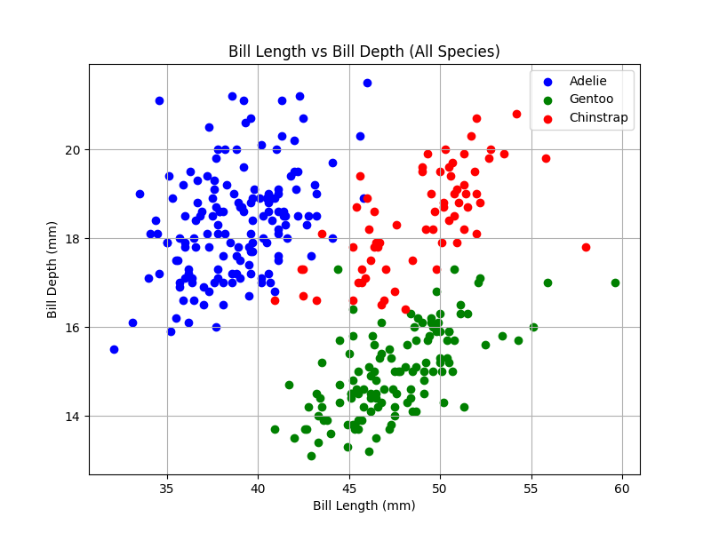 

1. `plt.figure(figsize=(8, 6))`: This function creates a new figure for the plot with a specified figure size. The `figsize` parameter specifies the width and height of the figure in inches.

2. `plt.scatter()`: This function creates a scatter plot. It takes two main arguments, which are arrays or lists representing the x and y coordinates of the points to be plotted. Additional parameters can be provided, such as `label` for the legend and `color` for the color of the points.

3. `plt.title()`: This function sets the title of the plot.

4. `plt.xlabel()`: This function sets the label for the x-axis.

5. `plt.ylabel()`: This function sets the label for the y-axis.

6. `plt.legend()`: This function adds a legend to the plot. The legend provides information about the data being plotted, such as the species of penguins in this case.

7. `plt.grid(True)`: This function adds a grid to the plot, making it easier to read and interpret the data.

8. `plt.show()`: This function displays the plot on the screen.

Each of the four plots in the code represents a scatter plot of bill length versus bill depth for different combinations of penguin species. The color of the points in each plot is determined by the species, and a legend is added to identify the species. The title, x-axis label, y-axis label, and grid are customized for each plot to provide clear information and visualization of the data.

----------------------------------------------------------------------
*(5) Plotly*:

This Python code utilizes the `plotly` library to create a scatter plot of flipper length versus body mass for different species of penguins. Best part of using plotly is,it creates the local server to display the html file to visualize.
 

1. `px.scatter()`: This function creates a scatter plot using Plotly Express. It takes a DataFrame (`df` in this case) as its main argument and additional parameters to customize the plot. In this code, the x-axis is specified by the column `'flipper_length_mm'`, the y-axis is specified by the column `'body_mass_g'`, and the color of the points is determined by the column `'species'`. Additional parameters like `color_discrete_map` allows specifying colors for each category (species) in the scatter plot.

2. `fig.show()`: This function displays the plotly figure (`fig`) on the screen.

The `px.scatter()` function is the main function used to create the scatter plot, while `fig.show()` is used to display the plot. The other parts of the code involve data loading, cleaning, and customization of the plot, but they are not specific to the `plotly` library.

Overall, this code creates a scatter plot using Plotly Express, where each point represents a penguin, with flipper length on the x-axis, body mass on the y-axis, and different species of penguins represented by different colors.

----------------------------------------------------------------------
*(6)Altair vs Plotly Comparision*

Altair follows a declarative approach to visualization. It allows users to describe their visualizations using a concise and intuitive grammar of graphics, where visualizations are specified through high-level abstractions like marks, encodings, and transformations.Altair provides interactive visualizations out of the box, including zooming, panning, and tooltips. It supports interactions like selection and filtering, allowing users to interactively explore their data.

Plotly follows an imperative approach, where users manipulate objects directly to create visualizations. While Plotly also offers high-level functions for creating common charts, it allows more fine-grained control over the visualization elements compared to Altair.
Plotly is known for its rich interactivity features. It offers extensive support for creating interactive plots with features like hover effects, linked views, animations, and more. Plotly also provides tools for building dashboards and web applications with interactive visualizations.

----------------------------------------------------------------------
*(7)Visualizing in MS Excel*
- Excel is a spreadsheet program used for organizing, formatting, and calculating data with formulas across a grid of cells. This visualization contains three plots, each providing insights of different species in 3 different years displaying bill deapth vs bill leanth. The slicers at the top of 3 years allow the user to filter the data by year which dynamically updates the three plots based on the selected criteria. The slicers make it easy to filter data for interactive insights, but ensuring accurate linkage between slicers and charts required a more detailed work.
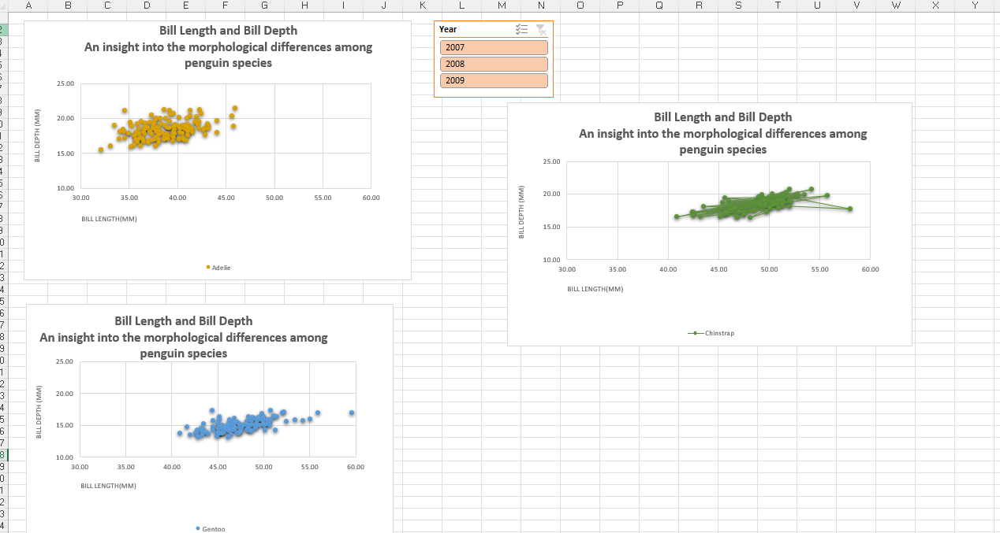 

----------------------------------------------------------------------
*(8)Visualization using Tableau*

Tableau is a data visualization tool that enables users to create and share interactive and graphical representations of data through dashboards and reports. This dashboard shows various features such as interactive filters, parameters, dynamic charts (bar chart, scatter plot and line chart), and tooltips for detailed data display upon hover. Integrating and visualizing data in Tableau was straightforward, showing its strength in user-friendly data manipulation and visualization. Here in this visualization we have added filters for years and sex of the species which dynamically adjusts the scatter plots output.

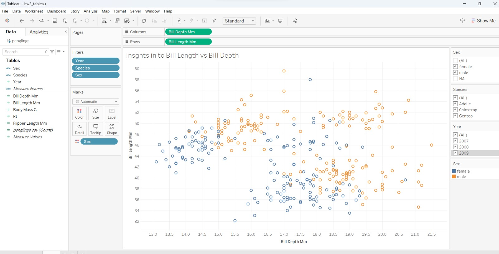
