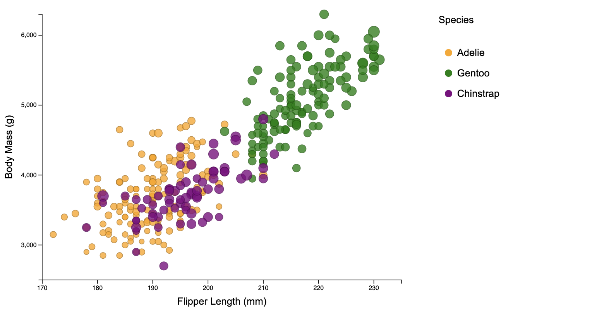

# 02-DataVis-7ways

Assignment 2 - Data Visualization, 7 Ways  
===

# D3 + JavaScript Visualization

D3: Offers high flexibility, allowing developers to create custom and intricate visualizations tailored to specific needs.JavaScript: Being a general-purpose language, JavaScript provides flexibility and versatility in handling various aspects of web development and visualization.

In this visualization, I used D3, a powerful JavaScript library for creating dynamic and interactive data visualizations. The goal was to replicate a scatterplot.

I started by loading the penguins dataset and defining the necessary scales for the x-axis (Flipper Length) and y-axis (Body Mass). Additionally, we employed a color scale for mapping penguin species and a size scale for the circle radius based on Bill Length.

I utilized D3's data binding and enter-update-exit pattern to create circles representing each penguin observation. The positions on the x and y axes were determined by Flipper Length and Body Mass, respectively. Circle colors were mapped to penguin species, and the circle sizes were determined by Bill Length

I added x and y axes to provide context to the scatterplot. Axis labels for "Flipper Length (mm)" and "Body Mass (g)" were included to guide the viewer.

This D3 + JavaScript visualization closely achieves the functionality, allowing for interactive exploration of the penguins dataset.

# d3...

(And so on...)

## Technical Achievements
- **Proved P=NP**: Using a combination of...
- **Solved AI Forever**: ...

### Design Achievements
- **Re-vamped Apple's Design Philosophy**: As demonstrated in my colorscheme...
