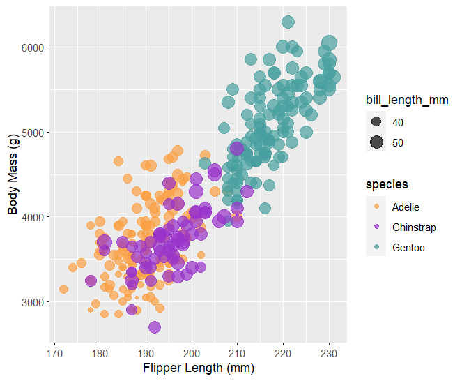
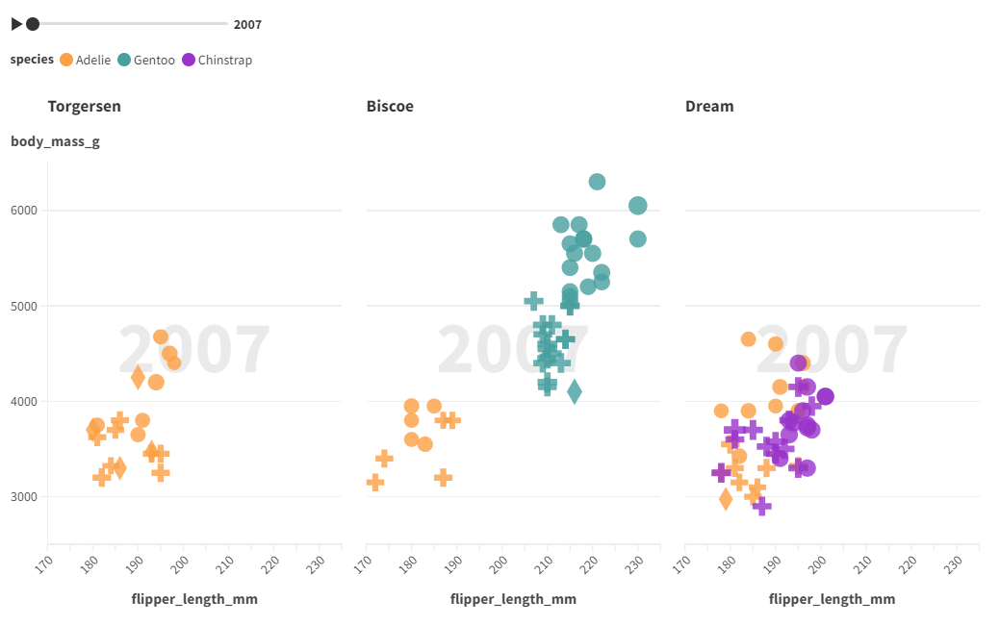

# Assignment 2

## JavaScript + D3

This visualization tool was actually pretty difficult to use.
It takes a lot of effort to create a visualization, but it is a very customizable tool.
To visualize the data, I used a combination of d3's "csv" function and other tools to create shapes in svgs.
Since every element had to be created manually, the effort involved with this visualization was great.

### Point Hover / Detailed Data 
I also added some extra interactivity to display the values
of the point that was being hovered over, as well as giving
the currently hovered point an outline to let the user know
which point was selected.

### Species Facts and Animations

In addition to this, I added animations where when you click
on a point of a certain species (Gentoo, Chinstrap, Adelie) on
the visualization, on the side there will be a view that
appears and gives a bit of information about that penguin
species as well as an image. I thought this gave a bit of
context to the user about the species of penguins that were
being visualized. (you can check out the animations etc in 
./d3/index.html in the repo)

#### D3 Sources

[1](https://d3-graph-gallery.com/graph/scatter_basic.html)
[2](https://stackoverflow.com/questions/11189284/d3-axis-labeling)
[3](https://d3-graph-gallery.com/graph/custom_legend.html)
[4](https://medium.com/@kj_schmidt/show-data-on-mouse-over-with-d3-js-3bf598ff8fc2)

*The species information was pulled from Wikipedia

## Python + Seaborn + Pandas + Matplotlib

This visualization tool was extremely easy to use.
It takes almost no effort (one line) to create a very nice looking graph and legend from the data.
These tools are used a lot to preprocess and explore data when viewing data for AI / ML
To visualize the data, all you have to do is pass load the csv with pandas,
then use seaborn and matplotlib tools to plot this data.
When you make differentiate things by color, or size (ex. species and bill_depth_mm)
the program automatically creates a legend for you.
The program also offers a good amount of customizability, allowing the user to choose things in depth,
while also offering many different themes that work out of the box.
To get the chart to closer mimic the example plot, I had to change a few of the pre-set stylings, such as the color.

#### Seaborn Sources

[1](https://stackoverflow.com/questions/14885895/color-a-scatter-plot-by-column-values)

## Python + Altair + Pandas

This visualization tool was also extremely easy to use.
It took almost no effort to create a very nice looking graph and legend from the data.
The syntax was very nice and easy to pick up and allowed me to quickly create a graph with
relevant visuals and customize it how I liked.
I think compared to the other tool I used in Python (Seaborn), Seaborn has a little bit nicer default settings
which makes it easy to quickly visualize something, but Altair makes it a lot easier to customize the visualization and
get it exactly how you like it. I think between the two I would prefer Altair better, as you can display things very easily
and the library feels a bit more Pythonic and simple.

#### Altair Sources

[1](https://altair-viz.github.io/user_guide/customization.html#customizing-colors)
[2](https://altair-viz.github.io/gallery/scatter_tooltips.html)

## R + ggplot2

This visualization tool was a bit tricky to use for me,
as I had no prior experience with R. It took me a little
bit to set up a working R environment, and download the necessary
libraries such as the penglings dataset as well as the tidyverse library
among others. I think that with more experience, R and ggplot2 is a nice
and easy way to make visualizations and color schemes that are customizable.
It did seem, however, that as you want to make more specific / detailed
changes, it was more and more difficult to do in ggplot2, and I had to resort
to using helper libraries such as colorspace and ggnewscale specifically
for managing color schemes.
For this visualization I used the basic code provided in the starter files
and expanded on it.
Instead of showing all of the penguins in one chart, I split the observations
into charts according to island. I also drew a line of best fit for each
species in each chart to help visualize the overall relationship between
body mass and flipper length per species on each island.

### Visualzation 1: Free X Axis Scale

I first created a visualization (Visualization 1) with a free X axis scale.
This aesthetically looks nicer, however when comparing the lines of best fit
and the graphs for each island, I realized that it was misleading when the
axes were not evenly spaced for each island.

### Visualzation 2: Fixed X Axis Scale

o remedy this, I created Visualization 2, where I evenly spaced the axes
for each sub-chart. This way, a viewer of the charts can more easily make
connections and comparisons between the sub-visualizations.

## Flourish

This visualization tool was extremely easy to use.
It required no coding experience, and I was easily
able to pick it up. To enter data, you just need to select a csv
file, and you can select which columns pertain to which parts
of the visualization. This made it extremely easy to create the
visualization. It also has built-in interactivity which was
a very nice tool. When you hover over the points on the plot,
there is a tooltip that shows up that shows you the selected
data on the plot. This also stays on click which is useful.
There is functionality as well to add and remove specific groups
from the visualization (species). To do this, you can click
on the species in the legend and they will be filtered.
I added more functionality to the plot by adding facets
depending on which island the penguin was found on, as well as
a time slider to show the data according to which year
it was found. I also added a different shapes for male and
female observations of penguins to better represent the
underlying data. This way, an observer of the chart can easily
view the changes over time of the diversity of each island.

*note that there is no code etc for Flourish as it is an online
tool, but the visualization can be found below

[flourish link (interactive)](https://public.flourish.studio/visualisation/16735989/)

## Vega-Lite

This visualization tool was pretty easy to use and very simple.
The syntax for the visualization was very clear and organized,
and there was good docs on the Vega GitHub site.
The only gripe I had with this visualization is that it was
a bit complicated to perform more complex interactivity within
the chart. I had tried to make interactivity of a drag bar
as well as a species select, but it was a bit complicated
and I couldn't figure it out. I only managed to add
interactivity with the species select in the end.
I also thought it was a bit difficult to create dynamic values
from the data, as I couldn't figure out how to load a dynamic
max and min values from the data. I did see that there was
functionality with "transform" and "calculate" but I did not
think this matched my use case exactly, as this creates a new
column entirely, and performs some kind of transform on the
entire data set.

### Vega-Lite Sources

[basic tutorial](https://vega.github.io/vega-lite/tutorials/explore.html)

[legend binding](https://vega.github.io/vega-lite/docs/bind.html#legend-binding/data/cars.json)

## Datawrapper

This tool was very easy to use. It was very easy to get the
information into the chart with a simple CSV upload, and it
was very simple to create the chart as well with a
step-by-step process. The program parsed the CSV file very
well, converting each column into a respective datatype and
allowing different visualization options depending on the
data type. There was also a good amount of
customizability available in every step. I especially liked
that at the end of the chart creation / customization there
was a preview mode where you were able to view the visualization
with filters according to different kinds of color blindness.
I think it is very important to make visualizations accessible,
and including this as a step in their pipeline and making it
easily accessible in their flow is a good thing.
There was also some built-in interactivity in the final chart
which I thought was useful: when you hover over a species,
it removes the other species from the plot and leaves only
the selected species. This works on hovering over both
the actual points on the chart and on the species names
in the legend.
I think that while there was a good amount of customizability
available, the program still lacks the complete customizability
available from a more complex language-based visualization tool.
I think that this tool can be used by people who want to make
rather simple visualizations but have no background in coding
or data science, or for those who want to quickly make a
visualization, as the step-by-step process has a very low
learning barrier, and is a very fast process.

[datawrapper link (interactive)](https://datawrapper.dwcdn.net/SkRVk/2/)

## Technical Achievements

### Show an Element's Detailed information on Hover in D3

I did this by adding "mousehover" and "mouseoff" elements to each circle when it was drawn.
When the user hovers over the element, the bottom updates with the information relevant to that element,

### Show a Red Circle Around Hovered Item in D3

I did this by also using the "mousehover" and "mouseoff" elements.
When the user hovers over an element, I add a red outline to the
selected element so the user knows which element is selected
When the user stops hovering, this red outline goes away, and the
information on the bottom disappears.

### Species Information Animations On Click in D3

I did this by using "click", transition(), duration()
and "opacity" in d3 as well as adding an
expanding circle with color matching the species color for
an interesting animation. I had to manually split up the
text so that it would fit, as in SVG, there is no option
to wrap text without external packages.

### Display Observations Per Island in R

I did this by using the facet_grid() function included in ggplot2.

### Display Lines of Best Fit Per Species in R

I did this by using the geom_smooth() function in ggplot2. This function
automatically creates a line of best fit for the current dataset. I
also grouped this functionality to create a line of best fit for each
species in each subplot. To achieve custom colors different from the color
scheme specified for the species for the point graph, I needed to use
two different libraries: colorspace, and ggnewscale. Colorspace allowed me
to darken the existing color scheme to use again for the lines of best fit,
and ggnewscale allowed me to create a separate color scheme for the
geom_smooth() function.

## Design Achievements

### Clear Legend on All Charts

For every chart, I included a legend showing which species corresponded with which color,
as well as an example circle size for the bill_length_mm value

### Consistent Color Choice

For every chart, I used the same colors, matching the hex colors used in the example plot.

### Allow User to See Which Element is Being Hovered in D3

I clearly allowed the user to see which element they were hovering on in the main visualization by
having a red circle (as can be seen in photo 2 in the D3 section).
This, linked with the detailed numbers shown on the bottom depending on which element is hovered on provides
a good experience for the user.

### Show Facts About Penguin Species in D3

I gave extra information to the user about each species of
penguin on click of a point with the corresponding species
as well as an image of that species of penguin. I also
matched the background color of the information to the color
of the species in the legend to connect these two 
visualizations. The purpose of this was to give
the viewer of the visualization more information about what
they are looking at as well as giving the data a more personal
feel due to the image.

### Penguin-y font in D3

This is a minor achievement, but I searched for and found what
I believe is a very penguin-y font (Oscar) and used it for
the penguin species. I imported this font with a link to a
google stylesheet containing it at the top of the HTML document

### Display Observations Per Island in R

I did this by using the facet_grid() function included in ggplot2. This
allows the viewer of the visualization to make connections between the
island that the observation occured on, and the flipper length and body mass
of each species.

### Show Lines of Best Fit Colors Clearly on Chart and Match to Species in R

I allowed the lines of best fit to match the species color, but darkened
these lines so that they were more visible and did not blend in with the
points themselves on the graph. To do this I used the darken functionality
in the colorspace library as well as the ggnewscale library.

### Show Observations by Year in Flourish

I was able to split up observations of the penguins by year
using Flourish, and display these observations separately.
I used a slider with the ability to "play" an animation to
switch from year to year. This allows the user to see how the
diversity of each island changed from year to year.

### Isolate Species Selection in Vega-Lite

I was able to add interactivity to the Vega-Lite chart by
adding functionality to show one species at a time when the
user selects a certain species. When one species is selected,
all of the others are greyed out to give better visibility.
