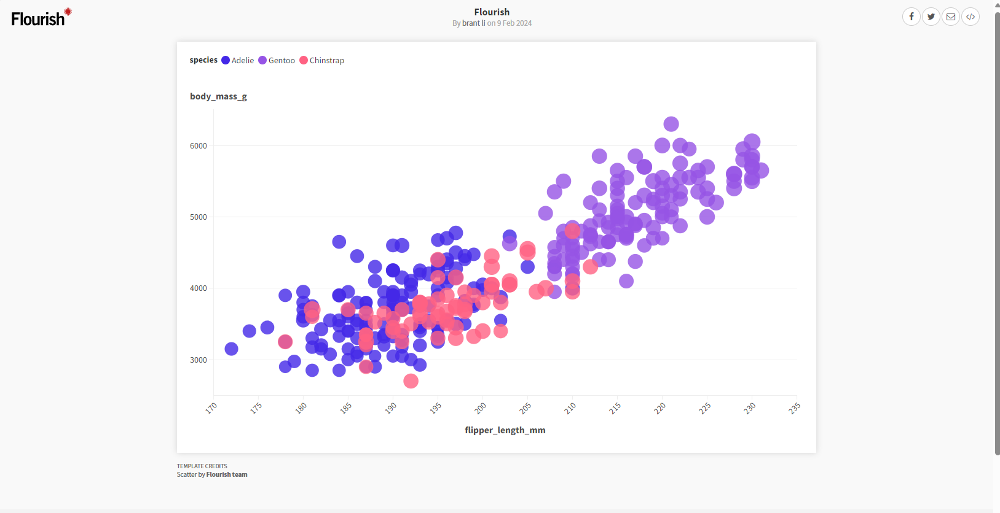

# 02-DataVis-7ways

Assignment 2 - Data Visualization, 7 Ways  
===

# R + ggplot2 + R Markdown

* It is quite easy to use if you were familiar with R before because adding an element on the chart is like adding more parameters (Size, Color, Axis).
* Lots of resources from the R community that give some examples and guidance for customizing the chart.
* Compared to Python, the structure code of `ggplot2` is easier to follow.

===

# d3
* Not easy to make a scatter plot in `d3.js` since everything has to be built on modular.
* Need lot of effort to make a chart that similar to `ggplot` R.
* A lot of feature can be custom but the code will be very long compared to simple `ggplot`.
  

===

# Python + Seaborn + matplotlib.pyplot

===

# Python + Altair

===

# Tableau

===

# PowerBI

===

# Microsoft Excel

===

# Flourish

===

# Datawrapper

===
