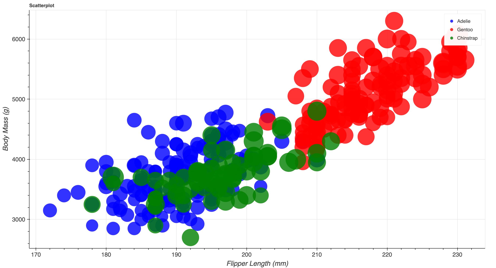
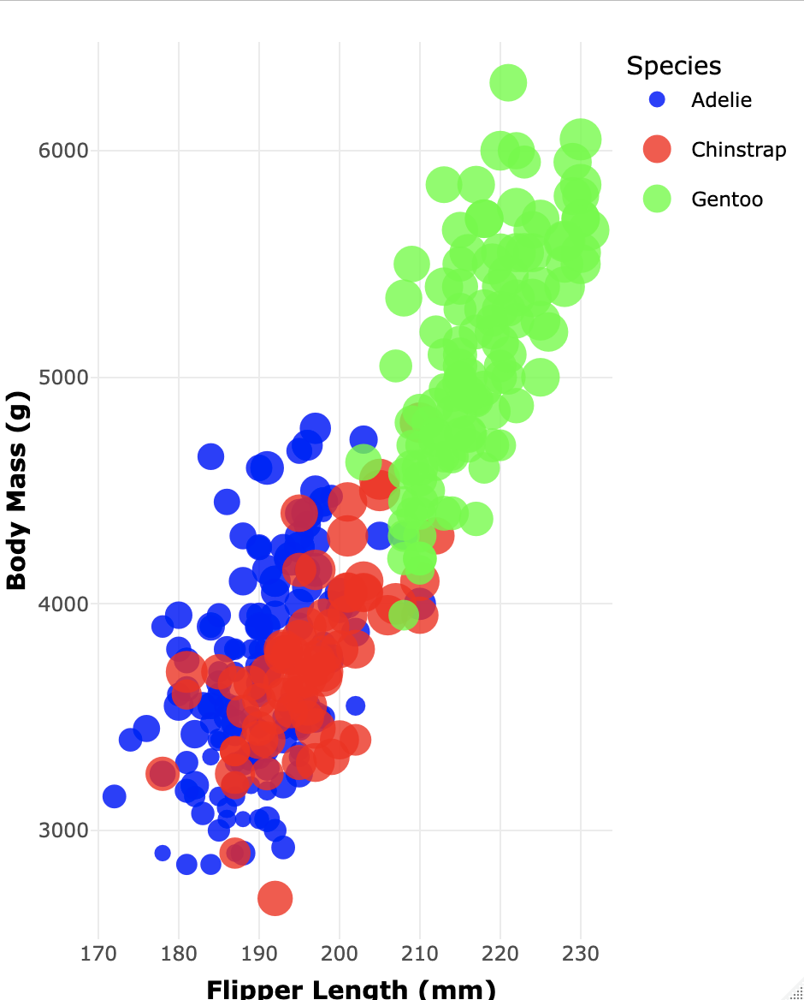

# 02-DataVis-7ways

Assignment 2 - Data Visualization, 7 Ways  

# Python + Plotly Express (PyVis1)

Plotly Express is a graphing library available for use with Python. Originally developed by the company Plotly, this library provides users with access to DASH graphics with ease through the inclusion of a wide variety of functions and graph objects that negate the necessity of lengthy code segments. 

To visualize the penglings dataset, I first made sure to drop null values (which originally skewed the chart oddly) using the Pandas `dropna()` function and then utilized the `scatter()` function to build the baseline requirements for the graph (no hacks required). Thanks to Plotly Express' built in function features, I didn't need to write any additional code to access species filters and hover functionalities. To filter the graph by species, all that's required it tapping (to deselect from one) or double tapping (to deselect from ALL but one) the species legend on the right hand side of the graph. Similarly, to get more insight on points, all that's required is a simple hover over each point with the cursor. The primary drawback I found in the process was the lack of distinct bubble sizes for the points. Though I did assign the point sizes to be influenced by bill length, it's hard to see the differences just by looking at the graph.

Overall, I found this tool very easy to use and I can see it being useful in scenarios that might require many simple visualizations. Because it has so many extra features built into its graphing functions, it can save users a lot of time on the coding and design end of things. 

# Python + Altair (PyVis2)

Altair is a declarative statistical visualization library for Python. It's designed to streamline the coding process, enabling users to spend more time analyzing and understanding visualizations, rather than focusing on the pure coding aspect.

To visualize the penglings dataset, I first dropped the Null values using the pandas `dropna()` function and then utilized the `alt.Chart()` function to implement the visualization requirements. Unlike the Plotly graph, this one did not automatically format the design elements correctly. For example, I had to manually specify domain scales and axis ticks in order to better mimic the original (whereas in plotly it was all done automatically). Also, like with Plotly Express, I found there was a lack of distinct bubble sizes for the points. Though I did assign the point sizes to be influenced by bill length, it's hard to see the differences just by looking at the graph.

However, overall I would still say this tool is still very easy to use and would be beneficial when in need of quick visualizations of datasets big and small. Like plotly, the streamlined functionalities and limited coding requirements makes this tool very accessible to non-technical audiences. 

### Technical Achievements

- **Mouse over Feature** For this visualization, I decided to add an extra tooltip functionality (coded within the `alt.Chart()`function) to allow users the option to hover and inspect data points within the graph. I also renamed the tooltip display names to be more visually appealing by removing the original column names and reformatting them into proper titles with units properly parenthesized.

# Python + Matplotlib Pyplot (PyVis3)

Matplotlib's Pyplot is an API of Python's Matplotlib library. It consists of a collection of functions that enable users to manipulate visualizations similar to MATLAB. 

To visualize the penglings dataset, I first dropped the Null values using the pandas `dropna()` function and then utilized the `plt.scatter()` function to build the baseline graph. Like the first two visualizations, this one was also fairly easy to accomplish; however, it did require some additional code to include the color mapping legend in the graph. Finally, like the prior 2 python graphs, this one also didn't have noticeable size variation across points, despite them being assigned to bill length properly.

Overall, this library was very easy to use and was quite similar to Plotly in terms of how much code was required to obtain the baseline graph. As such, this would also be a great library to utilize if in need of quick data visualizations since it has relatively few coding requirements. 

### Technical Achievments 

- **Mouse over Feature** For this visualization, I decided to add an extra tooltip functionality (coded within the `mplcursors.cursor()`function) to allow users the option to hover and inspect data points within the graph. `mplcursors` is a Python library that provides interactive cursor feedback for Matplotlib plots. Similar to the second graph, I also reformatted the tooltip display names to be visually appealing. 

# Python + Bokeh (PyVis4)

Bokeh is a Python library designed for creating interactive and data-driven visualizations in web browsers. It provides a flexible and easy-to-use interface for building a wide range of interactive plots, dashboards, and applications for data exploration and analysis. 

To visualize the penglings dataset, I first dropped all Null values using pandas' `dropna()` function and then moved on to designing the actual baseline visualization. Unlike the prior 3 libraries, Bokeh required more coding and was generally not as intuitive. I first had to use the `figure()` functionality to establish the graphing object. Then, I implemented some styling changes like axis font sizes and the axis tickers (via the `SingleIntervalTicker()` function). Finally, I went about plotting the actual points using the `p.scatter()` function to specify additional graph details.

Overall, I didn't feel this was quite as intuitive as the the previous graphs; however, it was still easy to use after reading some documentation. Since it requires a bit more code, I wouldn't suggest it as a first choice for making quick visualizations, but I could see it being advantageous for creating interactive and web-based visualizations that require a high degree of customization and interactivity. The Bokeh library itself has lots of sub functionalities that make its capabilities quite broad. 

### Technical Achievments 

- **Mouse over Feature** For this graph, I also added a hover-to-inspect functionality using Bokeh's `HoverTool()`. Thus, users can hover over points on the graph to inspect the individual values.

# Javascript + D3 (D3Vis)

D3 is a JavaScript library commonly utilized for crafting dynamic and interactive data visualizations in web browsers. Its data-driven approach, extensive feature set, and flexibility has made it a preferred tool for constructing sophisticated and captivating visual representations. 

To visualize the penglings dataset, I first loaded the csv data asynchronously using the `d3.csv()` function. Attached to this is a `then()` function, which encapsulates the scatterplot design code. Within the design code, I implemented a mixture of SVGs, variables, and filters to manipulate and plot the data (along with corresponding legends/axis labels). Additionally, in order to ensure that the code didn't attempt to build an empty graph if the data failed to load, I added a the `catch()` function to specify that a console error message should be outputted. 

I felt this graph was definitely the hardest to construct due to the amount of coding it required. Unlike the previous tools and libraries used, this needed extensive specifications for design elements like margins, axis scaling, text rotation, legend design, etc. Thus, it is definitely the least beginner-friendly option. This being said, because users can control so many minute details in the code, I see this option being most useful for constructing especially detailed and complex data visualizations. Yes, it would require more time in the long run, but users would be able to have more creative control of the elements.

### Technical Achievements

- **Color Legend** For this graph, I added a color legend using additional svg variables to specify the placement, text, and colors. Users can view this legend in the top left corner of the graph.

# Flourish (FlourishVis)

Flourish is a web platform designed for creating and sharing interactive data visualizations and stories. It offers a user-friendly interface that allows users to create a wide range of visualizations, including charts, maps, and narratives, without requiring any coding.

To visualize the penglings dataset smoothly, I started by selecting the scatterplot option on the intro page. Then, I imported the data through the Flourish data tab. Next, I easily selected the columns I wanted to visualize from the right-hand panel of the data tab. Finally, to achieve the desired dot opacity, I navigated back to the graph pane and adjusted the opacity in the `Dot Styles` tab.

Overall, this tool was probably the easiest to use since it didn't require any coding. The sheer breadth of graphs available to users makes this tool a fantastic option for non-coding audiences who want to visualize data in more customizeable ways. Generally, I think anyone looking for an intuitive (non-coding intensive) way to design visuals would greatly benefit from this tool. 

See the full visualization here: https://app.flourish.studio/visualisation/16709797/edit

# R + ggplot2 + plotly (RVis)

GGplot2 and Plotly are both R packages designed for creating visualizations. The primary difference between the two is that Plotly offers more interactive functionalities, whereas ggplot2 is mainly for "flat" visuals. 

To visualize the penglings dataset, I first installed the required packages/libraries and then proceeded to enter the parameters for the baseline graph using the `ggplot` function. In order to alter it from the example provided in class, I added `theme()` elements and a `guides` function for the species legend. I also converted the ggplot2 graph into plotly so that I could add interactive elements for the technical achievements. 

Overall, these tools and library were fairly easy to use (not much different that matplotlib and plotly express in Python). I can see them being useful for statistics-centered visualizations and tasks that focus more on mathematical operations as opposed to user interface. 

### Technical Achievements

- **Mouse over Feature** By integrating Plotly's `ggplotly()` function into the graph, I was able to make a hover-to-inspect feature for users to interact with.

### Creative Achievements

- **Labeling Enhancement** Within the `theme()` function I added code that bolded the axes labels and also increased their margins from the x/y axes.

