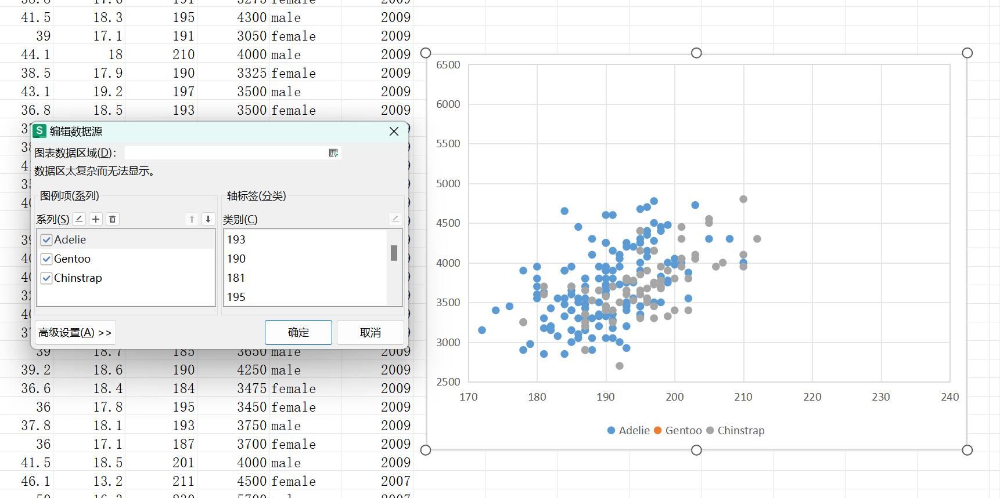
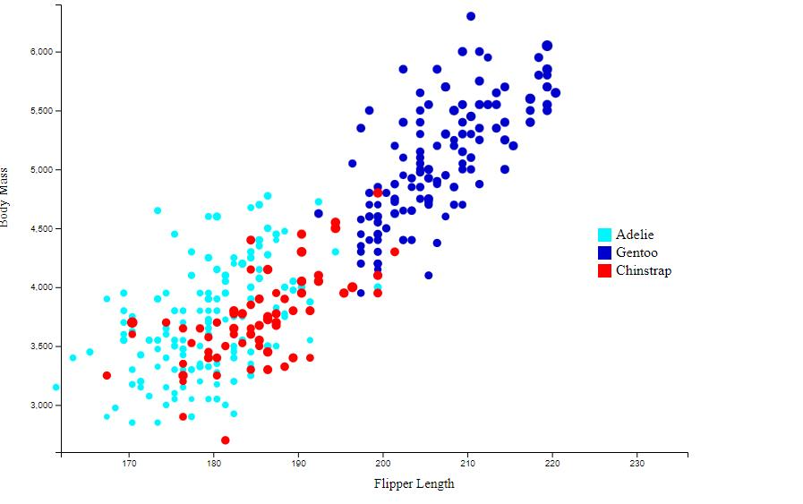
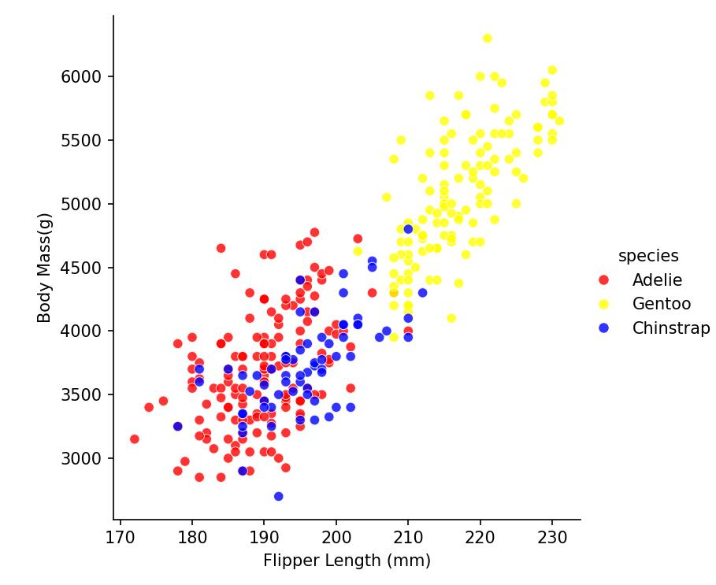

# 02-DataVis-7ways

Assignment 2 - Data Visualization, 7 Ways  
===

Excel：

In fact this takes the most of my time, and even in the end i couldnt figure out why my Gentoo species are not in the graph, it seems like excel is quite hard for me to use. I'd rather use R or Python lmao.

D3:

To be honest, I think my own development project from scratch to build is extremely painful, but fortunately this to achieve the function of a lot of online tutorials, I understand the basis of these reference to their methods to complete the data visualization.

Altair：

Python with Altair is really easy to use, only few codes, and the result is really nice.

Python+Matplotlib：

Python is really easy to use, I can easily find multiple ways to use these method to create a scatter plot, and it has more details than Altair.

Python+Plotly:

I just have trouble in this method, and I directly search a video and quickly learnt how to use Plotly easily. https://www.bilibili.com/video/BV13E411Z7XH/?spm_id_from=333.337.search-card.all.click&vd_source=cc339417ba245abda7eeea50fd92f5f4, which is quite useful.

Python+Seaborn:

In fact I think this is the easiest way to create the scatter plot, and I can easily find a lot of tutorials to help me. Seaborn has a great advantage in generating charts quickly and easily.

Technical Achievements:
Fisrtly I learned many various ways to make data visualizaiton, some methods may be more suitable for the short data, but as the data becomes more, they may hard to use.