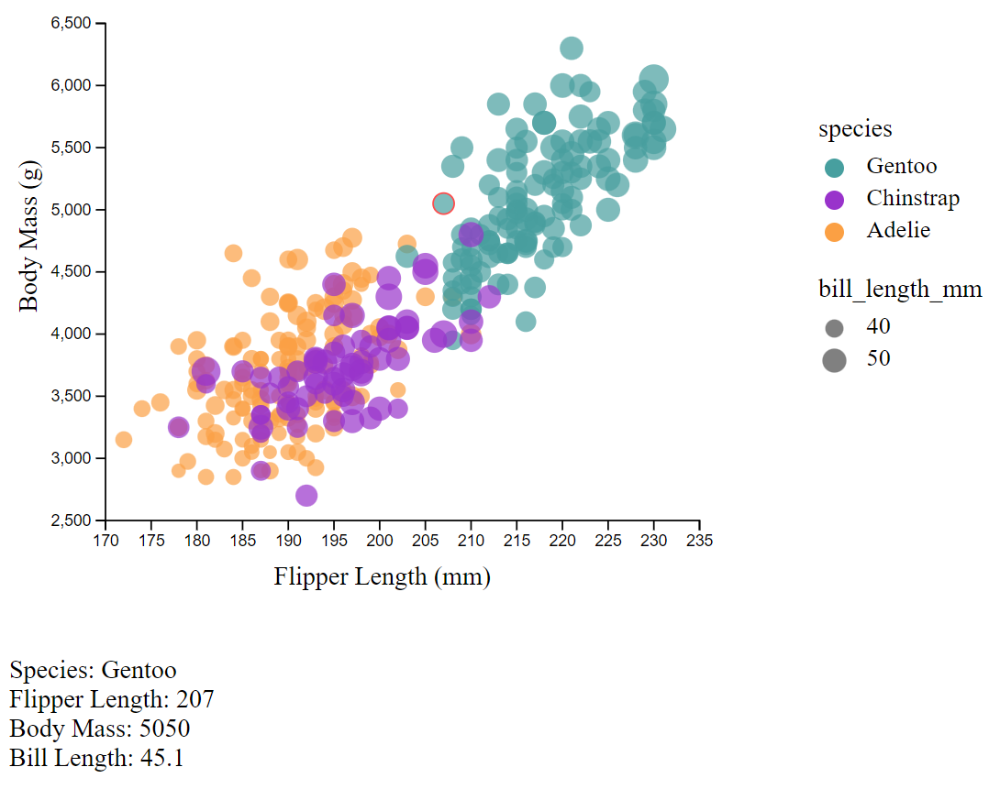
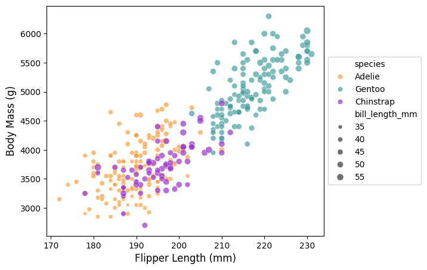

# Assignment 2

## JavaScript + D3

This visualization tool was actually pretty difficult to use.
It takes a lot of effort to create a visualization, but it is a very customizable tool.
To visualize the data, I used a combination of d3's "csv" function and other tools to create shapes in svgs.
Since every element had to be created manually, the effort involved with this visualization was great.

#### Sources:

[1](https://d3-graph-gallery.com/graph/scatter_basic.html)
[2](https://stackoverflow.com/questions/11189284/d3-axis-labeling)
[3](https://d3-graph-gallery.com/graph/custom_legend.html)
[4](https://medium.com/@kj_schmidt/show-data-on-mouse-over-with-d3-js-3bf598ff8fc2)

## Python + Seaborn + Pandas + Matplotlib

This visualization tool was extremely easy to use.
It takes almost no effort (one line) to create a very nice looking graph and legend from the data.
These tools are used a lot to preprocess and explore data when viewing data for AI / ML
To visualize the data, all you have to do is pass load the csv with pandas,
then use seaborn and matplotlib tools to plot this data.
When you make differentiate things by color, or size (ex. species and bill_depth_mm)
the program automatically creates a legend for you.
The program also offers a good amount of customizability, allowing the user to choose things in depth,
while also offering many different themes that work out of the box.
To get the chart to closer mimic the example plot, I had to change a few of the pre-set stylings, such as the color.

#### Sources

[1](https://stackoverflow.com/questions/14885895/color-a-scatter-plot-by-column-values)

### Technical Achievements

#### Showing an Element's Detailed information on Hover in D3

I did this by adding "mousehover" and "mouseoff" elements to each circle when it was drawn.
When the user hovers over the element, the bottom updates with the information relevant to that element,

#### Showing a Red Circle Around Hovered Item in D3

I did this by also using the "mousehover" and "mouseoff" elements.
When the user hovers over an element, I add a red outline to the selected element so the user knows which element is selected
When the user stops hovering, this red outline goes away, and the information on the bottom disappears.

### Design Achievements

#### Clear Legend on All Charts

For every chart, I included a legend showing which species corresponded with which color,
as well as an example circle size for the bill_length_mm value

#### Consistent Color Choice

For every chart, I used the same colors, matching the hex colors used in the example plot.

#### Allow User to See Which Element is Being Hovered

I clearly allowed the user to see which element they were hovering on in the main visualization by
having a red circle (as can be seen in photo 2 in the D3 section).
This, linked with the detailed numbers shown on the bottom depending on which element is hovered on provides
a good experience for the user.
