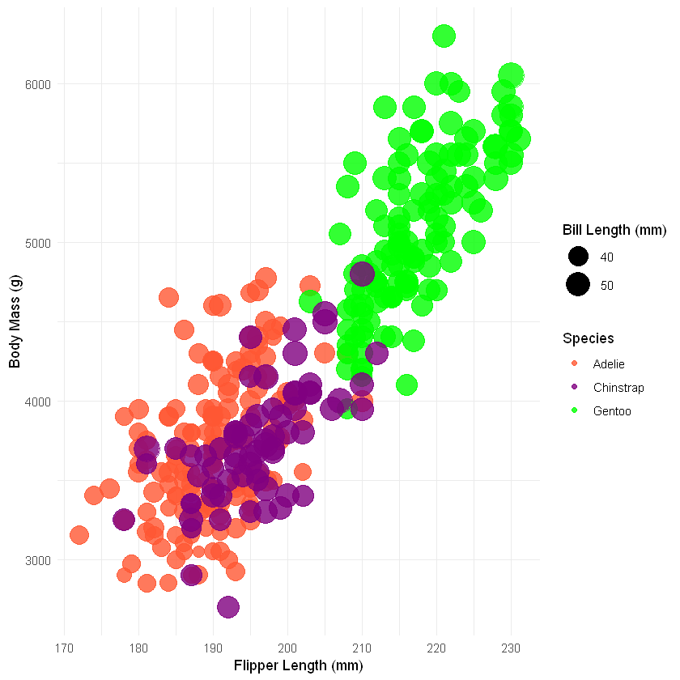

# 02-DataVis-7ways

Assignment 2 - Data Visualization, 7 Ways  
===

# Vega-Lite

Vega-Lite is a simplified, high-level version of Vega, designed for easier and quicker creation of basic charts.
To create the chart, I used Vega-Lite functions to generate a scatterplot with square marks, histograms for flipper length and body mass, and customized axis labels and titles, along with calculated Mass/Flipper Length Ratio and tooltips for species, flipper length, and body mass. This tool makes it easy to quickly generate basic and customizable data visualizations. 

## Technical Achievements:
Interactive features: Tooltips displaying a calculated field (Mass/Flipper Length Ratio) upon mouseover.
The tool allowed the adding of binning to the histograms for a more detailed analysis of flipper length and body mass by breaking the data into intervals. This made the visualization easier to understand.

## Design Achievements:
Design coherence through the arrangement of multiple views of the scatterplot and histograms, providing a total exploration of penguin metrics.

# Javascript + d3
JavaScript is a high-level programming language used for creating interactive and dynamic web content.
D3 is a JavaScript library that facilitates data visualization and manipulation by binding data to HTML and SVG elements.
I used various D3 functions such as d3.csv() to load data, d3.scaleLinear() to define scales, d3.axisBottom() and d3.axisLeft() to create axes, and d3.select() to manipulate SVG elements for generating the scatter plot.
The amount of code required to create the plot was quite substantial, spanning multiple lines of code. Nevertheless, it provided multiple configuration functions to enhance the plot and customize it.

## Technical Achievements:
Interactive Tooltips: The code implements interactive tooltips that provide detailed data information upon hover. The circles have interactivity (change sizes) when hovering on them. These features make it easier for users to get involved and explore the data.

## Design Achievements:
Aesthetic Appeal: Attention to design details and an appealing color palette contributed to improving the overall user experience.

# R + ggplot2 + R Markdown

R is a programming language used for statistical computing, data analysis, and visualization.
ggplot2 is a data visualization package for R.
R Markdown is a document format  for making dynamic documents with R, allowing users to integrate prose, code, and their results into a single document.
To visualize the penguin dataset, I employed ggplot2 and plotly for an interactive chart, highlighting species differences through color, size, and shape aesthetics. Additionally, the chart integrates facet_wrap to differentiate data by island and employs customized scales and themes for clarity and visual appeal. The analysis also calculates a new variable, bill_area_mm (showed on tooltip), for deeper insight, and the chart is made accessible through an HTML widget, served via servr.
I found using ggplot2 and dplyr for data manipulation and visualization straightforward because of their intuitive syntax and extensive documentation. However, setting up the interactive visualization with Plotly and serving it through servr proved challenging because it required integration between R libraries and web technologies.

## Technical Achievements:
Using Plotly for interactive visuals makes the experience more engaging by allowing users to hover over points to see detailed information about penguin features, and by adding a calculated feature (bill area) to make the analysis more thorough.

## Design Achievements:
I used a consistent color scheme to distinguish between penguin species, optimized font and element sizes for readability, and implemented faceted views by island to compare distributions across species, making it easier to understand the differences in a straightforward way.

# Matlab

Matlab is a high-performance programming language and environment used for numerical computing, data analysis, and visualization.
I generated the plot using the scatter function with custom color mapping based on penguin species, transparency settings, and the insertion of a background image, along with caption and legend.
Creating the scatterplot in Matlab was straightforward with easy customization options for color mapping and annotations; however, handling the background image and achieving specific transparency levels required some additional steps.

## Technical Achievements:
Using the scatter function with custom color mapping, transparency, legend handling, and background image manipulation for a visually appealing and informative result.

## Design Achievements:
Integrating a background image to serve as a visually appealing backdrop for the scatterplot.
Creating a descriptive and formatted caption using the annotation function to provide additional context and information within the plot.

# Microsoft Excel

Excel is a spreadsheet program used for organizing, formatting, and calculating data with formulas across a grid of cells.
This visualization contains three linked plots, each providing insights into the morphological differences and annual variations among the penguin species. The slicers at the top allow the user to filter the data by species, year, and/or island, which dynamically updates the three plots based on the selected criteria.
The slicers make it easy to filter data for interactive insights, but ensuring accurate linkage between slicers and charts required a more detailed work.

## Technical Achievements:
Adding interactive slicers that work with several charts to let users filter and show complex data in real-time was a useful feature that makes it more interesting and easier for the user to explore the data.

## Design Achievements:
The distinct color coding for each penguin species across all plots creates a visually coherent and immediately understandable representation of the data.
The use of trend lines in each plot, provides immediate visual cues about the relationship between variables for each penguin species, increasing the possiblilty to quickly discern correlations within the data.

# Python + Altair
Python is a high-level, interpreted programming language.
Altair is a statistical visualization library for Python, designed to create graphs and charts with a concise and intuitive syntax.
In this code, I used various functions and methods such as alt.Chart, encode, properties, configure_title, configure_axis, configure_legend, configure_view, selection_point, and interactive to create and customize the interactive scatter plot with tooltips, selection, zooming, and panning features, and then saved it as an HTML file.
The library is simple in syntax, efficient in data handling, and has the advantage to create interactive and aesthetically good visualization with minimal code.

## Technical achievements:
Interactive Selections: The plot has interactive selections that allow users to select specific data points and highlight or filter based on those selections.

## Design Achievements:
Zooming and Panning: This feature allows users to explore different scales of the data interactively. The overall aesthetic choices—such as font selection, title customization, and grid line activation—create a visually appealing chart.

# Tableau

Tableau is a data visualization tool that enables users to create and share interactive and graphical representations of data through dashboards and reports.
This dashboard shows various features such as interactive filters, parameters, dynamic charts (bar chart, scatter plot and line chart), and tooltips for detailed data display upon hover.
Integrating and visualizing data in Tableau was straightforward, showing its strength in user-friendly data manipulation and visualization. The main challenge involved customizing the visualizations to fit specific goals, such as the parameters and calculated fields configuration.

Source: https://public.tableau.com/app/profile/antonela.tamagnini/viz/Divingintopenguinmetrics/Dashboard?publish=yes

## Technical achievements:
Utilization of parameters and filters for dynamic data exploration, allowing users to customize data views.
Integration of multiple data visualizations within a single dashboard, facilitating comprehensive data analysis.

## Design Achievements:
A well-organized and easy-to-use dashboard design that improves understanding of data through strategic layout and visualization choices.
