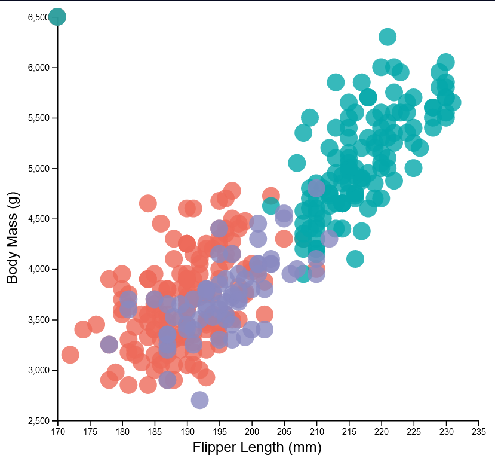

# Assignment 2 - Data Visualization, 7 Ways  
CS573, Spring 2024

Prof. Lane Harrison

Andrew Kerekon

## Tools
- plotly
- Excel
- d3
- Vega-Altair
- Vega-Lite
- Flourish
- DataWrapper
- (Extra) ggplot2

## Libraries
- R
- JavaScript
- Python

# R + plotly
Plotly is an interactive graphing library focusing on writing less code to produce detailed visualizations. Their software is available in R, JavaScript, and Python, but I decided to use their R library to practice programming in a different language.

To visualize the Penglings dataset, I used plotly's scatter plot after cleaning the data using tidyr's drop_na() function. I then specified a color map to match particular species names to certain colors, and changed opacity to 80%. I also specified sources for x and y axes and created labels to clarify which axis contained which datapoints. Additionally, bubbles are scaled according to bill_length_mm scaled down by a factor of 0.5, and all text is scaled and formatted with Ariel. I also added on custom tooltips for hover-over to allow for easy viewing of x and y data.

Plotly was a straightforward, easy-to-use library that was well-documented and suited this project perfectly. Importing data was made easy by the fact the penglings dataset already exists in R, and libraries such as plotly and tidyr were only a quick install away. Additionally, hover over on each data label is built in by default. The only downside was that I wasn't able to find a good way to include the bill_size circle size as part of the legend. I would recommend this tool to users who are comfortable with light programming in order to prepare much more detailed visualizations than those possible in Excel.

Resources Consulted:
- https://plotly.com/r/line-and-scatter/
- https://plotly.com/r/figure-labels/
- https://stackoverflow.com/a/38970417

# Excel

Excel is a dedicated tool for graphing, and is widely used in the professional world.

To visualize the Penglings dataset, I utilized Excel's bubble chart feature to incorporate our three variables (flipper length, body mass, and bill length) across all three species (Adelie, Chinstrap, Gentoo). I expected this would be straightforward, as Excel is effectively a "little language" built for this purpose, but the process presented some surprising hiccups.

For one, I first had to clean the data of unnecessary columns (island, bill depth, sex, and year) as well as invalid (NA) entries before Excel would allow points to be plotted. I then had to splice our y and "bubble size" columns (body mass and bill length) to separate columns underneath the three species to treat them as separate series. Once this was complete, factors such as adding labels to the chart were not straightforward, nor was changing the size of the bubbles to reflect bill length. I scaled bubble size to 25% and scaled them by width, rather than by area, to make the change more dramatic. I also rounded each bill length to the nearest 10 to provide better differentiation between bubbles, and changed transparency of each bubble to 20% which was opposite my initial intuition (default appeared that 0% was fully visible, and 100% fully transparent).

After all of these changes, Excel didn't appear to have the capacity to add legend labels for species nor a legend for the bill length bubble size, so I was not able to add these portions. Despite these setbacks, I could see this tool being useful for non-technical users to create effective visualizations without needing to program them manually.

Resources Consulted:
- https://www.statology.org/excel-bubble-chart-color-by-value/
- https://excelkid.com/bubble-chart/

# JavaScript + d3

d3 is a tool designed specifically for creating interactive visualizations with the JavaScript language.

To visualize the penglings dataset, I used promises to import data from CSV and filtered out any entry such that bill_length_mm was "NA". Ithen used d3's built in axes to create x and y axes of a particular size, translating as needed to allow labels to end in the right locations. I also used tickSizeInner to ensure grid lines would display. Following resources below, I created points for each data point at 80% opacity that mapped each species to a different color, with flipper_length_mm along the x-axis and body_mass_g on the y-axis. By iterating over all possible bill_length_mms, I rounded to the nearest 10 to choose the right bubble size and created a corresponding legend with both species mapped to color and bill_length mapped to circle size.

It was easy to bring in data, but difficult to adjust/scale where data ended up. I found myself having to test manual offsets for axis labels, which I needed to add myself rather than have tied to an axis like in Excel. I also found certain method chainings and general overhead of SVG files to be particularly cumbersome, especially when text would not appear until I set the fill to black. I would recommend d3 for technical users who want powerful visualizations, but only if they have the time required to realize a fully-fledged graphic.

Resources Consulted:
- https://d3-graph-gallery.com/graph/scatter_grouped_highlight.html
- https://d3js.org/d3-fetch#csv
- https://d3js.org/d3-axis
- https://d3-graph-gallery.com/graph/custom_legend.html
- https://observablehq.com/@weitinglin/how-can-i-skip-an-element-of-an-array-when-i-perform-a-data-data-

# Python + Vega-Altair

Altair is a visualization library for Python that uses the Vega-Lite grammar, focusing on getting charts set up with little written code.

In a Jupyter Notebook, I read the pengling's dataset into a pandas dataframe that Altair read to create a chart. This chart was configured to use the proper x and y axes titles and scales, to match other visualizations, and was also configured to use the same color bubbles. Additionally, opacity was configured to 80% and fonts were changed to Ariel sizes 14 and 16 in accordance with other visualizations. I also was able to add tooltips on hoverover using the "tooltip" argument.

I found it easy to get set up with Altair, with the only hurdles being the need to clean NA values from the pandas dataframe and the fact that changing the font also changed the scaling of the chart, which required manual limits of (300, 300) to be set. On the contrary, configurability of certain methods was challenging -- I wasn't able to find a way to swap the order of the legends themselves (species below bill_length), only the entries within. I would recommend Altair for aspiring data visualization professionals who are comfortable working with pandas and messing with configuration variables to get a desired result.

Resources Consulted:
- https://altair-viz.github.io/getting_started/overview.html
- https://altair-viz.github.io/gallery/multifeature_scatter_plot.html
- https://altair-viz.github.io/user_guide/generated/toplevel/altair.Chart.html#altair.Chart
- https://github.com/altair-viz/altair/issues/1465

# Vega-Lite
Similar to Altair, Vega-Lite is a JSON schema based grammar for creating statstical graphics. Instead of programming in Python, all programming is done in accordance with keys and values.

Using the Vega Viewer VS Code extension to see my progress in real time, I modeled my initial grammar from the referenced Vega scatter plots. Since they were similar to the desired Penglings dataset, I made sure to make significant changes in formatting and color to be distinct. I added titles, subtitles, standardized fonts and font sizes, and mapped each color and size to the proper species and bill_length. By prompting mark to include a tooltip, hover-over was built-in. 

I found it slightly more complicated to get set up, as I had to install a plugin to run Vega-Lite in VS Code, but I felt that syntax and style was very similar to Altair, so users with Altair experience would feel right at home with Vega-Lite. I found certain fields were confusingly nested, such as having to nest titles within a separate "legend" field. I also felt that subtitles were not as extensive, with support for only one line in contrast to Altair's array approach. I would recommend Vega-Lite to users who feel confident programming, like JSON-array syntax, and have prior Altair experience.

Resources Consulted:
- https://vega.github.io/vega-lite/examples/#scatter--strip-plots
- https://talk.observablehq.com/t/changing-colour-of-marks-based-on-data-values-vega-lite/3174
- https://vega.github.io/vega-lite/docs/mark.html
- https://vega.github.io/vega-lite/docs/title.html
- https://vega.github.io/vega-lite/docs/legend.html

# Flourish
Flourish is a web-based data visualization design tool that exports to SVG.

Using Flourish's built-in tutorial, I selected a scatter plot similar to the one Penglings would be modeled after. Setup was very different than other visualization tools, and I was prompted to select which columns from my data I would map to the x, y, color, and size attributes. The one hiccup here was unlike other tools, species (for color) was sorted by data index rather than by alphabetical order, so I had to sort the species column so that Chinstrap appeared before Gentoo. This was very straightforward, but took out a lot of customizability -- I felt that the circle size could not easily be scaled and that it was hard to differentiate certain circles from others. I also had to manually map colors depending on the index of the species entry, unlike other tools that had a 1-to-1 mapping -- adding species to the dataset could change coloring of points. Interestingly enough, I could also not change the position of the y-axis to be left aligned, nor the text to be Ariel -- only certain text fonts and sizes were available. Despite this, hover-over was built-in and I was able to display a tooltip for every point with all 4 data dimensions.

Overall, I would strongly recommend Flourish to users in need of a crisp visualization that can easily be exported to HTML but not in need of deep customizability. I would also recommend it more strongly to users who prefer a web-based application in lieu of writing code. 

Resources Consulted:
- https://app.flourish.studio/@flourish/scatter
- https://helpcenter.flourish.studio/hc/en-us/articles/8761569271567-How-to-color-the-dots-in-your-scatter-visualization

[Link to visualization](https://public.flourish.studio/visualisation/16738738/)

# DataWrapper
Similar to Flourish, DataWrapper is a web-based visualization design tool to create graphics without needing to write code.

Following only DataWrapper's walkthrough, I chose a scatterplot very similar to the desired Penglings chart, and imported the Penglings CSV into their web portal. From there, I was prompted to check data columns -- then select the proper columns and scaling for the horizontal and vertical axes. Color was a little cumbersome, but by selecting customize colors I unlocked a hidden dropdown where I could split on "species" and have each species of penguin have a custom color, and set this opacity to 80%. A very cool feature was the ability to check for colorblindness, so I was able to ensure my colors would not be hard to see for the three main types of colorblindness a user may experience. Despite this, I couldn't add a label to indicate that this data was from the "species" column. I could also select a maximum size, but it seemed rather arbitary and I couldn't scale it -- "25" turned out to be approximately the circle size I was hoping for, even though the largest bill_length is closer to 60mm. In order for labels to be as expected, I also had to rename the columns from "flipper_length_mm" and "body_mass_g" to "Flipper Length (mm)" and "Body Mass (g)" respectively to display as indicated.

DataWrapper was perhaps the most straightforward tool and as such I would recommend it to users who aren't comfortable with chart design, but certain features lacked the customizability of labeling and scaling that code-based tools would permit.

Resources Consulted:
- https://www.datawrapper.de/charts/scatter-plot

[Link to visualization](https://www.datawrapper.de/_/QboAL/)

# (Extra) R + ggplot2
As a bonus 8th visualization, I modified the given ggplot2 example to use displaying via plotly -- this allowed me to add in hover features as well as experimenting with different shapes instead of the usual circle/dot. Beyond the base example and in addition to the hover-over containing information about a specific point, I added in a title, changed the font size and type to be Ariel 14/16 consistent with other visualizations, and changed the colors to match consistency.

I would highly recommend ggplot2 for usability for programmers familiar with R, as well as those looking to get started with a programming language-based visualization framework. Syntax that included using the + symbol for different parts of the visualization was intuitive, and everything was well-documented and supported. I didn't have to perform any data cleaning, as ggplot2 took care of NA points immediately without any user intervention required.

## Technical Achievements
- Implemented hover-over where possible, including in plotly, vega-altair, vega-lite, flourish, datawrapper and ggplot2. Hover-over does not appear to be possible in Excel, and although hover-over is possible in d3 I was not able to achieve a successful hover-over. This hover over differs from tool to tool, but generally includes (x + y) as well as (species + bill_length_mm)
- Created an 8th visualization to practice R + ggplot2, modifying the given example to use plotly's tools, hover over, and text and font

## Design Achievements
- Standardized text font to Ariel and title size to 16 point, label size to 14 point whenever possible, including plotly, Excel, d3, Vega-Altair, Vega-Lite, and ggplot2. Web-based tools such as Flourish had options to change font to their predetermined types (not Ariel), while DataWrapper did not allow changing fonts unless you emailed their design team for a customization
- All plots contain a title/subtitle, although formatting differs for each tool
- Color choice standardized to always include "#156082", "#E97132", "#196B24" colors for datapoints, ordered alphabetically. Backgrounds were made gray when possible or white when not
- Colorblindness compatibility for Deuteranopia, Protanopia, and Tritanopia tested with DataWrapper and all colors found to be compatible
- On 8th visualization, experimented with different shapes instead of pure circles to represent same data
