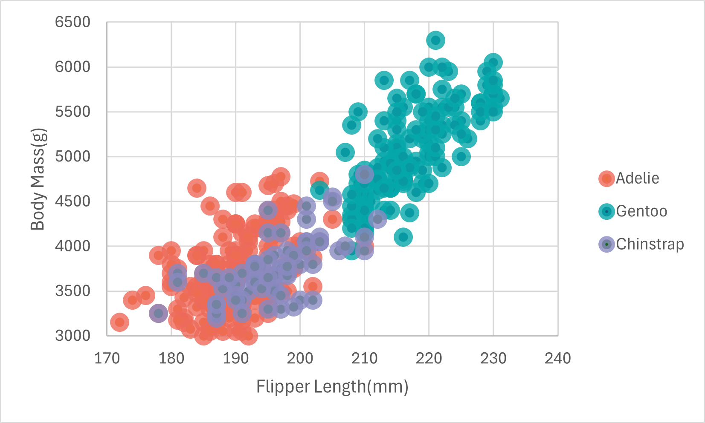

# 02-DataVis-7ways

Assignment 2 - Data Visualization, 7 Ways  
===

# R + ggplot2 + R Markdown

R is a language primarily focused on statistical computing.
ggplot2 is a popular library for charting in R.
R Markdown is a document format that compiles to HTML or PDF and allows you to include the output of R code directly in the document.

I used the `ggplot()` method to generate the scatterplot. It was convenient to be able to generate a plot quickly and with very few lines of code while also being able to change attributes by adding + and the new attribute to it. After going through some documentation it was relatively simple to complete the chart.

# d3

d3 is a JavaScript data visualization library. To create the chart, I used the an svg element and the property `.selectAll("dot")` on a created g element which was added to it. Making the axis ticks and numbers was easy with the built in function, and adding attributes such as size and font was simple as well.
However, it was kind of inconvenient that there is no built in way to label axes without having to create a new text object. I also could not get the dots to show up at first and had to downgrade to version 4 from version 6. The existing documentation seems to mostly cover version 4.

# Python + Pandas + Matplotlib

Since I was having some trouble getting it to work in vscode, I did it in Google Collab and copied the code into the python-matplotlib folder
https://colab.research.google.com/drive/1z-f9MYV3flDyWVIg_XQ_QybIQCWKHFF-?usp=sharing

Pandas is a popular Python library for data analysis, and Matplotlib is a Python library for making visualizations. 
Besides having to review some documentation, this was relatively easy to use. Some aspects such as the dataframe may be better applied to some ai tasks but work. It was nice that I didn't have to manually specify the range of the axes, and the dot size and opacity attributes as well as the axes labels were easy to adjust.

# Python + Pandas + Plotly Express

Since I was having some trouble getting it to work in vscode, I did it in Google Collab and copied the code into the python-plotly folder.
https://colab.research.google.com/drive/1z-f9MYV3flDyWVIg_XQ_QybIQCWKHFF-?usp=sharing

Plotly is an interactive graphing Python library. Plotly express is a high-level api for creating entire figures at once. This was one of the quickest libraries to use with the least amount of code, with the `px.scatter()`plot automatically being able to create the axes and labels and being able to automatically do color mapping with the "color" attribute, as well as showing more information about each data point when hovering over it with the "hover_data" attribute. The only downside is less control over some details; when adjusting the dot size I had to create a new dummy column in order to set it equal to size_max. 

# Python + Pandas + Seaborn

Since I was having some trouble getting it to work in vscode, I did it in Google Collab and copied the code into the python-plotly folder.
https://colab.research.google.com/drive/1z-f9MYV3flDyWVIg_XQ_QybIQCWKHFF-?usp=sharing

Seaborn is a python library meant for statistical data visualization. It is built on top of matplotlib and provides the ability to draw nicer looking graphs. 
I used the `sns.relplot()` function to create the graph. It was relatively simple to do in one line. Compared to Matplotlib, the result was easier to produce and it took fewer lines as it is more specialized. It was also easier to use the hue attribute to do the color mapping, while matplotlib requires the "map()" method. 

# Flourish

Flourish is a website for creating visualizations and interactive content for websites. It does not require any coding and is meant for a more general audience. It is able to export html code that allows the image to be embedded in a website. It is very intuitive and easy to use but probably isn't as useful for customization and more high level data visualization.

# Excel

Excel is a spreadsheet software. It was more difficult to create a graph with as I had to manually select which data points belonged to which category. It is meant for a much more general purpose and is probably not as useful for most cases of data visualization.

## Technical Achievements
- **Have Mouseover Datapoints Highlight Point and Show More Information**: For Plotly, I was able to have the dots be highlighted and show information about them when the mouse went over them

### Design Achievements
- **Made Color Palette Using coolors.co**: I made a palette similar to the one in the example photo, but with colors that would work nice together since I didn't know the exact hex codes. 

