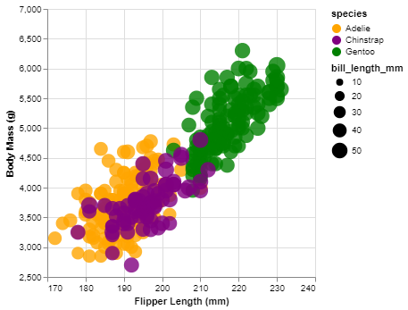

# 02-DataVis-7ways

# Assignment 2 - Data Visualization, 7 Ways  

# R + ggplot2 

R is a language primarily focused on statistical computing.
ggplot2 is a popular library for charting in R.

To visualized the cars dataset, I made use of ggplot2's `geom_point()` layer, with aesthetics functions for the color and size.

Installing language dependencies and learning the syntax will take some time, but it is very helpful for learning.

## Technical Achievements
Successfully imported a CSV file containing penguin data using the read.csv function, enabling subsequent data analysis and visualization.

Utilized the ggplot2 library in R to create a customized scatter plot (geom_point()) with aesthetics such as color and size mapped to different variables in the dataset.
## Design Achievements
Provided  clear and informative labels for the x and y axes (Flipper Length (mm) and Body Mass (g) respectively), improving the interpretability of the plot for viewers.

Incorporated an interactive tooltip (text aesthetic) that displays additional information about each data point upon hovering, enhancing the interactivity and explanatory power of the visualization.

# D3.js
D3.js is a powerful JavaScript library for creating complex and interactive data visualizations for web browsers. This data visualization explores the relationship between flipper length and body mass in different species.Because browser is attempting to protect us from downloading a file from a suspicious link. To resolve this, we need to run our own server. From your terminal, navigate to the directory containing the HTML page you want to run. Then, execute the command 'python3 -m http.server' to load the CSV data.

## Technical Achievements
Used D3.js to create a scatter plot
Implemented linear scales for both x and y axes to accurately represent the data.

Used a color scale to differentiate between the three species.

## Design Achievements
The chart is visually appealing and easy to understand.

The use of color effectively highlights the differences between species.

The appropriate size of the circles helps to convey the relationship between flipper length and body mass.

# Datawrapper
Datawrapper is an online data visualization tool that allows users to easily create various types of charts and maps, including line graphs, bar charts, scatter plots, pie charts, etc.
I made a scatter plot on Datawrapper and posted it to this link https://datawrapper.dwcdn.net/0q8lD/1/

# Flourish
Flourish is also an online data visualization tool. Comparing Datawrapper with Flourish, many settings are on the data page, which took me quite some time to find. I prefer Datawrapper because it guides the settings step by step.
I made a scatter plot on Flourish and posted it to this link https://public.flourish.studio/visualisation/16798309/

# Altair + Python
Python, known for its versatility, serves as a foundational language for various computational tasks, including statistical analysis. Altair is a declarative statistical visualization library in Python, allowing users to create concise and expressive visualizations with minimal code. Leveraging Altair, users can easily generate a variety of statistical plots, facilitating insightful data exploration and presentation.

## Technical Achievements
Customized the axes titles (x_axis_title and y_axis_title) and scales (scale=alt.Scale(domain=...)) to ensure appropriate visualization of the data range and improve interpretability.

Incorporated interactive tooltips (tooltip=[color_column, 'flipper_length_mm', 'body_mass_g', size_column]) that display relevant information upon hovering over data points, allowing for detailed exploration of individual data instances.

## Design Achievements
Provided clear and informative labels for the x and y axes (x_axis_title and y_axis_title), improving the readability and understanding of the plot for viewers.

Saved the generated plot as an HTML file (chart.html) with embedded options for SVG rendering (embed_options={'renderer':'svg'}), facilitating easy sharing and integration into web-based platforms.

# Matplotlib + Python
Python, renowned for its versatility, serves as a go-to language for statistical computing and data visualization tasks. Matplotlib, a widely-used library in Python, provides extensive functionality for creating static, interactive, and publication-quality plots. With Matplotlib, users have fine-grained control over every aspect of their plots, enabling them to effectively convey their data-driven insights.

## Technical Achievements
Created a scatter plot using Matplotlib to visualize the relationship between flipper length and body mass for penguins, providing a clear representation of the data points.

 Added padding to the plot (ax.margins(0.05)) to prevent data points from being cut off at the edges, ensuring the entire plot is visible.

## Design Achievements
Incorporated transparency (alpha) into the data points, allowing for better visualization of overlapping points and emphasizing areas of higher data density.

Presented the scatter plot in a clear and concise manner, with well-defined data points and axes, ensuring ease of interpretation for viewers.

# Ploty + Python
Python, a versatile programming language, is widely used for various tasks, including statistical computing. Plotly is a powerful library for creating interactive and publication-quality visualizations in Python. With Plotly, users can generate a wide range of charts and graphs, enhancing their ability to explore and communicate data effectively.

## Technical Achievements
Utilized a dummy column (dummy_column_for_size) to control the size of data points in the scatter plot, ensuring consistency and adjustability of point sizes.

## Design Achievements
Adjusted the maximum size of data points (size_max) to optimize visualization aesthetics while avoiding visual clutter.