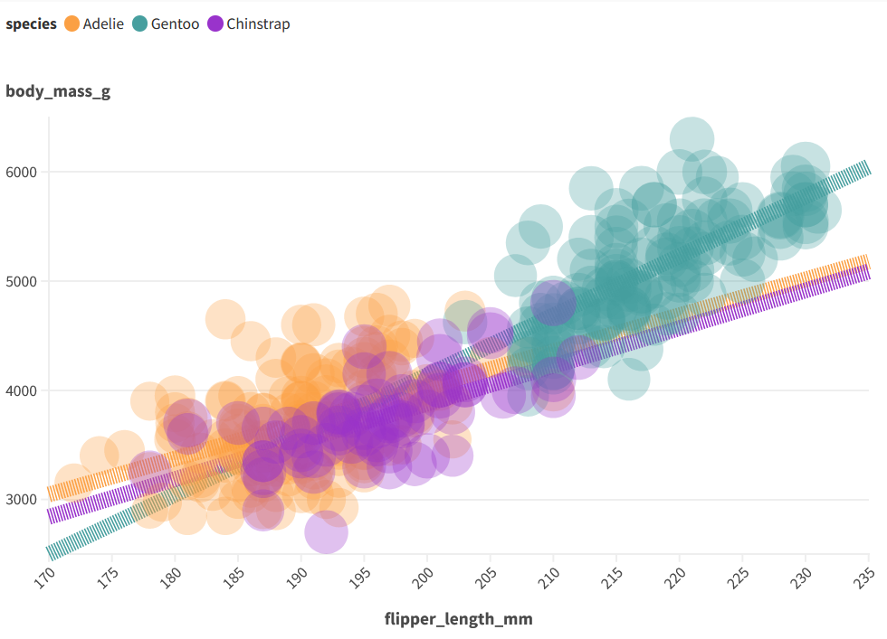

# 02-DataVis-7ways

Assignment 2 - Data Visualization, 7 Ways  
===
# d3 js
---

**Advantage:**
- flexible
- plenty of examples and templates
           
**Disadvantage:** 
- comparing to the drag and drop tools programming knowledge required

**Where do I see this in future:**
- Due to the specialized nature of technical skills, particularly in coding, their widespread adoption among non-coders may be limited.

**Technical achievements:** 
Dynamic Data Loading: Uses D3 to asynchronously load data from the "penglings.csv" file, allowing for dynamic data integration. 
Color and Size Encoding: Encodes species information with custom colors and bill length with variable circle sizes, providing a multi-dimensional representation of the data.
Text Annotations: Adds informative text annotations for axis titles and legends, contributing to the clarity of the visualization.

**Design achievements:** 
Consistent Styling: Maintains consistent and cohesive styling throughout the visualization, contributing to a unified and aesthetically pleasing design.
Dynamic Size & Color Legend implementation:  Utilizes a custom color mapping for each penguin species and dynamically generates legends for both size and color based on the specified data ranges and color mapping

# Flourish
---

Tool: flourish 
[Link:](https://app.flourish.studio/projects)

**What steps are done:**
- create login
- upload data
- draw report

**Advantage:** 
- easy to work
- free edition for try
- plenty of examples and templates
           
**Disadvantage:** 
- not flexible <-- for example: only 1 legend is available
- lack of data manipulation opportunities (you can add and delete columns but you can't do basic data maniplation such as create a new column as a sum of 2 other columns)

**Where do I see this in future:**
- if it improves the data manipulation ection it has potential to grow
Hacks: 
- Because of the technical limitation of the tool, I couldn't display the both legend but I customized the color legend to show required colors for related category

# powerbi 
---

Tool: powerbi 

**What steps are done:** 
- upload data
- draw report

**Advantage:** 
- easy to work
- free desktop edition
- data manipulation capabilities
- plenty of examples and communities
           
**Disadvantage:** 
- not flexible enough like ggplot, d3
- for example: only 1 legend is available

**Where do I see this in future:**
      - it's already quite popular, so that will be continue
**Hacks:**
- Because of the technical limitation of the tool, but using the table trick I display the second legend

# Vega-lite

**Advantage:** 
- easy to learn
- flexible
- plenty of examples and communities
           
**Disadvantage:** 
- Coding knowledge required.

**Technical achievements:**
Declarative Syntax & Effective Data Mapping: Uses a concise and high-level syntax for visualization configuration and efficiently maps variables to visual channels for a comprehensive representation. 

Color Encoding & Palette Usage & Opacity Control: Implements a meaningful color scale for enhanced data interpretation, and applies a distinct and visually appealing color palette for species differentiation. Includes opacity for transparency, improving visibility in crowded regions. 

Dynamic Data Source: Enables dynamic loading of data from an external CSV file for adaptability.

Scale Configuration & Size Variation: Defines scales for accurate data representation and distribution and uses varying point sizes to convey additional information effectively.

**Design achievements:**
Data Range and size consideration: Carefully chosen scales prevent crowding or sparse regions, optimizing distribution.

Consistent Aesthetics: Unified color palette, color harmony,  opacity for Clarity and visual elements contribute to a cohesive design.

# Python + Altair
---

**Advantage:**
- easy to work
- free edition for try
- plenty of examples and templates
           
**Disadvantage:**
- not flexible <-- for example: only 1 legend is available
- lack of data manipulation opportunities (you can add and delete columns but you can't do basic data maniplation such as create a new column as a sum of 2 other columns)

**Where do I see this in future:**
- if it improves the data manipulation ection it has potential to grow
**Hacks:**
- Because of the technical limitation of the tool, I couldn't display the both legend but I customized the color legend to show required colors for related category

**Technical achievements:**
Altair Chart Configuration: Utilizes Altair to create an interactive scatter plot with circles. Applies color mapping to species and sets a custom color range. Encodes size based on bill length, contributing an additional data dimension.

Tooltip Integration: Incorporates tooltips for interactive exploration, providing details on species and numerical variables when hovering over data points.

Mark Configuration: Configures the circle marks with a specified opacity level for better visibility.

Interactive Display: Uses the IPython display function to showcase the interactive chart within the Jupyter Notebook environment. In summary, the code effectively leverages Altair's capabilities to create an interactive and visually informative scatter plot, showcasing technical achievements in data visualization and exploration.

**Design achievements:**
Consistent Aesthetics: Maintains a consistent aesthetic with a specified color range and opacity, contributing to a unified and visually appealing design.

Color Mapping for Species: Implements a custom color mapping for each penguin species, enhancing visual distinction and facilitating species identification.

Size Encoding for Additional Insight: Utilizes point size to encode bill length, adding an extra layer of information to the plot and making it more informative.

# R + ggplot2 (plotly) + R Markdown
---

Tool: RStudio

Advantage: 
- easy to work
- free edition for try
- plenty of examples and templates
           
Disadvantage: 
R, ggplot2 (plotly), and R Markdown are hard to learn especially mastering these tools, especially for beginners. Additionally, the generation of complex interactive visualizations may require a deeper understanding of underlying code, potentially posing a challenge for users seeking a more straightforward graphical interface.

Hacks: 
- I used the professor's code as a basis for extension.

**Technical achievements:**
Efficient data manipulation, meticulous aesthetic configuration, faceting, and the transformation of a static ggplot into an interactive plot using plotly were seamlessly executed to create a visually appealing representation of penguin metrics. The plot's aesthetics were fine-tuned for clarity, employing color schemes and sizing considerations. Faceting enhances insights by breaking down the data into subplots based on categorical variables. The integration of plotly introduces interactivity, such as tooltips and zooming, fostering a dynamic and engaging exploration of the penguin metrics.

**Design achievements:**
Enhances plot interpretation by customizing legends, ensuring a clear association between colors and penguin species. This contributes to improved readability and comprehension of the visualized data. Additionally, the faceting of the plot by penguin sex aids in a focused comparison between male and female penguins, highlighting potential differences in metrics. The use of ggplotly introduces interactivity, allowing users to explore specific details through tooltips, enhancing the overall user experience. Clear titles and axis labels further contribute to the plot's interpretability, guiding viewers in understanding the relationships between different penguin metrics.

# Python + Matplotlib
---

**Advantage:**
- easy to work
- free edition for try
- plenty of examples and templates
           
**Disadvantage:**
- not flexible <-- for example: only 1 legend is available
- lack of data manipulation opportunities (you can add and delete columns but you can't do basic data maniplation such as create a new column as a sum of 2 other columns)

**Where do I see this in future:**
- if it improves the data manipulation ection it has potential to grow
**Hacks:**
- Because of the technical limitation of the tool, I couldn't display the both legend but I customized the color legend to show required colors for related category

**Technical achievements:**
Altair Chart Configuration: Utilizes Altair to create an interactive scatter plot with circles. Applies color mapping to species and sets a custom color range. Encodes size based on bill length, contributing an additional data dimension.

Tooltip Integration: Incorporates tooltips for interactive exploration, providing details on species and numerical variables when hovering over data points.

Mark Configuration: Configures the circle marks with a specified opacity level for better visibility.

Interactive Display: Uses the IPython display function to showcase the interactive chart within the Jupyter Notebook environment. In summary, the code effectively leverages Altair's capabilities to create an interactive and visually informative scatter plot, showcasing technical achievements in data visualization and exploration.

**Design achievements:**
Consistent Aesthetics: Maintains a consistent aesthetic with a specified color range and opacity, contributing to a unified and visually appealing design.

Color Mapping for Species: Implements a custom color mapping for each penguin species, enhancing visual distinction and facilitating species identification.

Size Encoding for Additional Insight: Utilizes point size to encode bill length, adding an extra layer of information to the plot and making it more informative.

