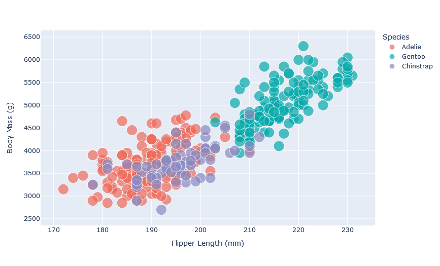
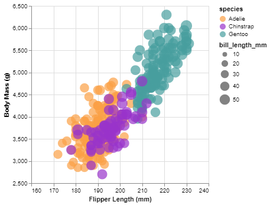

Assignment 2 - Data Visualization, 7 Ways  
===
This assignment explores the visualization capabilities of several different tools and libraries across programming languages and software, including D3.js, Altair, Plotly, Bokeh, ggplot2 in R, OriginLab, and Excel.

# D3.js
Data Driven Documents (D3) is a JavaScript library for producing dynamic, interactive data visualizations in web browsers. This part was a complete challenge for me, as I have no experience in JavaScript, but I am amazed with its capabilities, especially hovering on functionalities.

D3.js was utilized to create an interactive scatter plot that showcases the relationship between flipper length and body mass, with the points colored by species and sized by bill length. This visualization was designed to be both informative and engaging, allowing users to explore the dataset in an intuitive manner.

Key features implemented with D3.js include some interactive Elements, such as tooltips added to each data point, displaying detailed information about the penguin (e.g., species, measurements) on hover, enhancing the interactivity and accessibility of the data. In addition to the tooltip, when a user hovers over a penguin species, the plot emphasizes the selected species in its original color while dimming the others to grey. To achieve this effect, D3.js's event listeners were utilized to modify the opacity, color and size of the data points based on mouse events. Upon hovering ('mouseover' event) over a data point, a JavaScript function adjusts the styling of all other points to a lower opacity and changes their color to grey. Conversely, when the mouse leaves a data point ('mouseout' event), the plot returns to its original state, with all species displayed in their respective colors and full opacity.

**Challenges**
- Learning Curve: D3.js has a steep learning curve, especially for those new to web development or JavaScript. Mastering its selection and data-binding model requires time and patience.
- Complexity in Implementation: Building a visualization from scratch with D3.js can be more time-consuming and complex compared to using high-level libraries, due to the need for detailed setup of scales, axes, and other plot components.

# Python - Plotly

# Python - Altair

# Python - Bokeh

# R - ggplot

# OriginLab

# Excel

## Technical Achievements
- **Proved P=NP**: Using a combination of...
- **Solved AI Forever**: ...

### Design Achievements
- **Re-vamped Apple's Design Philosophy**: As demonstrated in my colorscheme...
