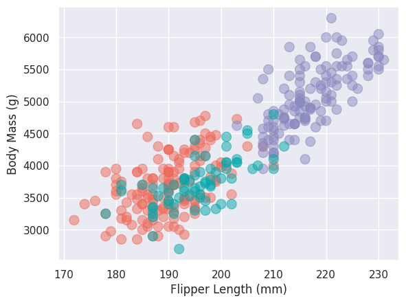

# 02-DataVis-7ways

Assignment 2 - Data Visualization, 7 Ways

An overall technical achievement that I wanted to achieve was to not manipulate the csv before using it in any of the programs. This additional backend achievement helped me understand how to use code to perform cleaning on the data.

===
# d3
For this visualization, I used the D3.js library to create an interactive scatter plot. To parse the file, i used the d3.csv function and filtered out the datapoints with na values. I was able to achieve all the features in our 'goal' graph. An additional feature in this graph was the interactive tool tip which allows you to see more information about a specific bubble on the plot.

Since I recently used d3 for assignment 1, it was easier to make this graph with the help of some online guides. However, the tool tip was slightly harder and I did end up using an LLM to create a clean solution. D3 is very useful for animations and interactivity. With some knowledge of javascript you are able to create amazing visualizations through the d3 library.

## Technical Achievements
- **Interactive tooltip**: When you hover over a bubble, it shows you more information regarding that specific datapoint.
### Design Achievements
- **Colors**: I used a colorscheme that I thought matched a penguin's colors as I thought it would bring the design together.
- **Sizing of Bubbles**: For the variable sizing based on 'bill size', I made sure the sizes were different enough to be noticable on first glance as this was not something apparent in the 'goal' graph.

# Excel
Excel was surprisingly one of the harder visualizations to create because I coudn't figure out the 'series' idea for the longest time. This visualization felt a little hacky to create. I do think Excel has a lot of potential for visualizations, but the ways to create them are very convoluted. I was able to achieve all the features in the 'goal' graph that were required. I was not able to put the 'bill sizes' legend in to the chart.

### Design Achievements
- **A Penguin Image**: I added a little penguin to the background because I thought it brought the visualization together and made it look less bare.
- **Colors**: I used a colorscheme that I thought matched a penguin's colors as I thought it would bring the design together.
- **Sizing of Bubbles**: For the variable sizing based on 'bill size', I made sure the sizes were different enough to be noticable on first glance as this was not something apparent in the 'goal' graph.

# Flourish
Flourish was by far the easiest visualization to make even though it was my first time using it. The application was very intuitive and easy to use. The tool - for my first time using it - seemed a little restrictive in the number of things you can do with it. I was not able to change the sizes of the bubbles based on bill length but was able to achieve all other features from the goal graph. I was also unable to change the colors of the specific species unfortunately as I did for my past graphs.

## Technical Achievements
- **Additional Filtering**: I added a feature to filter the data by islands. Clicking on an island shows you the data of the penguins only from that specific island. You can see the filter in action in the second picture.

# Tableau
Tableau is my most favorite data visualization tool, so I felt compelled to use it for this project. It is intuitive, and does not limit you in what you are trying to do. The tool is extremely easy to use. I may be biased however since I have been working with it for the past two years. I was able to achieve all the feature requirements on this graph. 

## Technical Achievements
- **Dashboard**: I created 2 additional graphs giving more insight into the dataset. The first simply shows the average bill length size for female versus male penguins and the second shows the number of penguins coming from each island.
- **Interactivity**: Addtionally, I added an 'action' on the dashbaord, when clicking on a bubble on the scatterplot, it shows the gender, bill length and the island that the penguin comes from. The second image highlights this interactivity.

### Design Achievements
- **Colors**: I used a colorscheme that I thought matched a penguin's colors as I thought it would bring the design together.
- **Sizing of Bubbles**: For the variable sizing based on 'bill size', I made sure the sizes were different enough to be noticable on first glance as this was not something apparent in the 'goal' graph.

# Matplotlib
Matplotlib is my go to when creating graphs in python. It was fairly easy to use. The only thing that felt hacky and was hard to do was create the legend for the bill sizes. I used an LLM to help me with that. I was not able to separate the legend by species and bill length. Simply creating the base visualization however was straight forward.

# Seaborn
This library needed the least amount of effort. It was easy to use. The only hacky thing in it's code was that I had to create a new column called 'Body Mass (g)' which had the same data as body_mass_g so I could get the neat title for the y-axis. I could not find a way to rename the y-axis title without using matplotlib.

# Vegalite
Vegalite seemed really hard at first, but their documentation specifically for creating bubble charts made it fairly straightforward to use. I achieved all the base feature requirements. I was unable to figure out how to put an accurate legend in for the bill sizes, so I ended up removing it entirely. Overall, vega-lite seems like fairly easy-to-use tool.

### Design Achievements
- **Colors**: I used a colorscheme that I thought matched a penguin's colors as I thought it would bring the design together.
- **Sizing of Bubbles**: For the variable sizing based on 'bill size', I made sure the sizes were different enough to be noticable on first glance as this was not something apparent in the 'goal' graph.

# References
https://www.educative.io/answers/how-to-create-a-bubble-chart-using-d3
https://stackoverflow.com/questions/11189284/d3-axis-labeling
